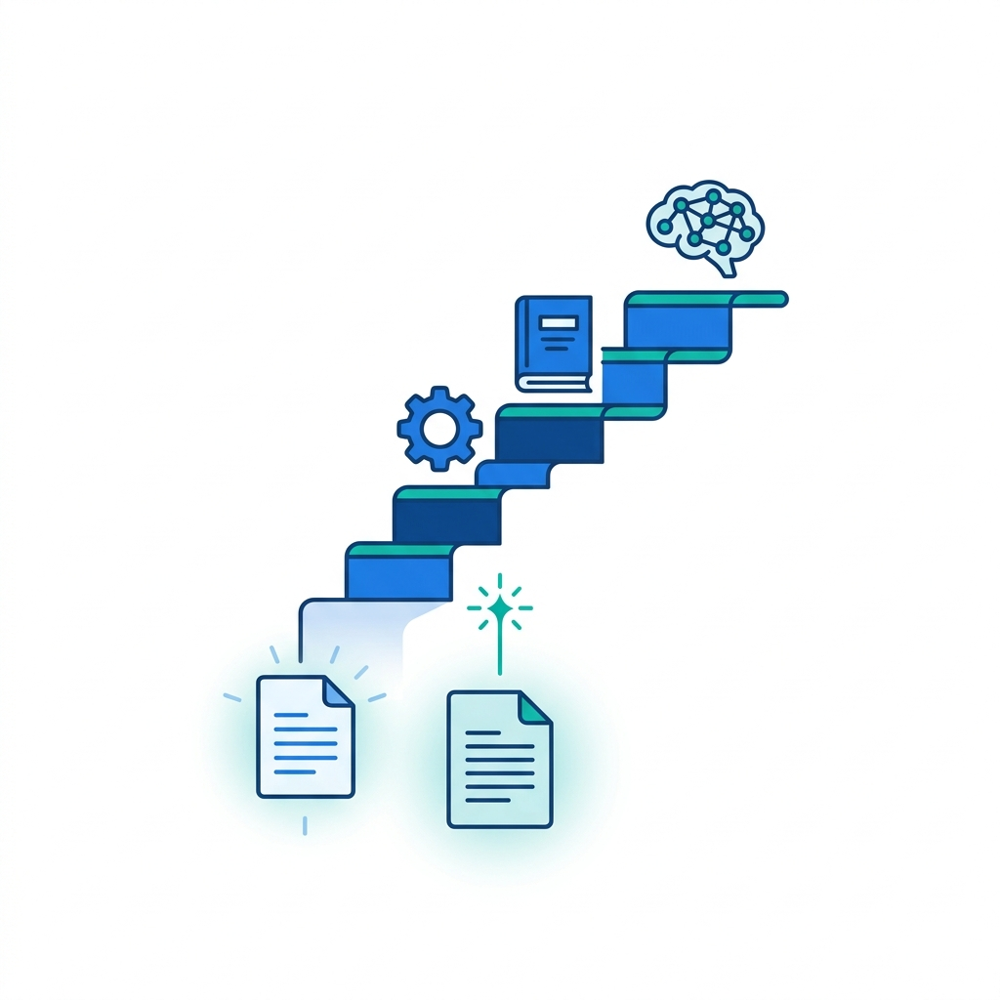
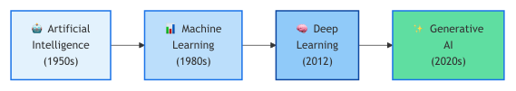
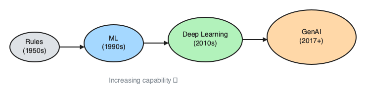
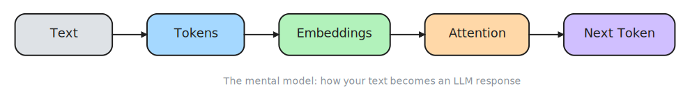
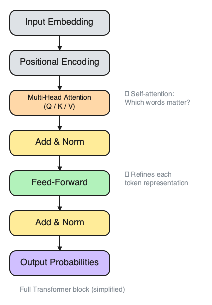
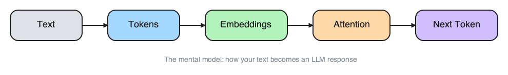
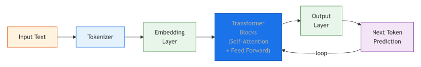
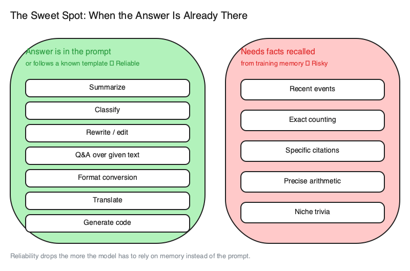

# 1. Introduction to Generative AI & LLMs

> **🎯 Learning Objectives**
>
> - Trace the evolution from rule-based AI to modern generative models
> - Explain how the Transformer architecture processes text using self-attention
> - Describe tokenization, embeddings, and context windows at a level sufficient to use LLMs effectively

## The Paper Nobody Noticed

<!-- IMAGE: A glowing research paper at the base of an upward staircase, each step transforming from a simple gear and rulebook into a small neural-network brain at the top; one bright spark rising from the paper. Conveys one idea sparking an industry. -->

<!-- END IMAGE -->

In June 2017, eight Google researchers published a paper with a title that read more like a pop song than a research paper: "Attention Is All You Need." The paper introduced the Transformer architecture, a new way for neural networks to process language. At the time, it was one of hundreds of papers published at NeurIPS that year. Nobody predicted it would become the foundation of a trillion-dollar industry.

Within six years, the Transformer spawned GPT-4, Claude, Gemini, Llama, and every other large language model you have heard of. GitHub Copilot writes code. ChatGPT passed the bar exam. AI assistants summarize meeting transcripts, triage support tickets, and generate test cases. The common thread behind all of it is the same architecture from that 2017 paper, scaled up with more data and more compute.

In this chapter, you will learn how that architecture works at a level that makes you a better practitioner. You do not need a PhD in machine learning. You need to understand tokenization, attention, and context windows well enough to write effective prompts, estimate costs, and debug unexpected behavior.

## The Evolution of AI

The path from the earliest AI systems to today's generative models spans seven decades. Each era built on the limitations of the one before it.


<!-- figure: AI eras at a glance -->

**Rule-based systems** (1950s to 1980s) relied on hand-written rules. IBM's Deep Blue played chess by evaluating millions of positions using human-defined heuristics. Spell checkers flagged words not found in a dictionary. These systems were brittle: they worked only for the exact scenarios their creators anticipated.

**Machine learning** (1990s to 2010s) shifted the approach from writing rules to learning patterns from data. Spam filters learned which word combinations predicted junk email. Recommendation engines learned user preferences from click history. The key insight was that algorithms could generalize from examples, but they still required humans to design the right features.

**Deep learning** (2012 onward) removed the feature-engineering bottleneck. Convolutional neural networks learned to recognize images directly from pixels. Recurrent neural networks (RNNs) and LSTMs processed text one word at a time, enabling machine translation and voice assistants. The catch: sequential processing was slow and struggled with long sequences.

**Generative AI** (2017 to present) arrived with the Transformer. By processing all words in parallel through self-attention, Transformers eliminated the sequential bottleneck. Combined with massive datasets and unprecedented compute budgets, this produced models that generate code, prose, images, and music. The models are not merely classifying or predicting; they are creating new content.


<!-- figure: AI evolution from rule-based systems to generative AI -->

> [!NOTE]
> **Did You Know?** The original Transformer paper "Attention Is All You Need" has been cited over 130,000 times, making it one of the most influential computer science papers ever written. The eight authors are now spread across multiple AI companies they helped found.

Once you understand the Transformer pipeline, see [Chapter 3](03-working-with-llm-apis.md) to set up your environment and make your first API calls. For a deep dive into security and protecting your API keys, see [Chapter 12](12-security-guardrails.md).

## How Transformers Work (Simplified)

<!-- IMAGE: A single document at the center with many citation arrows radiating outward, and a few small figure-silhouettes branching off toward separate company buildings. Conveys an influential paper whose authors dispersed. -->

<!-- END IMAGE -->

Every large language model you interact with, whether GPT-4o, Claude, or Gemini, runs on the Transformer architecture. Understanding its five-step pipeline will help you write better prompts, estimate costs, and troubleshoot problems.

### Step 1: Tokenization


<!-- figure: Token-to-response pipeline -->

LLMs do not read words. They read tokens, chunks of text that typically correspond to 3 to 4 English characters. The tokenizer splits your input into these chunks and converts each one to a numerical ID.


<!-- figure: Transformer architecture high-level view -->

```text
"The cat sat on the mat" → [The, cat, sat, on, the, mat]
                         → [1234, 5678, 9012, 3456, 1234, 7890]
```

You can see this in action with the `tiktoken` library:

```python
import tiktoken

enc = tiktoken.encoding_for_model("gpt-4o")
text = "Generative AI is transforming software development."
tokens = enc.encode(text)
print(f"Token count: {len(tokens)}")
print(f"Token IDs:   {tokens}")
# Token count: 7
# Token IDs:   [25523, 15592, 382, 47767, 4093, 5765, 13]
```

Tokenization matters for three practical reasons. You are billed per token, not per word. Context windows are measured in tokens. Different languages tokenize differently: a sentence in Japanese may use twice as many tokens as the same meaning expressed in English.

> [!TIP]
> **Developer Gotcha:** Tokenizers are specific to model families. `tiktoken` is OpenAI's tokenizer. If you are using Claude or Gemini, their tokenizers are different. While `tiktoken` provides a decent rough estimate, using it to calculate exact costs for non-OpenAI models will result in inaccurate counts.


<!-- figure: Tokenization flow from text to token IDs -->

### Step 2: Embeddings

Each token ID becomes a vector, a list of numbers that captures semantic meaning. In GPT-2, each vector has 768 dimensions. In GPT-4, the dimensionality is much larger.

```text
"cat"   → [0.12, -0.34, 0.56, ...] (768+ dimensions)
"dog"   → [0.11, -0.30, 0.52, ...] (nearby, similar meaning)
"table" → [0.89, 0.23, -0.67, ...] (far away, different meaning)
```

Words with similar meanings end up close together in this vector space. "Cat" and "dog" are neighbors. "Cat" and "spreadsheet" are distant. The model learns these positions during pre-training by reading billions of text samples.

### Step 3: Self-Attention

**Self-attention** is the mechanism that made Transformers revolutionary. For each token, the model asks: "Which other tokens should I pay attention to in order to understand this one?"

Consider this sentence:

```text
"The bank was closed because it was a holiday."
```

The word "bank" is ambiguous. Is it a financial institution or a riverbank? The attention mechanism connects "bank" to "closed" and "holiday," concluding it refers to a financial institution. In a different sentence, "The bank of the river was muddy," attention would connect "bank" to "river" and "muddy" instead.


<!-- figure: Full Transformer architecture -->

**High-Resolution Diagram:** For a full-page version of this architecture and other technical matrices, see [Appendix E](appendix-e-diagrams.md#chapter-1-the-transformer-architecture). The high-resolution file is also available in the companion repository: 
- [ch01-transformer-full.png](https://github.com/kpassoubady/building-with-llms-companion/blob/main/diagrams/ch01-transformer-full.png)

> [!NOTE]
> **Think of attention like a meeting.** In a 10-person meeting, when someone says "the budget," everyone immediately looks at the CFO. Self-attention works the same way: each token figures out which other tokens are most relevant to its meaning.

Before Transformers, RNNs processed tokens one at a time from left to right. By the time they reached the end of a long sentence, early tokens had faded from memory. Self-attention compares every token to every other token simultaneously, regardless of distance.


### Step 4: Feed-Forward Networks

After the attention step determines which tokens are relevant to each other, a feed-forward neural network refines the representation at each position. This is where the model applies its learned knowledge to transform raw relationships into deeper understanding.

### Step 5: Repeat, Then Predict

A single attention-plus-feed-forward pass is one Transformer block. GPT-4 stacks 120 or more of these blocks on top of each other. Each layer refines the model's understanding further.

The final layer outputs a probability distribution over all possible next tokens:

```text
"The cat sat on the" → {mat: 12%, floor: 8%, roof: 5%, couch: 4%, ...}
```

The model samples from this distribution (controlled by a parameter called temperature, which you will explore in [Chapter 7](07-api-parameters.md)) to produce the next token. Then it feeds that token back in and repeats. This is how LLMs generate text: one token at a time, each informed by everything that came before.

> [!WARNING]
> **Transformers are not magic.** They are sophisticated pattern-matching machines trained on text from the internet. They do not "understand" language the way humans do. Keeping this in mind will help you write better prompts and set realistic expectations.

## Key Concepts: Context Windows and Parameters

Two numbers define the practical limits of any LLM: its context window and its parameter count.

### Context Windows

**Context window** is the maximum number of tokens the model can process in a single request. This includes both your input (the prompt) and the model's output (the response). If your prompt uses 100,000 tokens, a model with a 128K context window has only 28,000 tokens left for its response.

| Model | Context Window | Approximate Pages (~500 words/page) |
|:------|:--------------|:-----------------------------------|
| GPT-4o | 128K tokens | ~200 |
| GPT-4o-mini | 128K tokens | ~200 |
| Claude 3.5 Sonnet | 200K tokens | ~310 |
| Gemini 2.5 Pro | 1M tokens | ~1,500 |
| Llama 3.1 | 128K tokens | ~200 |

### Why Context Windows Have Limits

Self-attention compares every token to every other token. For a sequence of length *n*, the model computes *n*² attention scores. A 128K token context means 128,000² = 16.4 billion attention computations. This quadratic cost is why context windows cannot grow without bound, even as hardware improves.

### Parameters = Learned Knowledge

**Parameters** are the numerical weights that the model learned during pre-training. More parameters generally means more patterns learned and better performance, though the relationship is not linear.

| Model | Parameters | Analogy |
|:------|:----------|:--------|
| GPT-2 | 1.5 billion | A well-read college student |
| GPT-3 | 175 billion | An expert in many fields |
| GPT-4 | ~1.8 trillion (estimated) | A team of experts |
| Llama 3.1 | 8B / 70B / 405B | Choose your size |

For a deeper dive into choosing the right model based on context window and parameter count, see [Chapter 2](02-llm-landscape.md): The LLM Landscape.

## NLP Tasks That LLMs Handle

LLMs are general-purpose text processors. They handle a wide range of natural language processing tasks that previously required separate, specialized models.


<!-- figure: NLP task categories -->

| Task | Description | Example |
|:-----|:-----------|:--------|
| **Classification** | Assign a label to text | "Is this email spam or not?" → `spam` |
| **Named Entity Recognition** | Find entities in text | "Apple CEO Tim Cook announced..." → ORG=Apple, PERSON=Tim Cook |
| **Sentiment Analysis** | Determine tone or opinion | "The new update broke my workflow." → NEGATIVE |
| **Summarization** | Condense long text | 500-word article → 2-sentence summary |
| **Translation** | Convert between languages | "The meeting is at 3 PM" → "La réunion est à 15 heures" |
| **Code Generation** | Write code from descriptions | "Find the nth Fibonacci number" → `def fibonacci(n): ...` |

The key insight: you do not need to train separate models for each task. A single LLM handles all of them through prompting. The prompt is what tells the model which task to perform.

## Pre-training vs Fine-tuning vs Prompting

There are three ways to make an LLM do what you want, and they differ dramatically in cost, effort, and accessibility.

| Stage | What Happens | Cost | Who Does It |
|:------|:------------|:-----|:------------|
| **Pre-training** | Learn language from the internet | $10M to $100M+ | OpenAI, Google, Meta |
| **Fine-tuning** | Specialize on a domain or task | $100 to $10K | Companies |
| **RLHF** | Align with human preferences | $1M+ | Model providers |
| **Prompting** | Guide behavior with instructions | $0.001/call | You |

Pre-training produces the base model. Fine-tuning adjusts it for a specific domain (medical records, legal contracts, your company's codebase). RLHF (Reinforcement Learning from Human Feedback) makes the model helpful, harmless, and honest.

This book focuses on prompting: the most accessible and cost-effective way to get value from LLMs. You do not need to train anything. You write instructions, and the model follows them. The quality of your instructions determines the quality of the output.

For your first hands-on API call, jump to [Chapter 3](03-working-with-llm-apis.md): Working with LLM APIs.

## 🧪 Try It Yourself

The companion repository contains full exercises, starter code, and solutions for exploring tokenization and building parameter intuition:

- [building-with-llms-companion/exercises/ch01/tokenizer_explorer](https://github.com/kpassoubady/building-with-llms-companion/tree/main/exercises/ch01/tokenizer_explorer)
- [building-with-llms-companion/exercises/ch01/parameter_intuition](https://github.com/kpassoubady/building-with-llms-companion/tree/main/exercises/ch01/parameter_intuition)

### Exercise 1: Count Your Tokens

Write a script that tokenizes three sentences of different lengths and calculates the cost of sending each one to GPT-4o.

```python
import tiktoken

enc = tiktoken.encoding_for_model("gpt-4o")
sentences = [
    "Hello, world!",
    "Explain the difference between a list and a tuple in Python.",
    "You are a senior developer. Review this pull request and list "
    "all bugs, style issues, and security concerns. Be thorough.",
]
price_per_million = 2.50  # GPT-4o input price

for sentence in sentences:
    tokens = enc.encode(sentence)
    cost = len(tokens) * price_per_million / 1_000_000
    print(f"{len(tokens):3} tokens | ${cost:.6f} | {sentence[:50]}...")
```

### Exercise 2: Explore Tokenization Edge Cases

Try tokenizing these inputs and explain why the token counts differ:

- `"Hello"` vs `" Hello"` (leading space)
- `"hello"` vs `"HELLO"` (case)
- `"indivisibility"` (long word)
- `"🚀🤖✨"` (emojis)


## 📋 Chapter Summary

> **💡 Key Takeaways**
>
> - The Transformer architecture processes all tokens in parallel via self-attention, enabling modern LLMs to handle long inputs far more efficiently than previous sequential models.
> - Text is split into tokens, not words, and you are billed per token; context windows measure token capacity, and different languages tokenize at different rates.
> - Prompting costs fractions of a penny per call and requires no training; pre-training costs millions and produces the base model that prompting then guides.

> [!PITFALLS]
> - Confusing words with tokens (a 1,000-word document may have 1,300+ tokens)
> - Ignoring context window limits (your prompt + expected response must fit within the window)
> - Assuming LLMs "understand" text (they predict the next token based on statistical patterns)

## 🧠 Knowledge Check

1. **Multiple Choice:** What mechanism allows Transformers to process all words simultaneously, rather than one at a time?

    ::: {.mcq-2col}
    - [ ] Recurrent connections
    - [ ] Convolutional filters
    - [ ] Self-attention
    - [ ] Backpropagation
    :::

2. **True or False:** More parameters always means better performance for every task.

    ::: {.tf-inline}
    - [ ] True
    - [ ] False
    :::

3. **Fill in the Blank:** The process of converting text to numerical token IDs is called ______.

4. **Multiple Choice:** Which stage of making an LLM useful is the most accessible for individual developers?

    ::: {.mcq-2col}
    - [ ] Pre-training
    - [ ] Fine-tuning
    - [ ] RLHF
    - [ ] Prompting
    :::

5. **Scenario:** You have a document that is 4,000 tokens long. Roughly how many attention score computations does the model need to perform for that document?

<details>
<summary><strong>Click to Reveal Answers</strong></summary>

1. **Answer**: Self-attention. Self-attention lets each token attend to every other token in parallel, replacing the sequential processing of RNNs and LSTMs.
2. **Answer**: False. Smaller models often outperform larger ones on simple tasks where the extra capacity adds noise rather than value. A GPT-4o-mini can classify sentiment just as well as GPT-4o at a fraction of the cost.
3. **Answer**: Tokenization. The tokenizer splits text into subword units and maps each to a numerical ID.
4. **Answer**: Prompting. Prompting requires no training, no infrastructure, and costs fractions of a penny per call. Pre-training costs millions.
5. **Answer**: 16 million. Self-attention is O(n²), so 4,000² = 16,000,000 attention computations. This is why context windows have practical limits.

</details>
