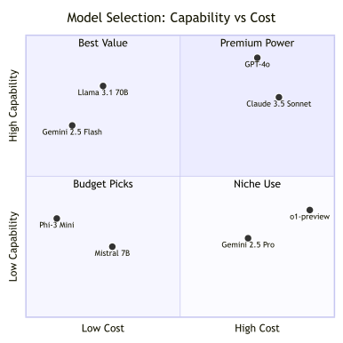
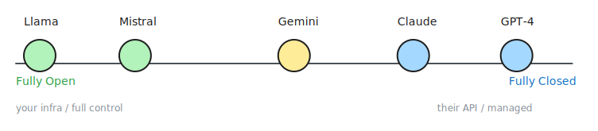

# 2. The LLM Landscape

> **🎯 Learning Objectives**
>
> - Compare the major LLM families (GPT, Claude, Gemini, Llama, Mistral) by capability and cost
> - Choose the right model for a given use case using a decision matrix
> - Evaluate the tradeoffs between open-source and closed-source models

## The $60,000 Support Bot

<!-- IMAGE: A traffic splitter or fork on a clean digital pathway. Simple envelope and message icons (with basic shapes like keys) are routed to a small, sleek server tower, while complex puzzle-piece and gear icons are routed to a large, glowing neural-network dome. Conveys routing traffic between models to optimize cost. -->

<!-- END IMAGE -->

A startup building a customer support bot chose GPT-4 for everything. The product worked well. The monthly API bill did not: $60,000. After profiling their traffic, the engineering team discovered that 80% of incoming queries were simple questions ("What are your hours?" "How do I reset my password?") that a smaller model could handle without any loss in quality. They routed those to GPT-4o-mini and kept GPT-4 for the complex, multi-step cases. The new monthly bill: $8,000.

The lesson is not that GPT-4 is too expensive. The lesson is that choosing the right model is an engineering decision, not a brand loyalty one. A single application often benefits from two or three models working together, each matched to the complexity of the task it handles.

In this chapter, you will learn the current LLM landscape, understand what differentiates each model family, and build a practical decision framework for selecting models by use case, constraint, and budget.

## The Major Model Families

The LLM market in 2025 has five major players and a growing ecosystem of open-source alternatives. Each model family has distinct strengths, pricing, and tradeoffs.


| Model | Provider | Context | Strengths | Pricing (per 1M tokens) |
|:------|:---------|:--------|:----------|:-----------------------|
| **GPT-4o** | OpenAI | 128K | Best all-rounder, strong reasoning | $2.50 in / $10.00 out |
| **GPT-4o-mini** | OpenAI | 128K | Fast, cheap, good for simple tasks | $0.15 in / $0.60 out |
| **Claude 3.5 Sonnet** | Anthropic | 200K | Best for long documents, coding | $3.00 in / $15.00 out |
| **Claude 3.5 Haiku** | Anthropic | 200K | Fast, cheap Anthropic option | $0.25 in / $1.25 out |
| **Gemini 2.5 Pro** | Google | 1M | Largest context window | $1.25 in / $10.00 out |
| **Gemini 2.0 Flash** | Google | 1M | Free tier available, fast | $0.10 in / $0.40 out |
| **Llama 3.1 70B** | Meta (open) | 128K | Self-hosted, no data leaves | Free (compute cost) |
| **Mistral Large** | Mistral (open) | 128K | Strong European option | $2.00 in / $6.00 out |
| **Phi-3 Medium** | Microsoft (open) | 128K | Small but capable, edge deployment | Free (compute cost) |

> [!WARNING]
> **Prices change frequently.** The pricing table in this chapter reflects mid-2025 rates. Always check the provider's current pricing page before making cost projections.

Notice the cost spread. GPT-4o-mini costs $0.15 per million input tokens. GPT-4o costs $2.50, roughly 17 times more. For a task like sentiment classification where both models perform equally well, the cheaper option saves you 94% on API costs with no quality penalty.

### A Quick Cost Example

Here is a simple function to estimate the cost of an API call given the token counts and model:

```python
def estimate_cost(input_tokens, output_tokens, model="gpt-4o"):
    pricing = {
        "gpt-4o":        {"input": 2.50, "output": 10.00},
        "gpt-4o-mini":   {"input": 0.15, "output": 0.60},
        "claude-sonnet": {"input": 3.00, "output": 15.00},
        "gemini-flash":  {"input": 0.10, "output": 0.40},
    }
    rates = pricing.get(model, pricing["gpt-4o"])
    cost = (input_tokens * rates["input"] + output_tokens * rates["output"]) / 1_000_000
    print(f"{model}: {input_tokens} in + {output_tokens} out = ${cost:.4f}")
    return cost

estimate_cost(1000, 500, "gpt-4o")       # $0.0075
estimate_cost(1000, 500, "gpt-4o-mini")   # $0.0005
estimate_cost(1000, 500, "gemini-flash")  # $0.0003
```

At 10,000 calls per day, the difference between GPT-4o and Gemini Flash adds up to over $2,000 per month.

## Decision Matrix: Choosing the Right Model

Picking a model is not about finding the "best" one. It is about finding the best one for your specific constraints.

### By Use Case

| Use Case | Recommended Model | Why |
|:---------|:-----------------|:----|
| Quick prototyping | GPT-4o-mini / Gemini Flash | Cheap, fast iteration |
| Production chatbot | GPT-4o / Claude Sonnet | Reliable, well-rounded |
| Code generation | Claude Sonnet / GPT-4o | Top coding benchmarks |
| Document analysis (long) | Gemini 2.5 Pro | 1M token context |
| Summarization | Any capable model | All do well here |
| Classification | GPT-4o-mini / Gemini Flash | Simple task, save money |
| Creative writing | Claude Sonnet / GPT-4o | Best prose quality |
| Data extraction (JSON) | GPT-4o-mini with JSON mode | Structured output support |
| Privacy-sensitive | Llama 3.1 / Mistral (self-hosted) | Data stays on-premise |
| Multilingual | GPT-4o / Gemini Pro | Best language coverage |


### By Constraint

| Constraint | Approach |
|:-----------|:---------|
| Budget under $10/month | Gemini Flash (free tier) or GPT-4o-mini |
| Must be self-hosted | Llama 3.1, Mistral, Phi-3 |
| Must handle 500+ page documents | Gemini 2.5 Pro (1M context) |
| Need fastest response time | GPT-4o-mini, Gemini Flash |
| Regulatory (EU data residency) | Mistral (EU-based) or self-hosted |

The comparison chart maps models by capability and cost; the sketch below provides a step-by-step decision tree to select the right model based on your constraints.



### Model Selection Walkthrough

To make this concrete, walk through three scenarios:

Scenario 1: **Internal FAQ Bot.** Your company wants a Slack bot that answers HR policy questions. The questions are short, the answers are in a 20-page handbook, and accuracy matters more than creativity. Pick GPT-4o-mini or Gemini Flash. The task is simple classification plus retrieval, and the cheaper models handle it well. Save the budget for scaling.

Scenario 2: **Legal Document Analyzer.** A law firm needs to review 200-page contracts and flag risky clauses. The documents are sensitive (client privilege). Pick Gemini 2.5 Pro for the 1M-token context window. If data cannot leave the firm's servers, switch to Llama 3.1 70B self-hosted, accepting a smaller context window and chunking the document.

Scenario 3: **Coding Assistant.** Your team wants an LLM that reviews pull requests and suggests improvements. Code quality and reasoning matter. Pick Claude 3.5 Sonnet or GPT-4o. Both lead the HumanEval benchmark. Start with GPT-4o-mini during development to save costs, then switch to the full model for production.

> [!TIP]
> **Cross-Reference:** For a detailed breakdown of which tasks each model handles best, see [Chapter 4](04-capabilities-limitations.md): Model Capabilities & Limitations. For advanced strategies to minimize your monthly API bill, see [Chapter 13](13-cost-optimization.md): Cost, Latency & Error Handling.

> [!NOTE]
> **Start cheap, scale up.** Begin every project with the cheapest model that might work (GPT-4o-mini or Gemini Flash). Only upgrade to a larger model when you hit a quality ceiling. Most tasks do not need the most powerful model.

## Open Source vs Closed Source

The LLM landscape is split between proprietary API-only models and open-weight models you can run on your own infrastructure. Neither is universally better; the right choice depends on your constraints.



| Factor | Closed Source (API) | Open Source (Self-hosted) |
|:-------|:-------------------|:-------------------------|
| **Quality** | Highest (GPT-4o, Claude Sonnet) | Competitive for many tasks (Llama 3.1 70B) |
| **Setup effort** | Minutes (get API key, make call) | Hours to days (GPU provisioning, deployment) |
| **Data privacy** | Data leaves your control | Data stays on your servers |
| **Cost model** | Per-token usage fee | One-time compute cost + infrastructure |
| **Updates** | Provider handles improvements | You manage model versions |
| **Customization** | Limited to prompting and fine-tuning APIs | Full control (fine-tune, quantize, modify) |
| **Vendor lock-in** | Tied to provider's pricing and policies | No vendor dependency |

### The Hybrid Approach

Most production systems benefit from a hybrid strategy:

1. Use closed-source APIs for development and prototyping (fast setup, best quality)
2. Evaluate open-source alternatives before production (cost savings at scale)
3. Route sensitive data through self-hosted open-source models
4. Implement model fallback: if the primary provider is down, route to a backup

This is exactly what the `shared/llm_client.py` pattern in this book's companion code supports. By using `litellm` as a provider-agnostic layer, you can switch from OpenAI to Gemini to a self-hosted Llama endpoint by changing a single environment variable.

> [!NOTE]
> **Did You Know?** Gemini 2.5 Pro supports a 1-million-token context window. That is roughly 3,000 pages of text in a single prompt. For comparison, GPT-4o supports 128K tokens (about 400 pages). A year before that, 4K tokens was the standard.

## Benchmarks: What They Tell You?

<!-- IMAGE: A tall stack of books and pages on the left funneling down into a tiny chip on the right, with a small-vs-huge size contrast. Conveys a very large context window. -->

<!-- END IMAGE -->

Benchmarks provide a standardized way to compare models, but they come with important caveats.

The top two or three models on any benchmark are usually within a few percentage points of each other. The gap between "first place" and "third place" is often smaller than the gap between a good prompt and a bad prompt on the same model.

| Benchmark | What It Tests | Leaders (2025) |
|:----------|:-------------|:---------------|
| **MMLU** | General knowledge across 57 subjects | GPT-4o, Claude Sonnet |
| **HumanEval** | Code generation (Python) | Claude Sonnet, GPT-4o |
| **MATH** | Mathematical reasoning | GPT-4o, Gemini Pro |
| **MT-Bench** | Multi-turn conversation quality | Claude Sonnet, GPT-4o |
| **GPQA** | Graduate-level science questions | GPT-4o, Claude Sonnet |

> [!IMPORTANT]
> **Benchmarks do not replace your own evaluation.** A model that scores highest on MMLU may underperform on your specific use case. Always test with your actual data, your actual prompts, and your actual success criteria before committing to a model for production.

Benchmarks also have a contamination problem. Models trained on internet data may have seen benchmark questions during pre-training, inflating their scores. Newer benchmarks like GPQA attempt to mitigate this with graduate-level questions that are less likely to appear in training data.

> [!TIP]
> **Cross-Reference:** For techniques to build your own evaluation harness, see [Chapter 8](08-iteration-evaluation.md): Iteration & Evaluation.

## Decoding Model Names

Browse any provider's model catalog and you will find names like "Claude Opus 4.6 Thinking Fast," "GPT-5.5 Low Thinking," or "Gemini 3 Flash High." These are not random words. Each name follows a pattern: **base model + variant modifiers**. Understanding the modifiers helps you pick the right model without reading every spec sheet.

| Modifier | What It Means | When to Use It |
|:---------|:-------------|:---------------|
| **Thinking** | Extended reasoning mode. The model "thinks" before answering, using more tokens internally. Better accuracy on complex tasks, higher cost and latency. | Multi-step math, code debugging, logic puzzles |
| **Fast** | Speed-optimized variant. Lower latency, sometimes at the cost of quality or higher price for the same capability. | Real-time chat, autocomplete, latency-sensitive UIs |
| **High** | Higher quality or reasoning effort within a model family. | Production tasks where accuracy matters more than speed |
| **Low** | Lower quality/effort. Cheaper and faster, acceptable for simple tasks. | Classification, simple extraction, high-volume batch |
| **Max** | Maximum capability setting. Highest reasoning effort, highest cost. | Complex agentic workflows, research-grade tasks |
| **Medium / Minimal** | Mid-range or baseline effort. Balanced cost and quality. | General-purpose use when you do not need extremes |
| **Mini** | Smaller, cheaper model in the same family. Fewer parameters. | Prototyping, simple tasks, budget-constrained apps |
| **Adaptive** | Auto-routes to the best model for each request. The provider decides. | When you want the provider to optimize cost vs quality |
| **1M** | Extended context window variant (e.g., 1 million tokens). | Very long documents, entire codebases in one prompt |
| **Codex** | Code-specialized variant. Optimized for code generation and editing. | IDE copilots, automated code review, refactoring |

The naming conventions differ by provider. OpenAI uses suffixes like "Low Thinking" and "Codex Max High." Anthropic uses family names (Haiku, Sonnet, Opus) for tiers and appends "Thinking" or "Fast." Google uses "Flash" for speed, "Pro" for quality, and appends "High/Low Thinking." Despite the inconsistency, the underlying concepts are the same across providers.

> [!TIP]
> **Practical Rule:** Start with the cheapest model that might work. Add a "Thinking" variant only if you hit reasoning failures. Move to "Fast" only if latency is a measured problem. Most applications never need "Max" or "High."

> [!NOTE]
> **Deep Dive:** For a detailed breakdown of every provider's naming scheme with examples and a decision flowchart, see [Model Naming Guide](https://github.com/kpassoubady/building-with-llms-companion/blob/main/references/model-naming-guide.md) in the companion repository.

## Key Terminology Quick Reference

These terms appear throughout the book. Bookmark this table for reference.

| Term | Meaning |
|:-----|:--------|
| **Parameters** | Number of trainable weights (e.g., 70B = 70 billion parameters) |
| **Context window** | Maximum input + output tokens per request |
| **TPM** | Tokens per minute (rate limit imposed by the provider) |
| **RPM** | Requests per minute (rate limit imposed by the provider) |
| **Temperature** | Controls output randomness (0 = deterministic, higher = more creative) |
| **Top-p** | Alternative to temperature; nucleus sampling that considers only the top probability mass |
| **Fine-tuning** | Further training a base model on domain-specific data |
| **RLHF** | Reinforcement Learning from Human Feedback; aligns model behavior with human preferences |
| **Quantization** | Compressing model weights to use less memory (e.g., 4-bit), enabling larger models on smaller hardware |

## 🧪 Try It Yourself

### Exercise 1: Cost Comparison Calculator

Extend the cost estimator from earlier in this chapter to compare all four model tiers for a realistic workload. Assume 5,000 API calls per day with an average of 800 input tokens and 400 output tokens each.

```python
def daily_cost(calls, input_tokens, output_tokens, model, rates):
    cost = calls * (input_tokens * rates["input"] + output_tokens * rates["output"]) / 1_000_000
    print(f"{model:18} → ${cost:>8.2f}/day  (${cost * 30:>10.2f}/month)")
```

```python
pricing = {
    "gpt-4o":        {"input": 2.50, "output": 10.00},
    "gpt-4o-mini":   {"input": 0.15, "output": 0.60},
    "claude-sonnet":  {"input": 3.00, "output": 15.00},
    "gemini-flash":  {"input": 0.10, "output": 0.40},
}
```

```python
for model, rates in pricing.items():
    daily_cost(5000, 800, 400, model, rates)
```

### Exercise 2: Model Selection Decision Tree

For each scenario below, pick the best model and justify your choice:

1. A startup with a $50/month budget needs to classify customer feedback as positive, negative, or neutral.
2. A healthcare company must analyze patient records that cannot leave their private cloud.
3. A publisher wants to summarize 300-page manuscripts into 2-page synopses.

> [!TIP]
> **Starter Code:** The companion repository contains full exercises, starter code, and solutions for calculating API costs and selecting the right model for specific use cases.
> - [building-with-llms-companion/exercises/ch02/cost_calculator.py](https://github.com/kpassoubady/building-with-llms-companion)
> - [building-with-llms-companion/exercises/ch02/model_selector.py](https://github.com/kpassoubady/building-with-llms-companion)

## 📋 Chapter Summary

> **💡 Key Takeaways**
>
> - Model selection is an engineering decision: cost per million tokens varies 150x across the available options, so matching model to task complexity directly determines API spend.
> - Open-source models keep data on your infrastructure and eliminate vendor lock-in, but require GPU provisioning; closed-source APIs offer minutes-to-start setup at the cost of data leaving your control.
> - Benchmark rankings are a starting point, not a verdict: the gap between first and third place is usually smaller than the gap a well-crafted prompt produces on the same model.

> [!PITFALLS]
> - Using the most powerful (and expensive) model for every task, including simple ones
> - Trusting benchmark rankings without testing models on your actual use case
> - Assuming open-source models are always cheaper (GPU infrastructure costs add up)

## 🧠 Knowledge Check

1. **Multiple Choice:** Which model family offers the largest context window as of 2025?

    ::: {.mcq-2col}
    - [ ] OpenAI GPT-4o (128K)
    - [ ] Anthropic Claude 3.5 Sonnet (200K)
    - [ ] Google Gemini 2.5 Pro (1M)
    - [ ] Meta Llama 3.1 (128K)
    :::

2. **True or False:** Open-source models are always cheaper to run than closed-source API models.

    ::: {.tf-inline}
    - [ ] True
    - [ ] False
    :::

3. **Fill in the Blank:** The practice of compressing model weights to use less memory (e.g., from 16-bit to 4-bit) is called ______.

4. **Multiple Choice:** For a budget-constrained classification task, which model would you try first?

    ::: {.mcq-2col}
    - [ ] GPT-4o
    - [ ] Claude 3.5 Sonnet
    - [ ] GPT-4o-mini
    - [ ] Llama 3.1 405B
    :::

5. **Scenario:** Your company processes medical records that cannot leave your private cloud. You need a model for summarization. What model type should you choose, and what is the main tradeoff?

<details>
<summary><strong>Click to Reveal Answers</strong></summary>

1. **Google Gemini 2.5 Pro (1M)** - at 1 million tokens, Gemini 2.5 Pro supports roughly 3,000 pages of text in a single request, far exceeding other options.
2. **False** - open-source models require GPU infrastructure (purchase or rental). For low-volume workloads, a pay-per-token API can be cheaper than maintaining dedicated GPU servers.
3. **Quantization** - quantization reduces model size and memory requirements, enabling larger models to run on consumer-grade hardware at the cost of some precision.
4. **GPT-4o-mini** - for a simple classification task, GPT-4o-mini provides sufficient quality at $0.15 per million input tokens, roughly 17x cheaper than GPT-4o.
5. **A self-hosted open-source model** (Llama 3.1 or Mistral). The data stays on your infrastructure, satisfying the privacy requirement. The main tradeoff is that you need GPU infrastructure and the model quality may be slightly lower than the top closed-source alternatives for the same parameter count.

</details>
