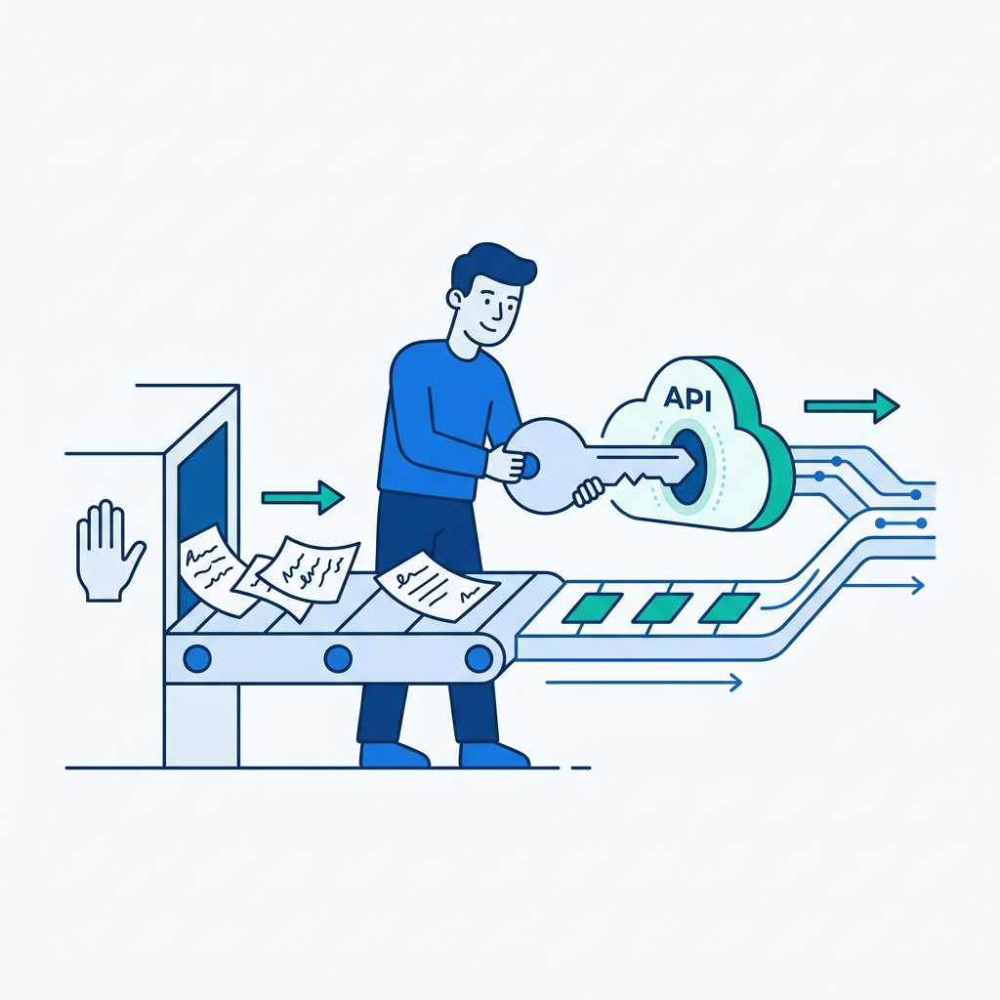
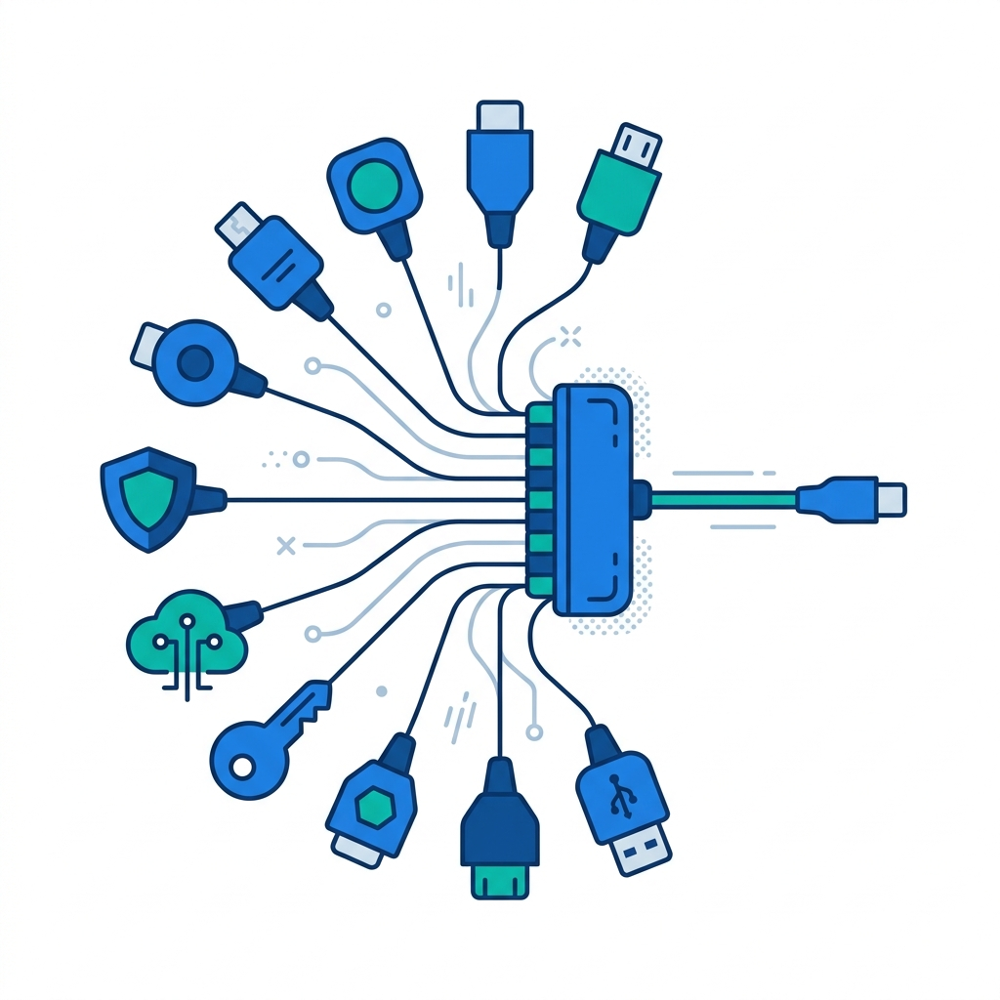
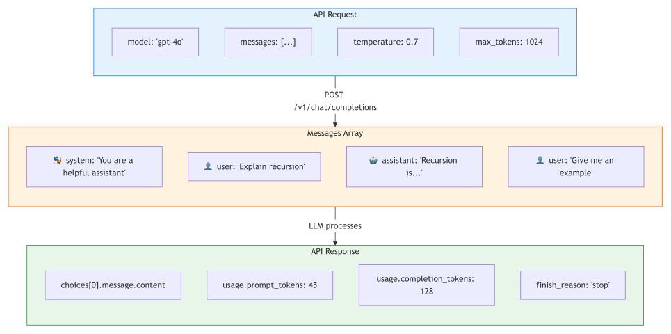
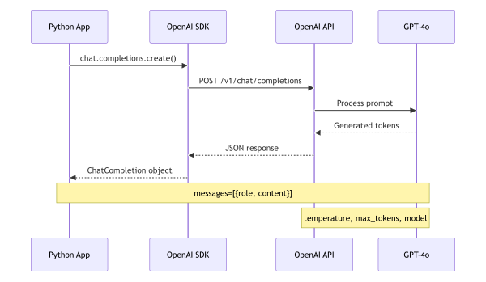

# 3. Working with LLM APIs

> **🎯 Learning Objectives**
>
> - Set up a provider-agnostic LLM development environment using litellm
> - Make API calls with proper message structure (system, user, assistant roles)
> - Interpret API responses: choices, usage, finish_reason

## Five Lines, One Billing Meter

<!-- IMAGE: A conveyor belt carrying messy, hand-sorted paper tickets that transitions into a clean digital pathway. A developer stands at the transition, plugging a key-shaped connector into a glowing API cloud socket. Conveys replacing a manual pipeline with an automated API call. -->

<!-- END IMAGE -->

Your first "Hello, World!" was one line of code. Your first LLM call is five. In both cases, the simplicity is deceptive. `print("Hello, World!")` hides a compiler, a runtime, and an operating system. Those five lines of LLM code hide a network request, a tokenizer, a billion-parameter model, and a billing meter that charges you for every token in and every token out.

In 2022, a Shopify engineering team replaced a manual ticket classification pipeline that took 15 hours of human effort per week with a 12-line Python script that called an LLM API. Classification accuracy went from 78% to 94%, and the weekly cost dropped from several hundred dollars in labor to under two dollars in API fees. The hardest part was not writing the script. It was understanding what the API expected, what it returned, and where the hidden costs lived.

In this chapter, you will make your first API calls, understand the anatomy of requests and responses, and learn the message role system that structures every LLM conversation. By the end, you will have a working development environment and the confidence to call any LLM from code.

## Setting Up Your Environment

Before writing your first API call, you need three things: an API key from at least one provider, a Python environment with the right packages, and a configuration file that keeps your secrets out of your source code.

### Getting API Keys

Each major LLM provider requires an API key for authentication. You only need one to get started, but the course setup supports all three so you can compare models later.

| Provider | Where to Get a Key | Free Tier |
|:---------|:-------------------|:----------|
| OpenAI | platform.openai.com/api-keys | $5 credit for new accounts |
| Google Gemini | aistudio.google.com/apikey | Generous free tier (60 RPM) |
| Anthropic | console.anthropic.com | $5 credit for new accounts |

> [!IMPORTANT]
> **Never hardcode API keys.** Use environment variables or a `.env` file. See [Chapter 12](12-security-guardrails.md) for production-grade key management.

### Installing Dependencies

The project uses three key packages. Install them with pip:

```bash
pip install litellm python-dotenv tiktoken
```

`litellm` handles the API routing. `python-dotenv` loads your `.env` file into environment variables. `tiktoken` provides fast token counting for cost estimation (you will use this in [Chapter 4](04-capabilities-limitations.md)). All three are listed in the project's `requirements.txt`.

### The `.env` File

Create a `.env` file in your project root. This file is already in `.gitignore`, so it will never be committed to version control.

```bash
# Which provider to use: openai | gemini | claude
LLM_PROVIDER=openai

# Set the key for your chosen provider
OPENAI_API_KEY=sk-your-key-here
GEMINI_API_KEY=your-gemini-key-here
ANTHROPIC_API_KEY=sk-ant-your-key-here
```

### The Provider-Agnostic Wrapper

This book uses `litellm`, a library that provides a single API interface to 100+ LLM providers. You write one set of code, and it works with OpenAI, Gemini, Claude, or any other supported provider.

The `shared/llm_client.py` module wraps `litellm` with two convenience functions:

- `get_completion()` returns the response text as a string.
- `get_completion_full()` returns the full response object with metadata (token counts, finish reason).

```python
from shared import get_completion, show_config

show_config()  # verify your setup
```

Expected output:

```
Provider:      openai
Default model: gpt-4o
Mini model:    gpt-4o-mini
Credential:    OPENAI_API_KEY = ...abcd
```

The wrapper maps two tiers to provider-specific model names:

| Tier | OpenAI | Gemini | Claude |
|:-----|:-------|:-------|:-------|
| `"default"` | gpt-4o | gemini-2.5-flash | claude-sonnet-4 |
| `"mini"` | gpt-4o-mini | gemini-2.0-flash | claude-haiku-4.5 |

Use `"mini"` for experimentation and development. Use `"default"` when you need higher quality or are comparing output.

> [!NOTE]
> **Did You Know?** The `litellm` library supports 100+ LLM providers with a single API interface. You can switch from OpenAI to Gemini to Claude by changing one string in your `.env` file.

## Anatomy of an API Request

<!-- IMAGE: A central universal adapter hub with one clean cable out and many small provider plugs of different shapes fanning in. Conveys one interface, many providers. -->

<!-- END IMAGE -->

Every LLM API call follows the same pattern: you send a model name, a list of messages, and optional parameters. The model processes your input and returns a response. The entire exchange is stateless. The model does not remember previous calls.



The diagram shows the round trip between your application and the API; the sketch below breaks down the anatomy of a single request into its core components.


Here is the simplest possible call:

```python
from shared import get_completion

response = get_completion(
    messages=[
        {"role": "user", "content": "What is Python in one sentence?"}
    ],
    tier="mini",
)
```

```python
print(response)
# Output: Python is a versatile, high-level programming language 
# known for its readable syntax and wide use in web development, data 
# science, AI, and automation.
```

Five lines. That is all it takes to query one of the most capable language models ever built. Now let's understand what each part does.



### The `model` Parameter

The model string tells the API which LLM to use. Different models have different capabilities, speeds, and costs. In this book, the `tier` parameter maps to the right model for your configured provider, so you write `tier="mini"` or `tier="default"` instead of hardcoding a model name.

Under the hood, when you pass `tier="mini"` with `LLM_PROVIDER=openai`, the wrapper resolves it to `gpt-4o-mini`. When you switch your `.env` to `LLM_PROVIDER=gemini`, the same `tier="mini"` resolves to `gemini/gemini-2.0-flash`. Your code stays the same; only the configuration changes.

### The `messages` Array

The `messages` parameter is a list of dictionaries, each with a `role` and `content` field. This list represents the conversation history. For a single-turn interaction, you send one message. For multi-turn conversations, you send the entire history.

```python
messages = [
    {"role": "system", "content": "You are a helpful Python tutor."},
    {"role": "user", "content": "What is a list comprehension?"},
]
```

### Key Parameters

```python
response = get_completion(
    messages=[...],
    tier="default",  # "default" = capable, "mini" = fast/cheap
    temperature=0.7, # 0.0 = deterministic, 2.0 = creative chaos
    max_tokens=1024, # maximum response length in tokens
)
```

> [!TIP]
> **Cross-Reference:** For a deep dive into temperature, top_p, and other parameters that control output, see [Chapter 7](07-api-parameters.md): API Parameters & Output Control.

## Anatomy of an API Response

When the model finishes processing, the API returns a response object containing the generated text, token usage statistics, and a reason for stopping. Understanding this response is essential for debugging, cost tracking, and building reliable applications.

```python
from shared import get_completion_full

response = get_completion_full(
    messages=[{"role": "user", "content": "Say hello in three languages."}],
    tier="mini",
)

# The generated text
print(response.choices[0].message.content)
# "Hello (English), Hola (Spanish), Bonjour (French)"

# Token usage: this is what you pay for
print(response.usage.prompt_tokens)       # 10
print(response.usage.completion_tokens)   # 15
print(response.usage.total_tokens)        # 25

# Why did the model stop?
print(response.choices[0].finish_reason)  # "stop"
```

### The `choices` Array

The response includes a `choices` array. For standard calls, it contains one element at index 0. The `message.content` field holds the generated text.

### The `usage` Object

The `usage` object tracks three values:

| Field | What It Counts |
|:------|:---------------|
| `prompt_tokens` | Tokens in your input (system + user messages) |
| `completion_tokens` | Tokens the model generated |
| `total_tokens` | Sum of input + output (this is what you are billed for) |

> [!TIP]
> **Always log token usage.** Add `print(response.usage)` to every call during development. It will save you from surprise bills and help you optimize prompts for cost.

### The `finish_reason` Field

**finish_reason** tells you why the model stopped generating:

| finish_reason | Meaning | Action |
|:-------------|:--------|:-------|
| `stop` | Model completed its response naturally | None needed |
| `length` | Hit `max_tokens` limit, response is truncated | Increase `max_tokens` or shorten your prompt |
| `content_filter` | Content blocked by safety filters | Rephrase the prompt or review the content |

If you see `finish_reason="length"`, your response was cut off mid-sentence. This is one of the most common bugs in LLM applications, and it is easy to miss if you do not check.

### Putting It Together: A Response Logger

Here is a reusable helper that logs every API call's key metadata. Add this to your development workflow early. It takes seconds to write and saves hours of debugging.

```python
from shared import get_completion_full

def logged_call(messages, tier="mini", **kwargs):
    """Make an API call and log the response metadata."""
    response = get_completion_full(messages=messages, tier=tier, **kwargs)
    content = response.choices[0].message.content
    usage = response.usage
    finish = response.choices[0].finish_reason
    print(f"[{tier}] {usage.prompt_tokens} in + "
          f"{usage.completion_tokens} out | finish={finish}")
    if finish == "length":
        print("⚠️  Response was truncated! Increase max_tokens.")
    return content
```

## The Three Roles Explained

The message role system is the grammar of LLM conversations. Every message has one of three roles, and understanding when to use each one is the difference between a mediocre prompt and a production-quality one.


| Role | Purpose | When to Use |
|:-----|:--------|:------------|
| `system` | Set the model's persona, rules, and output format | Always (first message in the array) |
| `user` | Provide the actual request or input data | Every turn (the human's input) |
| `assistant` | Include previous model responses | Multi-turn conversations only |

### System: The Persistent Persona

**System message** shapes every response the model gives. It persists across all turns in a conversation. A well-crafted system message is the single highest-leverage investment you can make in prompt quality.

```python
messages = [
    {"role": "system", 
    "content": "You are a senior Python developer. "
        "Give concise answers with code examples. "
        "Use type hints in all code."},
    {"role": "user", "content": "How do I read a CSV file?"},
]
```

Without the system message, the model defaults to a generic helpful assistant. With it, you get focused, consistent, role-appropriate responses.

Common patterns for system messages:

- **Persona:** "You are a security expert specializing in OWASP Top 10."
- **Structured output:** "Always respond in valid JSON. No text outside the JSON."
- **Constrained response:** "Classify as exactly one of: BUG, FEATURE, QUESTION."
- **Audience:** "Explain to a junior developer with less than one year of experience."

You can combine these. A system message that sets a persona, constrains the output format, and specifies the audience will produce dramatically better results than a bare user prompt with no system message at all.

### User: The Request

The user message contains the actual question, instruction, or data you want the model to process. It changes every turn.

### Assistant: The Memory

The assistant role includes the model's previous responses. Because LLMs are stateless (they do not remember previous calls), you must send the entire conversation history each time.

```python
conversation = [
    {"role": "system", "content": "You are a Python tutor."},
    {"role": "user", "content": "What is a decorator?"},
    {"role": "assistant", 
    "content": "A decorator is a function that wraps "
        "another function to extend its behavior..."},
    {"role": "user", "content": "Show me an example."},
]
```

The model sees the full history and responds in context

```python
response = get_completion(messages=conversation)
```

Each turn sends all previous messages again, which means token costs grow with conversation length. [Chapter 9](09-conversation-design.md) covers strategies for managing long conversations.

> [!WARNING]
> **Each turn resends the full conversation.** A 20-turn conversation with a detailed system message can easily consume 5,000+ input tokens per turn. Monitor your token usage and consider truncating older messages when costs grow.

## Error Handling

API calls can fail for reasons outside your control: rate limits, network outages, authentication errors, or content policy violations. Robust applications handle these gracefully.

```python
from shared import get_completion
import litellm

try:
    response = get_completion(
        messages=[{"role": "user", "content": "Hello!"}],
    )
    print(response)
except litellm.exceptions.RateLimitError:
    print("Rate limited: wait and retry with exponential backoff")
except litellm.exceptions.AuthenticationError:
    print("Bad API key: check your .env file")
except litellm.exceptions.APIConnectionError:
    print("Network error: check your internet connection")
except Exception as e:
    print(f"Unexpected error: {e}")
```

The most common errors you will encounter during development:

| Error | Cause | Fix |
|:------|:------|:----|
| `AuthenticationError` | Invalid or missing API key | Check `.env` file, regenerate key if needed |
| `RateLimitError` | Too many requests per minute | Add retry logic with exponential backoff |
| `APIConnectionError` | Network failure or provider outage | Check connectivity, try again later |
| `InvalidRequestError` | Malformed messages or exceeding context window | Validate input, reduce token count |
| `ContentFilterError` | Prompt or response blocked by safety filters | Rephrase the prompt |

For production applications, implement retry logic with exponential backoff. Start with a 1-second delay, double it on each retry, and cap at 3 to 5 attempts. Most rate limit errors resolve within a few seconds. The `litellm` library includes built-in retry support, but understanding the error types helps you write better fallback logic and user-facing error messages.

## Billing and Cost Awareness

Understanding how you are billed prevents surprise charges. Every API call costs money, and costs vary dramatically across models.

| Model | Input (per 1M tokens) | Output (per 1M tokens) | Relative Cost |
|:------|:---------------------|:----------------------|:-------------|
| GPT-4o-mini | $0.15 | $0.60 | 1x (baseline) |
| Gemini Flash | $0.10 | $0.40 | 0.7x |
| GPT-4o | $2.50 | $10.00 | 16x |
| Claude Sonnet | $3.00 | $15.00 | 20x |

A typical development session running 50 API calls with the mini tier costs less than $0.05. The same session with GPT-4o costs about $0.80. Over a month of active development, those differences compound.

Two rules of thumb for cost management:

1. **Develop with mini, deploy with whatever the task requires.** You do not need GPT-4o to iterate on your prompt structure. Switch to the capable tier only for final quality checks.
2. **Log every call.** Track prompt_tokens, completion_tokens, and model name in a log file or database. This data is invaluable for optimizing costs later.

> [!TIP]
> **Cross-Reference:** For advanced cost optimization strategies including prompt caching and batching, see [Chapter 13](13-cost-optimization.md): Cost Optimization & Monitoring.

## Your First 5 API Calls

The best way to build intuition for LLM capabilities is to try several different tasks with the same setup. Each example below is a complete, working call.

### 1. Summarization

```python
from shared import get_completion

paragraph = (
    "Machine learning is a subset of artificial intelligence that "
    "focuses on building systems that learn from data. Unlike "
    "traditional programming where rules are explicitly coded, ML "
    "algorithms identify patterns in data and make decisions with "
    "minimal human intervention."
)

response = get_completion(
    messages=[
        {"role": "system", "content": "Summarize in exactly one sentence."},
        {"role": "user", "content": paragraph},
    ],
    tier="mini",
)
print(response)
# Output: Machine learning is an AI subfield where algorithms learn
#         patterns from data rather than following hand-coded rules.
```

### 2. Classification

```python
from shared import get_completion

response = get_completion(
    messages=[
        {"role": "system", 
        "content": "Classify as POSITIVE, NEGATIVE, or "
            "NEUTRAL. Respond with only the label."},
        {"role": "user", "content": "The food was okay but nothing special."},
    ],
    tier="mini",
    temperature=0.0,
)
print(response)  # Output: NEUTRAL
```

### 3. Translation

```python
from shared import get_completion

response = get_completion(
    messages=[
        {"role": "system", 
        "content": "Translate to Spanish. "
            "Return only the translation."},
        {"role": "user", "content": "The quick brown fox jumps over the lazy dog."},
    ],
    tier="mini",
)
print(response)
# Output: El rápido zorro marrón salta sobre el perro perezoso.
```


### 4. Code Generation

```python
from shared import get_completion

response = get_completion(
    messages=[
        {"role": "system", "content": "Write Python code only. No explanation."},
        {"role": "user", 
        "content": "Write a function that checks if a string "
            "is a palindrome."},
    ],
    tier="mini",
    temperature=0.0,
)
print(response)
```

### 5. Explanation

```python
from shared import get_completion

response = get_completion(
    messages=[
        {"role": "system", 
        "content": "Explain to a 10-year-old. "
            "Use simple words and an analogy."},
        {"role": "user", "content": "What is recursion?"},
    ],
    tier="mini",
)
print(response)
```

### Comparing Approaches: get_completion vs get_completion_full

| Feature | `get_completion()` | `get_completion_full()` |
|:--------|:-------------------|:-----------------------|
| Return type | String (response text only) | Full response object |
| Token usage | Not available | `response.usage.total_tokens` |
| Finish reason | Not available | `response.choices[0].finish_reason` |
| When to use | Quick prototyping, simple scripts | Production code, debugging, cost tracking |

Use `get_completion()` when you just need the text. Use `get_completion_full()` when you need to inspect metadata, log usage, or debug response truncation.

### Comparing Tiers

Run the same prompt with both tiers and observe the quality difference:

```python
from shared import get_completion_full, get_model

prompt = "Explain the CAP theorem to a junior developer."

for tier in ["mini", "default"]:
    model = get_model(tier)
    response = get_completion_full(
        messages=[{"role": "user", "content": prompt}],
        tier=tier, temperature=0.3,
    )
    usage = response.usage
    print(f"\n[{model}] {usage.prompt_tokens} in + "
          f"{usage.completion_tokens} out = {usage.total_tokens} tokens")
    print(response.choices[0].message.content[:300])
```

> [!TIP]
> **Cross-Reference:** [Chapter 2](02-llm-landscape.md) covers how to choose between open and closed models, and when to upgrade from mini to default tier.

## 🧪 Try It Yourself

### Exercise 1: Inspect a Full Response

Make an API call using `get_completion_full()` and print every field: content, prompt_tokens, completion_tokens, total_tokens, and finish_reason. Then change `max_tokens` to 10 and observe what happens to `finish_reason`.

```python
from shared import get_completion_full

response = get_completion_full(
    messages=[
        {"role": "system", "content": "You are a helpful assistant."},
        {"role": "user", "content": "Explain what an API is."},
    ],
    max_tokens=10,
)
print(f"Content: {response.choices[0].message.content}")
print(f"Finish:  {response.choices[0].finish_reason}")
print(f"Tokens:  {response.usage.total_tokens}")
```

### Exercise 2: Build a Mini Classifier

Write a 10-line script that classifies support tickets into one of four categories: BILLING, TECHNICAL, ACCOUNT, or GENERAL. Test it with at least three different ticket descriptions.

> [!TIP]
> **Starter Code:** The companion repository contains full exercises, starter code, and solutions for making basic LLM API calls and building simple CLI Q&A scripts.
> - [building-with-llms-companion/exercises/ch03/hello_llm](https://github.com/kpassoubady/building-with-llms-companion/tree/main/exercises/ch03/hello_llm)
> - [building-with-llms-companion/exercises/ch03/cli_qa](https://github.com/kpassoubady/building-with-llms-companion/tree/main/exercises/ch03/cli_qa)

## 📋 Chapter Summary

> **💡 Key Takeaways**
>
> - The messages array uses three roles: system for persistent persona and rules, user for each request, and assistant for prior responses in multi-turn conversations; the model is stateless and needs the full history each call.
> - Always check `finish_reason` in the response: a value of `length` means the output was truncated at `max_tokens`, which silently cuts responses mid-sentence and is easy to miss.
> - Track `prompt_tokens` and `completion_tokens` on every call during development; developing with the mini tier costs 10 to 20 times less than the default tier for the same experimentation volume.

> [!PITFALLS]
> - Forgetting the system message (the model defaults to generic responses without one)
> - Not checking `finish_reason` (truncated responses look correct until you notice the missing ending)
> - Hardcoding API keys in source files (use `.env` and never commit secrets to version control)

## 🧠 Knowledge Check

1. **Multiple Choice:** Which role in the messages array persists across conversation turns and shapes every response?

    ::: {.mcq-2col}
    - [ ] user
    - [ ] assistant
    - [ ] system
    - [ ] function
    :::

2. **True or False:** The assistant role is only used in multi-turn conversations.

    ::: {.tf-inline}
    - [ ] True
    - [ ] False
    :::

3. **Fill in the Blank:** The ______ field in the API response tells you why the model stopped generating text.

4. **Multiple Choice:** What does `usage.prompt_tokens` count?

    ::: {.mcq-2col}
    - [ ] The number of tokens in the model's response
    - [ ] The total number of tokens in the request and response combined
    - [ ] The number of tokens in your input messages
    - [ ] The maximum number of tokens the model can generate
    :::

5. **Scenario:** Your API response has `finish_reason="length"` and the last sentence ends mid-word. What happened, and how do you fix it?

<details>
<summary><strong>Click to Reveal Answers</strong></summary>

1. **system**: the system message sets the model's persona, rules, and constraints. It is the first message in the array and influences every response.
2. **True**: you only need the assistant role when you are building multi-turn conversations and want the model to have context from its own prior responses.
3. **finish_reason**: the three possible values are `stop` (completed naturally), `length` ( hit the max_tokens limit), and `content_filter` (blocked by safety filters).
4. **The number of tokens in your input messages**: `prompt_tokens` counts the tokens sent to the model (system + user + assistant messages). Output tokens are tracked separately in `completion_tokens`.
5. **The response was truncated because it exceeded `max_tokens`.** The model was still generating when it hit the limit. Fix it by increasing `max_tokens` in your API call, or by shortening your input prompt to leave more room for the response within the context window.

</details>
