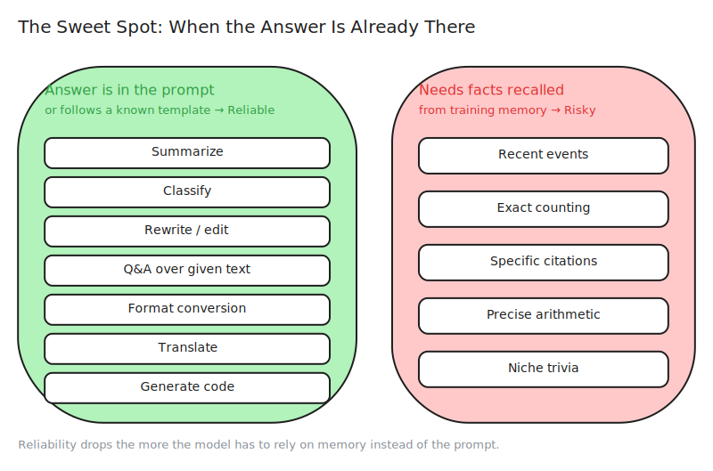
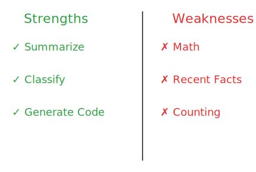
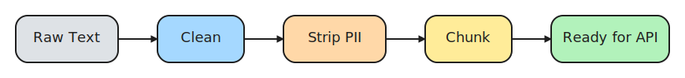
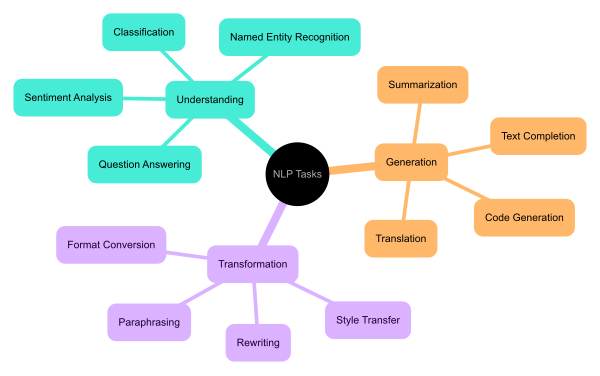

# 4. Model Capabilities & Limitations

> **🎯 Learning Objectives**
>
> - Identify the tasks where LLMs excel and where they consistently fail
> - Apply input preprocessing techniques to improve response quality
> - Make informed model selection decisions based on capability vs cost tradeoffs

## Six Cases That Never Existed

<!-- IMAGE: A balance scale with a confident robot head on one pan and a question-mark cloud on the other, evenly weighed. Conveys strengths balanced against limits. -->

<!-- END IMAGE -->

In June 2023, attorney Steven Schwartz submitted a legal brief to the Southern District of New York in the case Mata v. Avianca. The brief cited six prior court decisions to support his argument. The judge could not find any of them. That is because none of them existed. Schwartz had used ChatGPT to research the cases, and the model had fabricated six court decisions, complete with realistic-sounding case names, docket numbers, and procedural summaries. The judge imposed sanctions on Schwartz and his colleague, fining them $5,000 for submitting fictitious citations. The case is now taught in law schools as a cautionary tale about AI-generated content.

The irony is that the same model that invented those cases could have drafted a competent summary of a real case in seconds. LLMs are simultaneously remarkable and unreliable. They can write a working interpreter for a toy programming language, but they cannot reliably count the number of r's in "strawberry." They can translate a paragraph into 20 languages, but they will confidently tell you about events that happened after their training data was collected, making up the details as they go.

In this chapter, you will learn where LLMs excel, where they fail, and how to preprocess your inputs so the model has the best chance of giving you a useful response. Knowing the boundaries of what these models can do is not optional. It is the difference between building a reliable application and building one that fabricates court cases.

## Where LLMs Excel

LLMs are strongest when the task involves transforming, reorganizing, or generating text based on patterns they have seen billions of times during training. The following tasks consistently produce high-quality results across providers and model sizes.



| Task | Reliability | Best Tier | Why It Works |
|:-----|:-----------|:----------|:-------------|
| Summarization | Excellent | mini | Compression is a well-learned pattern |
| Classification | Very Good | mini | Labels are short; low chance of drift |
| Code generation | Very Good | default | Trained on billions of lines of code |
| Rewriting/editing | Excellent | mini | Paraphrasing is a core language skill |
| Translation | Good | default | Extensive multilingual training data |
| Q&A over given text | Excellent | mini | Answer is in the prompt; no fabrication needed |
| Format conversion | Excellent | mini | JSON to CSV, Markdown to HTML, SQL to ORM |
| 10+ Task Full Matrix | [Full Matrix](https://github.com/kpassoubady/building-with-llms-companion/blob/main/diagrams/ch04-capability-matrix.png) | default/mini | Detailed capability mapping in companion repo |

> [!TIP]
> **High-Resolution Matrix:** For a full-page Model Capability Matrix mapping 10+ tasks against reliability and cost tiers, see [Appendix E](appendix-e-diagrams.md#chapter-4-model-capability-matrix). The high-resolution file is also available in the companion repository:
> - [ch04-capability-matrix.png](https://github.com/kpassoubady/building-with-llms-companion/blob/main/diagrams/ch04-capability-matrix.png)

The pattern behind all of these: the answer is either contained in the prompt or follows a well-known template. When the model does not need to recall facts from its training data, it rarely fails.

### Code Explanation: A Developer's Best Friend

One of the most practical use cases is having an LLM explain unfamiliar code. You paste a function, and the model returns a plain-English breakdown of what it does, its parameters, and its edge cases.

```python
from shared import get_completion

code = """
def binary_search(arr, target):
    lo, hi = 0, len(arr) - 1
    while lo <= hi:
        mid = (lo + hi) // 2
        if arr[mid] == target:
            return mid
        elif arr[mid] < target:
            lo = mid + 1
        else:
            hi = mid - 1
    return -1
"""

response = get_completion(
    messages=[
        {"role": "system", 
        "content": "You are a senior Python developer. "
            "Explain the function's purpose, "
            "parameters, and time complexity "
            "in 3-4 sentences."},
        {"role": "user", 
        "content": f"Explain this code:\n```python\n{code}\n```"},
    ],
    tier="mini",
    temperature=0.3,
)
print(response)
```

This works reliably because the model does not need to recall external facts. Everything it needs is in the prompt. The code is the source of truth, and the model is just translating from Python to English.

### Structured Extraction: The Most Reliable Use Case

If you need to extract structured data from unstructured text, LLMs are your best tool. The output is short, the format is constrained, and the answer is always in the input.

```python
from shared import get_completion

text = ("Hi, I'm Sarah Chen from Acme Corp. "
        "I'm a Senior Engineer. Reach me at sarah@acme.com.")

response = get_completion(
    messages=[
        {"role": "system", 
        "content": "Extract these fields as JSON: "
            "name, email, company, role. "
            "Return ONLY valid JSON."},
        {"role": "user", "content": text},
    ],
    tier="mini",
    temperature=0.0,
)
print(response)
# Output:
# {"name": "Sarah Chen", "email": "sarah@acme.com",
#  "company": "Acme Corp", "role": "Senior Engineer"}
```

> [!NOTE]
> **Did You Know?** In the 2023 Mata v. Avianca case, a lawyer submitted a brief containing six fabricated court citations generated by ChatGPT. The Southern District of New York imposed sanctions. This case is now taught in law schools as a cautionary tale about AI-generated content.

<!-- IMAGE: A gavel resting on a document whose citation lines are dissolving into faint ghost shapes. Conveys fabricated, unreliable citations. Keep abstract and neutral. -->

<!-- END IMAGE -->

> [!TIP]
> **Cross-Reference:** To mitigate hallucinations by providing models with actual source material, see [Chapter 11](11-rag-architecture.md): Retrieval-Augmented Generation (RAG). For controlling output creativity and reducing "guesswork" with API parameters, see [Chapter 7](07-api-parameters.md).

## Where LLMs Fail

Understanding failure modes is more important than understanding strengths. A model that fails silently is more dangerous than one that throws an exception. LLMs never say "I don't know" unless you explicitly instruct them to. Instead, they generate plausible-sounding text regardless of whether it is true.



### 1. Hallucinations

**Hallucination** is when the model generates false information presented as fact. This is the most dangerous failure mode because the output looks authoritative.

```python
from shared import get_completion

response = get_completion(
    messages=[
        {"role": "user", 
        "content": "What paper did Guido van Rossum "
            "publish in Nature in 2019?"},
    ],
    tier="mini",
)
print(response)
# The model may fabricate a paper title, volume number, and abstract.
# None of it is real.
```

Hallucinations happen because LLMs predict the most likely next token, not the most truthful one. When asked about a paper that does not exist, the most likely continuation is a plausible-sounding citation, not "No such paper exists."

### 2. Mathematics and Counting

LLMs process text as tokens, not as numbers. They do not perform arithmetic. They predict what the answer to a math problem would look like based on patterns in their training data.

```
Prompt:  "What is 17 × 23?"
Output:  "391" ✅ (pattern-matched from training data)

Prompt:  "What is 1,847 × 293?"
Output:  [Often wrong: the model is guessing, not calculating]
```

For multi-step word problems, accuracy drops further. If you need reliable math, call Python's built-in arithmetic and let the model handle the text framing around it.

### 3. Recent Events (Knowledge Cutoff)

**Knowledge cutoff** is the date after which the model has no training data. Ask about events after that date and the model will either refuse to answer or fabricate a response.

### 4. Deterministic Logic

Tasks that require exact string manipulation, character counting, or formal logical reasoning are unreliable.

```
Prompt:  "How many r's are in 'strawberry'?"
Output:  "2" ❌ (there are 3)
```

The model sees "strawberry" as tokens, not individual characters. It cannot iterate over characters the way a `for` loop can.

### 5. Long-Context Distraction

Even with 128K+ token context windows, models attend best to the beginning and end of the input. Information buried in the middle of a long document is more likely to be missed or misinterpreted. Researchers call this the "lost in the middle" problem.

### Failure Mode Summary

| Failure Mode | Example | Mitigation |
|:-------------|:--------|:-----------|
| Hallucinations | Fabricated citations, fake URLs | Provide source text in prompt; validate output programmatically |
| Mathematics | Wrong arithmetic on large numbers | Use Python for computation; let the model frame the result |
| Recent events | Incorrect answers about events after training | State the cutoff explicitly; use RAG for current data ([Chapter 11](11-rag-architecture.md)) |
| Character counting | Wrong letter count in words | Use Python string operations instead |
| Long-context loss | Missed details in the middle of long docs | Put critical information at the start or end; chunk long inputs |

> [!CAUTION]
> **Never trust LLM output for legal, medical, or financial decisions without human review.** Models can generate authoritative-sounding text that is completely fabricated.

### Hallucination Mitigation Strategies

You cannot eliminate hallucinations entirely, but you can make them rare and detectable.

| Strategy | How It Works | Effort |
|:---------|:------------|:-------|
| Provide source text | Include the facts in the prompt so the model does not need to recall them | Low |
| Ask for citations | "Quote the relevant passage from the text above" | Low |
| Set temperature to 0 | Reduce randomness in token selection | Low |
| RAG (Retrieval-Augmented Generation) | Retrieve real documents and inject them into the prompt | Medium |
| Fact-checking chain | Use a second LLM call to verify claims from the first | Medium |
| Programmatic validation | Check URLs, dates, and numbers with code after generation | Medium |

The single most effective strategy is also the simplest: provide the source material in the prompt. When the model has the answer in front of it, it almost never fabricates.

> [!TIP]
> **Cross-Reference:** For a complete implementation of Retrieval-Augmented Generation that grounds model responses in real documents, see [Chapter 11](11-rag-architecture.md): RAG Pipelines.

## Input Preprocessing

The quality of your output depends on the quality of your input. Raw text from real-world sources contains noise, sensitive data, and formatting issues that degrade model performance. A preprocessing pipeline solves these problems before the text reaches the API.



### Step 1: Clean the Text

Remove HTML tags, boilerplate headers and footers, excessive whitespace, and encoding artifacts. The model processes every token you send, so noise in your input is noise in your output (and tokens on your bill).

### Step 2: Remove PII

Before sending text to an external API, strip personally identifiable information. A simple regex handles the most common patterns:

```python
import re

def scrub_pii(text):
    """Remove emails and phone numbers from text."""
    text = re.sub(r'[\w.+-]+@[\w-]+\.[\w.-]+', '[EMAIL]', text)
    text = re.sub(r'\b\d{3}[-.]?\d{3}[-.]?\d{4}\b', '[PHONE]', text)
    return text

raw = "Contact jane.doe@acme.com or call 555-123-4567 for details."
print(scrub_pii(raw))
# Output: Contact [EMAIL] or call [PHONE] for details.
```

### Step 3: Chunk Long Inputs

If your input exceeds the model's context window (or is so long that important details get lost in the middle), split it into manageable chunks.

```python
import tiktoken

def chunk_text(text, max_tokens=2000, overlap=200):
    """Split text into overlapping chunks by token count."""
    enc = tiktoken.encoding_for_model("gpt-4o")
    tokens = enc.encode(text)
    chunks = []
    for i in range(0, len(tokens), max_tokens - overlap):
        chunk_tokens = tokens[i:i + max_tokens]
        chunks.append(enc.decode(chunk_tokens))
    return chunks
```

Overlapping chunks ensure that sentences split at a boundary are still present in at least one chunk.

### Step 4: Count Tokens and Estimate Cost

Before making an expensive API call, count your tokens and estimate the cost:

```python
import tiktoken

enc = tiktoken.encoding_for_model("gpt-4o")
text = "Your document text goes here..."
token_count = len(enc.encode(text))
cost_estimate = token_count * 2.50 / 1_000_000  # GPT-4o input price
print(f"Tokens: {token_count} | Estimated cost: ${cost_estimate:.4f}")
```

> [!TIP]
> **Test with adversarial inputs.** Before deploying any LLM feature, try inputs designed to break it: empty strings, very long text, text in unexpected languages, and deliberately misleading prompts.

## Choosing the Right Model for the Task

Not every task needs the most capable model. A classification task that produces a single label does not benefit from GPT-4o's deep reasoning capabilities. Using the right model for the right task can cut costs by 10 to 20x with no loss in quality.

| Task Type | Recommended Tier | Reasoning |
|:----------|:----------------|:----------|
| Classification, extraction, formatting | mini | Short output, well-defined patterns |
| Summarization, rewriting | mini | Compression is well-learned at all sizes |
| Code generation, complex reasoning | default | Benefits from deeper reasoning layers |
| Creative writing, nuanced analysis | default | Quality difference is noticeable |
| Prototyping and experimentation | mini | Fast iteration at minimal cost |

### Same Prompt, Two Models

Run the same prompt through both tiers and compare quality and cost:

```python
from shared import get_completion_full, get_model

prompt = ("Explain the CAP theorem to a junior developer. "
          "Include a real-world example with a specific database.")

for tier in ["mini", "default"]:
    model = get_model(tier)
    response = get_completion_full(
        messages=[{"role": "user", "content": prompt}],
        tier=tier, temperature=0.3,
    )
    usage = response.usage
    print(f"\n[{model}] {usage.prompt_tokens} in + "
          f"{usage.completion_tokens} out")
    print(response.choices[0].message.content[:300])
```

For this prompt, the mini model gives a competent two-paragraph explanation. The default model adds a more nuanced example, acknowledges edge cases, and structures the response more clearly. Whether that extra quality is worth the 10x cost depends on your use case.



## Setting Realistic Expectations

Three principles will save you from the most common mistakes when building LLM-powered applications.

LLMs are probabilistic, not deterministic. The same prompt can produce different outputs on consecutive calls. If you need consistency (classification labels, JSON schemas, code generation), set `temperature=0.0`. Even then, minor variations can occur across API versions.

Always validate critical outputs programmatically. If your application relies on structured output (JSON, labels, numbers), parse and validate it in code. Do not assume the model will always follow your format instructions perfectly.

```python
import json

response_text = get_completion(messages=[...], temperature=0.0)
try:
    data = json.loads(response_text)
except json.JSONDecodeError:
    # Handle malformed output: retry, fall back, or flag for review
    print("Model returned invalid JSON. Retrying...")
```

Start cheap, upgrade if needed. Begin every new feature with the mini tier. Only upgrade to the default tier if the quality difference matters for your use case. Most classification, extraction, and formatting tasks work equally well on both tiers.

> [!TIP]
> **Cross-Reference:** For writing prompts that reduce failure modes, see [Chapter 5](05-prompt-fundamentals.md): Prompt Engineering Fundamentals. For security implications of hallucinations in production, see [Chapter 12](12-security-guardrails.md).

## 🧪 Try It Yourself

### Exercise 1: Hallucination Detector

Ask the model about a topic you invented. For example, ask it to summarize the paper "Recursive Token Folding in Sparse Attention Networks" by Dr. Elena Vasquez (this paper does not exist). Observe how confidently the model fabricates a summary.

```python
from shared import get_completion

response = get_completion(
    messages=[
        {"role": "user", "content": "Summarize the 2024 paper "
         "'Recursive Token Folding in Sparse Attention Networks' "
         "by Dr. Elena Vasquez, published in NeurIPS."},
    ],
    tier="mini",
)
print(response)
# The model will likely produce a detailed, convincing,
# and entirely fabricated summary.
```

### Exercise 2: Build a PII Scrubber

Extend the `scrub_pii()` function to also redact Social Security numbers (pattern: `NNN-NN-NNNN`) and credit card numbers (4 groups of 4 digits). Test it with sample text before sending anything to an API.

> [!TIP]
> **Starter Code:** The companion repository contains full exercises, starter code, and solutions for building code explainers, bug triagers, and auditing hallucinations.
> - [building-with-llms-companion/exercises/ch04/code_explainer](https://github.com/kpassoubady/building-with-llms-companion/tree/main/exercises/ch04/code_explainer)
> - [building-with-llms-companion/exercises/ch04/bug_triager](https://github.com/kpassoubady/building-with-llms-companion/tree/main/exercises/ch04/bug_triager)
> - [building-with-llms-companion/exercises/ch04/hallucination_audit](https://github.com/kpassoubady/building-with-llms-companion/tree/main/exercises/ch04/hallucination_audit)

## 📋 Chapter Summary

> **💡 Key Takeaways**
>
> - Hallucinations are the most dangerous failure mode: the model generates false information with the same confident tone as correct information, so any fact-critical output requires programmatic validation or source text in the prompt.
> - Tasks where the answer is contained in the prompt (summarization, extraction, classification, code explanation) are high-reliability; tasks requiring external knowledge recall (recent events, arithmetic, character counting) are not.
> - Input preprocessing (cleaning noise, redacting PII, chunking long text, counting tokens) directly improves output quality and controls cost before a single API call is made.

> [!PITFALLS]
> - Trusting LLM output for factual claims without verification (hallucinations are silent failures)
> - Sending PII to external APIs without redaction (privacy and compliance risk)
> - Ignoring the knowledge cutoff date (the model will fabricate answers about recent events rather than admitting ignorance)

## 🧠 Knowledge Check

1. **Multiple Choice:** Which task are LLMs LEAST reliable at?

    ::: {.mcq-2col}
    - [ ] Summarizing a long paragraph
    - [ ] Classifying text into categories
    - [ ] Precise mathematical calculation
    - [ ] Translating between languages
    :::

2. **True or False:** Increasing temperature makes hallucinations less likely.

    ::: {.tf-inline}
    - [ ] True
    - [ ] False
    :::

3. **Fill in the Blank:** The date after which a model has no training data is called the ______.

4. **Scenario:** Your model is truncating responses mid-sentence. What are two possible causes?

5. **Multiple Choice:** What is the best mitigation for hallucinated URLs in model output?

    ::: {.mcq-2col}
    - [ ] Increase the temperature
    - [ ] Use a larger model
    - [ ] Validate URLs programmatically
    - [ ] Add "be accurate" to the prompt
    :::

<details>
<summary><strong>Click to Reveal Answers</strong></summary>

1. **Precise mathematical calculation**: LLMs predict what an answer looks like based on patterns, not by performing computation. For simple arithmetic they often match patterns from training data, but multi-step or large-number calculations are unreliable.
2. **False**: higher temperature increases randomness in token selection, which makes hallucinations more likely, not less. Use lower temperature (0.0 to 0.3) for factual tasks.
3. **knowledge cutoff**: every model has a knowledge cutoff date. Information after that date is not in its training data. The model may refuse to answer or fabricate a response.
4. **Two causes: (1) `max_tokens` is set too low, so the response hits the limit before completing. (2) The input is so long that the combined input + output exceeds the context window.** Check `finish_reason` in the response. If it says `"length"`, increase `max_tokens` or shorten the input.
5. **Validate URLs programmatically**: no prompt instruction can guarantee the model will not hallucinate URLs. The only reliable mitigation is to check that URLs exist (HTTP HEAD request) or to provide the valid URLs in the prompt and instruct the model to use only those.

</details>
