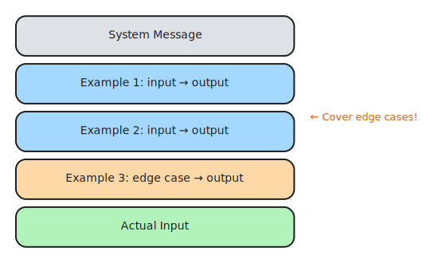
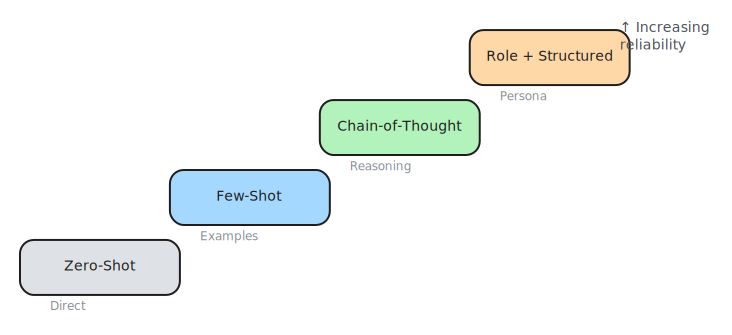
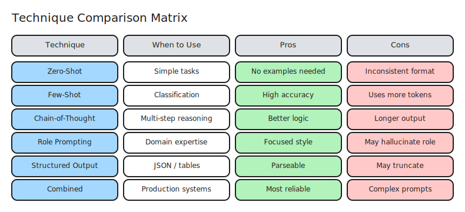

# 6. Prompting Techniques

> **🎯 Learning Objectives**
>
> - Apply zero-shot, few-shot, and chain-of-thought prompting to different task types
> - Use role prompting to focus model expertise on a specific domain
> - Force structured output (JSON) for programmatic consumption

## Let's Think Step by Step

<!-- IMAGE: An open toolbox with several distinct prompt "tools," and a path of stepping stones leading from a question to a lightbulb. Conveys a kit of prompting methods. -->

<!-- END IMAGE -->

In 2022, a research team at the University of Tokyo was trying to get large language models to solve grade-school math word problems. The models were getting about 18% accuracy on the MultiArith benchmark, barely better than random guessing. The researchers tried larger models, more data, and more careful prompt phrasing. Nothing worked well enough.

Then they tried adding three words to the end of each prompt: "Let's think step by step."

Accuracy jumped from 17.7% to 78.7%. The model had the knowledge to solve the problems all along. It just needed permission to show its work. The researchers published their findings in a paper titled "Large Language Models are Zero-Shot Reasoners" (Kojima et al., 2022), and chain-of-thought prompting became a standard technique in every production LLM system.

This chapter covers the major prompting techniques: zero-shot, few-shot, chain-of-thought, role prompting, and structured output. Each technique has situations where it excels and situations where it is overkill. You will learn when to use each one, how to combine them, and how to select the right technique for a given task.

## Zero-Shot Prompting

**Zero-shot prompting** is the simplest technique: give the model a direct instruction with no examples. The model relies entirely on patterns learned during training.

```python
from shared import get_completion

response = get_completion(
    messages=[
        {"role": "system", "content":
            "Classify the sentiment as POSITIVE, NEGATIVE, or NEUTRAL. "
            "Respond with ONLY the label."},
        {"role": "user", "content":
            "The new update completely broke my workflow."},
    ],
    temperature=0.0,
)
print(response)  # Output: NEGATIVE
```

This works because sentiment classification is a well-defined task that the model has seen millions of times during training. The labels are standard, the task is unambiguous, and the expected output is short.

### When Zero-Shot Works

Zero-shot prompting works well for tasks that match common patterns in the model's training data:

- Classification with standard labels (sentiment, topic, intent)
- Summarization of well-structured text
- Translation between common language pairs
- Code generation for common patterns
- Format conversion (JSON to CSV, Markdown to HTML)

### When Zero-Shot Fails

Zero-shot fails when the task is ambiguous, the labels are domain-specific, or the expected output format is unusual. If you ask the model to classify support tickets as "P1, P2, P3, P4" without examples, it may interpret those labels differently than you intend. If your task requires a specific output structure that the model has not seen before, zero-shot will produce inconsistent results.

The rule of thumb: always try zero-shot first. It uses the fewest tokens and is the simplest to maintain. Only add complexity when zero-shot is not reliable enough.

> [!TIP]
> **Cross-Reference:** Zero-shot prompts rely on the building blocks from [Chapter 5](05-prompt-fundamentals.md). A well-structured zero-shot prompt with a clear instruction, context, and output format can outperform a sloppy few-shot prompt with many examples.

## Few-Shot Prompting

**Few-shot prompting** adds 2 to 5 examples to the prompt, teaching the model your specific pattern. The model uses these examples to infer the task format, edge-case handling, and output style.

### Message-Based Few-Shot (Recommended)

The cleanest approach uses alternating user/assistant message pairs:

```python
from shared import get_completion

response = get_completion(
    messages=[
        {"role": "system", "content":
            "Classify the sentiment as POSITIVE, NEGATIVE, or NEUTRAL. "
            "Respond with ONLY the label."},
        # Example 1
        {"role": "user", "content":
            "This product is amazing! Best purchase ever."},
        {"role": "assistant", "content": "POSITIVE"},
        # Example 2
        {"role": "user", "content":
            "Terrible quality. Broke after one day."},
        {"role": "assistant", "content": "NEGATIVE"},
        # Example 3
        {"role": "user", "content":
            "It works as expected. Nothing special."},
        {"role": "assistant", "content": "NEUTRAL"},
        # Example 4 (edge case: mixed sentiment)
        {"role": "user", "content":
            "Great features but too many bugs to be usable."},
        {"role": "assistant", "content": "NEGATIVE"},
        # Actual classification
        {"role": "user", "content":
            "The battery life could be better but overall I like it."},
    ],
    temperature=0.0,
)
print(response)  # Output: POSITIVE
```



### In-Prompt Few-Shot (Compact)

For simpler tasks, you can embed examples directly in the user message:

```python
from shared import get_completion

response = get_completion(
    messages=[
        {"role": "user", "content": """Classify the intent:

"I can't log in" → account_access
"How much does it cost?" → pricing
"The app keeps crashing" → bug_report

Classify: "Can I upgrade my plan?" →"""},
    ],
    temperature=0.0,
)
print(response)  # Output: pricing
```

Both approaches work. Message-based is better for longer examples and multi-turn conversations. In-prompt is more compact and uses fewer tokens.

### Zero-Shot vs Few-Shot

| Aspect | Zero-Shot | Few-Shot |
|:-------|:----------|:---------|
| Examples provided | None | 2 to 5 |
| Model learns from | Training data only | Training + your examples |
| Consistency | Variable | Much more consistent |
| Token cost | Lower | Higher (examples use tokens) |
| Best for | Standard tasks | Custom tasks, domain-specific labels |
| Maintenance | Simple | Examples need updating if requirements change |

### Best Practices for Few-Shot Examples

1. **Use 3 to 5 examples.** Enough to show the pattern without wasting tokens. More than 5 rarely improves results.
2. **Cover edge cases.** Include the tricky inputs that zero-shot gets wrong: mixed sentiment, ambiguous phrasing, empty inputs.
3. **Balance categories.** If you have three labels, include at least one example per label. Showing four positives and one negative biases the model toward positive.
4. **Order matters.** The model attends most strongly to the first and last examples (primacy and recency effects). Put your most representative examples in those positions.
5. **Match the real distribution.** If 80% of your inputs are technical issues, most of your examples should be technical.

> [!TIP]
> **Few-shot examples are your test cases.** Include examples that cover edge cases: the ambiguous input, the empty input, the input in an unexpected format. The model learns as much from your edge-case examples as from the happy-path ones.

## Chain-of-Thought (CoT) Prompting

**Chain-of-thought prompting** asks the model to show its reasoning before giving the final answer. Instead of jumping directly to a conclusion, the model works through intermediate steps, which significantly improves accuracy on multi-step problems.

### The Simplest Version: "Think Step by Step"

```python
from shared import get_completion

response = get_completion(
    messages=[
        {"role": "user", "content":
            "A store has 15 apples. 8 are sold in the morning, "
            "then 3 more are delivered. How many apples remain? "
            "Think step by step."},
    ],
    temperature=0.0,
)
print(response)
# Output:
# Starting count: 15 apples
# After selling 8: 15 - 8 = 7 apples
# After delivery of 3: 7 + 3 = 10 apples
# Final answer: 10 apples
```

Without "Think step by step," the model sometimes jumps to the wrong answer because it tries to produce the final number in one token prediction. With CoT, each intermediate step constrains the next step, making errors easier to catch and correct.

> [!NOTE]
> **Did You Know?** The "Let's think step by step" technique was discovered in a 2022 paper by Kojima et al. at the University of Tokyo. Three words improved accuracy on the MultiArith benchmark from 17.7% to 78.7%. It remains one of the most effective zero-cost prompt improvements.

<!-- IMAGE: A small brain figure climbing three steps while an accuracy meter beside it jumps from low to high. Conveys step-by-step reasoning boosting results. -->

<!-- END IMAGE -->

### Structured CoT

#### Controlling the Reasoning Format

For production systems, you want the reasoning in a predictable structure:

```python
from shared import get_completion

buggy_code = """
def calculate_average(numbers):
    total = 0
    for n in numbers:
        total += n
    return total / len(numbers)
"""

response = get_completion(
    messages=[
        {"role": "system", "content":
            "You are a senior Python developer. "
            "For each code review, respond in this format:\n"
            "ANALYSIS: [step-by-step reasoning about the code]\n"
            "BUGS: [list of bugs found]\n"
            "FIX: [corrected code]\n"
            "CONFIDENCE: [HIGH/MEDIUM/LOW]"},
        {"role": "user", "content":
            f"Review this code:\n```python\n{buggy_code}\n```"},
    ],
    temperature=0.0,
)
print(response)
```

The structured format makes the output parseable. You can extract the BUGS section programmatically and route it to your issue tracker.

### When to Use CoT

| Task Type | Without CoT | With CoT |
|:----------|:-----------|:---------|
| Simple classification | Works fine | Overkill (wastes tokens) |
| Multi-step math | Unreliable | Much better |
| Code debugging | Misses steps | Catches more bugs |
| Logical reasoning | Often wrong | Significantly better |
| Decision making | Jumps to conclusion | Considers tradeoffs |

CoT is most valuable when the task requires multiple reasoning steps. For simple classification or extraction, it adds tokens without improving accuracy.

### Self-Consistency: Running CoT Multiple Times

For critical decisions, run the same CoT prompt several times and take the majority answer:

```python
from shared import get_completion

answers = []
for _ in range(5):
    response = get_completion(
        messages=[
            {"role": "user", "content":
                "Is this code thread-safe? Think step by step.\n\n"
                f"```python\n{code}\n```\n\n"
                "Answer: YES or NO"},
        ],
        temperature=0.7,
    )
    answers.append(response.strip().split()[-1])

final = max(set(answers), key=answers.count)
print(f"Consensus: {final} ({answers.count(final)}/5 agree)")
```

This trades API cost for reliability. If 4 out of 5 runs agree, you have high confidence in the answer.

## Role Prompting

**Role prompting** assigns a persona to the model, shaping its response style, depth, and focus. The same question answered by "a senior security engineer" and "a friendly Python tutor" produces dramatically different responses.

```python
from shared import get_completion

code = "password = input('Enter password: ')"

# Review 1: Security engineer
response_security = get_completion(
    messages=[
        {"role": "system", "content":
            "You are a senior security engineer with 15 years of "
            "experience. You follow OWASP guidelines. Be direct."},
        {"role": "user", "content":
            f"Review this code:\n```python\n{code}\n```"},
    ],
    temperature=0.3,
)

# Review 2: Python tutor
response_tutor = get_completion(
    messages=[
        {"role": "system", "content":
            "You are a friendly Python tutor for beginners. "
            "Explain issues in simple language with examples."},
        {"role": "user", "content":
            f"Review this code:\n```python\n{code}\n```"},
    ],
    temperature=0.3,
)

print("Security Engineer:", response_security[:200])
print("\nPython Tutor:", response_tutor[:200])
```

The security engineer will flag plaintext password storage, lack of hashing, and potential for shoulder surfing. The tutor will gently explain why storing passwords in plain text is risky and show how to use `getpass` instead.

### Effective Roles

| Role | Effect on Response |
|:-----|:------------------|
| "Senior security engineer" | Focuses on vulnerabilities, OWASP, threat models |
| "Patient tutor for beginners" | Simple language, more examples, step-by-step |
| "Technical writer" | Structured, clear, well-organized prose |
| "Strict code reviewer" | Catches more issues, less forgiving |
| "DevOps engineer" | Infrastructure-focused, mentions CI/CD, monitoring |

### Role + Constraints

Roles are most effective when combined with explicit constraints:

> [!PROMPT]
> You are a senior code reviewer at a fintech company.
> You follow these standards:
> - PEP 8 compliance
> - Type hints required
> - Security-first mindset
> - No magic numbers
>
> Respond as a numbered list of findings with severity (HIGH/MEDIUM/LOW).

The role sets the perspective. The constraints set the rules. Together, they produce focused, actionable output.

## Structured Output: JSON Mode

For production systems, free-form text is not enough. You need output that code can parse, validate, and route. Structured output techniques force the model to respond in a specific format.


### Strategy 1: Prompt-Based JSON

The simplest approach: describe the JSON schema in your prompt.

```python
from shared import get_completion
import json

resume_text = (
    "Hi, I'm Maria Santos, a DevOps Engineer at CloudScale Inc. "
    "I've been working with Kubernetes and AWS for 6 years. "
    "I have a Master's in Computer Science from Stanford. "
    "Reach me at maria.santos@cloudscale.io."
)

response = get_completion(
    messages=[
        {"role": "system", "content": """Extract contact information.
Respond with ONLY valid JSON, no markdown fences:
{
    "name": "full name",
    "email": "email or null",
    "company": "company or null",
    "role": "job title or null",
    "skills": ["skill1", "skill2"],
    "experience_years": number or null
}"""},
        {"role": "user", "content": resume_text},
    ],
    temperature=0.0,
)

data = json.loads(response)
print(json.dumps(data, indent=2))
```

This works with any provider and any model. The downside is that the model might occasionally wrap the JSON in markdown fences or add explanatory text around it.

### Strategy 2: JSON Mode (API-Level)

Some providers support a `response_format` parameter that guarantees valid JSON:

```python
import litellm
import json

response = litellm.completion(
    model="gpt-4o",
    messages=[
        {"role": "system", "content":
            "Extract contacts as JSON with fields: "
            "name, email, company, role, skills."},
        {"role": "user", "content": resume_text},
    ],
    response_format={"type": "json_object"},
)

data = json.loads(response.choices[0].message.content)
print(json.dumps(data, indent=2))
```

JSON mode guarantees syntactically valid JSON. It does not guarantee the specific fields you want. You still need to describe the schema in your prompt and validate the response in code.

### Robust JSON Parsing

Regardless of which strategy you use, always handle malformed responses:

```python
import json

def parse_json_response(text):
    """Parse JSON from LLM response, handling common issues."""
    text = text.strip()
    try:
        return json.loads(text)
    except json.JSONDecodeError:
        pass
    # Remove markdown code fences
    if text.startswith("```"):
        text = text.split("\n", 1)[1].rsplit("```", 1)[0].strip()
        try:
            return json.loads(text)
        except json.JSONDecodeError:
            pass
    # Find JSON object in surrounding text
    start = text.find("{")
    end = text.rfind("}") + 1
    if start != -1 and end > start:
        try:
            return json.loads(text[start:end])
        except json.JSONDecodeError:
            pass
    return {"error": "Could not parse JSON", "raw": text}
```

This function handles the three most common failure modes: clean JSON, JSON wrapped in markdown fences, and JSON embedded in explanatory text. Use it every time you parse LLM output as JSON.

> [!WARNING]
> **JSON mode does not guarantee valid JSON in all cases.** Always wrap your JSON parsing in a try/except block. Models can return truncated JSON if they hit the token limit, or occasionally include markdown formatting around the JSON.

## Technique Selection Guide

With five techniques in your toolkit, the question becomes: which one should you use? The answer depends on your task type, reliability requirements, and token budget.

<!--  -->

<!-- IMAGE: An open toolbox with several distinct prompt "tools," and a path of stepping stones leading from a question to a lightbulb. Conveys a kit of prompting methods. -->

<!-- END IMAGE -->

The diagram traces the logical progression from zero-shot through structured output, labeling what you add at each step; the sketch below presents the same progression as a staircase where each step represents increasing reliability.


### Decision Table

| Situation | Start With | Upgrade To |
|:----------|:-----------|:-----------|
| Standard NLP task (sentiment, summary) | Zero-shot | Few-shot if inconsistent |
| Custom classification (domain-specific labels) | Few-shot | More examples if edge cases fail |
| Math or logic problems | CoT | Self-consistency if unreliable |
| Domain-specific expertise needed | Role + few-shot | Add CoT for complex reasoning |
| Production system needing parseable output | Few-shot + structured | JSON mode + validation |

### Combining Techniques

The most effective prompts combine multiple techniques. Here is a prompt that uses role prompting, chain-of-thought, few-shot examples, and structured output:

```python
from shared import get_completion

code = """
def transfer(sender, receiver, amount):
    sender.balance -= amount
    receiver.balance += amount
    return True
"""

response = get_completion(
    messages=[
        # ROLE + CoT + FORMAT (system)
        {"role": "system", "content":
            "You are a senior Python developer specializing in API design. "
            "Think step by step when analyzing code. "
            "Respond as JSON: "
            '{"issues": [], "suggestions": [], "score": int}.'},
        # FEW-SHOT EXAMPLE
        {"role": "user", "content":
            "Review: def add(a,b): return a+b"},
        {"role": "assistant", "content":
            '{"issues": ["no type hints", "no docstring"], '
            '"suggestions": ["add -> int return type"], "score": 6}'},
        # ACTUAL REQUEST
        {"role": "user", "content":
            f"Review:\n```python\n{code}\n```"},
    ],
    temperature=0.0,
)
print(response)
```

This prompt tells the model who it is (role), how to think (CoT), what the output looks like (few-shot example), and what format to use (JSON schema). Each technique reinforces the others.

### Technique Comparison

| Technique | Tokens Used | Reliability | Complexity | Best For |
|:----------|:-----------|:-----------|:-----------|:---------|
| Zero-shot | Low | Moderate | Simple | Standard tasks, prototyping |
| Few-shot | Medium | High | Moderate | Custom tasks, edge cases |
| Chain-of-thought | Medium-High | High for reasoning | Moderate | Math, logic, debugging |
| Role prompting | Low | Moderate | Simple | Domain expertise, tone control |
| Structured output | Low-Medium | High for format | Moderate | Production systems, APIs |
| Combined | High | Highest | Complex | Production, critical systems |



> [!NOTE]
> **High-Resolution Matrix:** For a full-page version of the Prompting Technique Matrix comparing 6+ advanced techniques, see [Appendix E](appendix-e-diagrams.md#chapter-6-prompting-technique-matrix). The high-resolution file is also available in the companion repository:
> - [ch06-technique-matrix.png](https://github.com/kpassoubady/building-with-llms-companion/blob/main/diagrams/ch06-technique-matrix.png)

> [!TIP]
> **Cross-Reference:** For controlling output creativity and consistency with API parameters (temperature, top_p), see [Chapter 7](07-api-parameters.md). For evaluating which technique works best on your specific dataset, see [Chapter 8](08-iteration-evaluation.md).

## 🧪 Try It Yourself

### Exercise 1: Zero-Shot vs Few-Shot Comparison

Build a sentiment classifier using zero-shot, then improve it with few-shot examples. Test both on 10 sample texts and compare accuracy.

```python
from shared import get_completion

test_texts = [
    "This product is absolutely amazing!",
    "The design is gorgeous but the software is buggy.",
    "It works as described. Nothing special.",
    "Not worth the price. There are better alternatives.",
    "Pretty good but the battery could last longer.",
]

# Zero-shot: classify each text with no examples
for text in test_texts:
    response = get_completion(
        messages=[
            {"role": "system", "content":
                "Classify as POSITIVE, NEGATIVE, or NEUTRAL. "
                "Respond with ONLY the label."},
            {"role": "user", "content": text},
        ],
        temperature=0.0,
    )
    print(f"{response:8} | {text[:50]}")
```

Now add 3 to 5 few-shot examples (including edge cases) and rerun. How much does accuracy improve?

### Exercise 2: Chain-of-Thought Debug

Give the model a buggy function and ask it to debug using structured CoT. Compare the output with and without the "Think step by step" instruction.

> [!TIP]
> **Starter Code:** The companion repository contains full exercises, starter code, and solutions for building sentiment classifiers, parsing resumes, and comparing prompting techniques.
> - [building-with-llms-companion/exercises/ch06/sentiment_classifier](https://github.com/kpassoubady/building-with-llms-companion/tree/main/exercises/ch06/sentiment_classifier)
> - [building-with-llms-companion/exercises/ch06/resume_parser](https://github.com/kpassoubady/building-with-llms-companion/tree/main/exercises/ch06/resume_parser)
> - [building-with-llms-companion/exercises/ch06/technique_shootout](https://github.com/kpassoubady/building-with-llms-companion/tree/main/exercises/ch06/technique_shootout)

## 📋 Chapter Summary

> **💡 Key Takeaways**
>
> - Try zero-shot first for standard tasks. Only add examples, chain-of-thought, or role prompting when zero-shot is not reliable enough for the task at hand.
> - Few-shot examples work best when you cover edge cases, balance categories, and order examples so the most representative ones appear first and last.
> - Combine techniques for production: role prompting sets perspective, chain-of-thought improves multi-step reasoning, few-shot examples anchor the format, and a JSON schema makes output parseable.

> [!PITFALLS]
> - Starting with complex techniques when zero-shot would have worked (wasted tokens and maintenance burden)
> - Using unbalanced few-shot examples (four positive, one negative) that bias the model
> - Trusting JSON mode to guarantee the right fields (it guarantees valid JSON syntax, not your specific schema)

## 🧠 Knowledge Check

1. **Multiple Choice:** Which technique adds "Let's think step by step" to improve reasoning?

    ::: {.mcq-2col}
    - [ ] Zero-shot prompting
    - [ ] Few-shot prompting
    - [ ] Zero-shot chain-of-thought
    - [ ] Role prompting
    :::

2. **True or False:** Few-shot prompting requires fine-tuning the model.

    ::: {.tf-inline}
    - [ ] True
    - [ ] False
    :::

3. **Fill in the Blank:** Providing 3 to 5 input/output examples in the prompt is called ______-shot prompting.

4. **Multiple Choice:** Role prompting is most useful for:

    ::: {.mcq-2col}
    - [ ] Precise mathematical calculation
    - [ ] Domain-specific expertise and tone control
    - [ ] Reducing token costs
    - [ ] Guaranteeing valid JSON output
    :::

5. **Scenario:** Your JSON output from the model is sometimes wrapped in `` ```json `` markers. What are two ways to fix this?

<details>
<summary><strong>Click to Reveal Answers</strong></summary>

1. **Zero-shot chain-of-thought**: Adding "Let's think step by step" (or similar) to a prompt without providing reasoning examples is zero-shot CoT. The technique was discovered by Kojima et al. (2022) and dramatically improved accuracy on reasoning benchmarks.
2. **False**: Few-shot prompting provides examples directly in the prompt at inference time. No model weights are modified. Fine-tuning is a separate process that changes the model's parameters using training data.
3. **few**: Few-shot prompting provides a small number of input/output examples in the prompt to teach the model the desired pattern, format, and edge-case handling.
4. **Domain-specific expertise and tone control**: Role prompting assigns a persona that shapes the model's vocabulary, depth, and focus. A "senior security engineer" will flag vulnerabilities that a generic assistant might miss.
5. **Two fixes: (1) Add "no markdown fences" or "respond with raw JSON only" to your prompt instruction. (2) Implement robust parsing that strips markdown fences before calling `json.loads()`.** Both approaches should be used together for maximum reliability.

</details>
