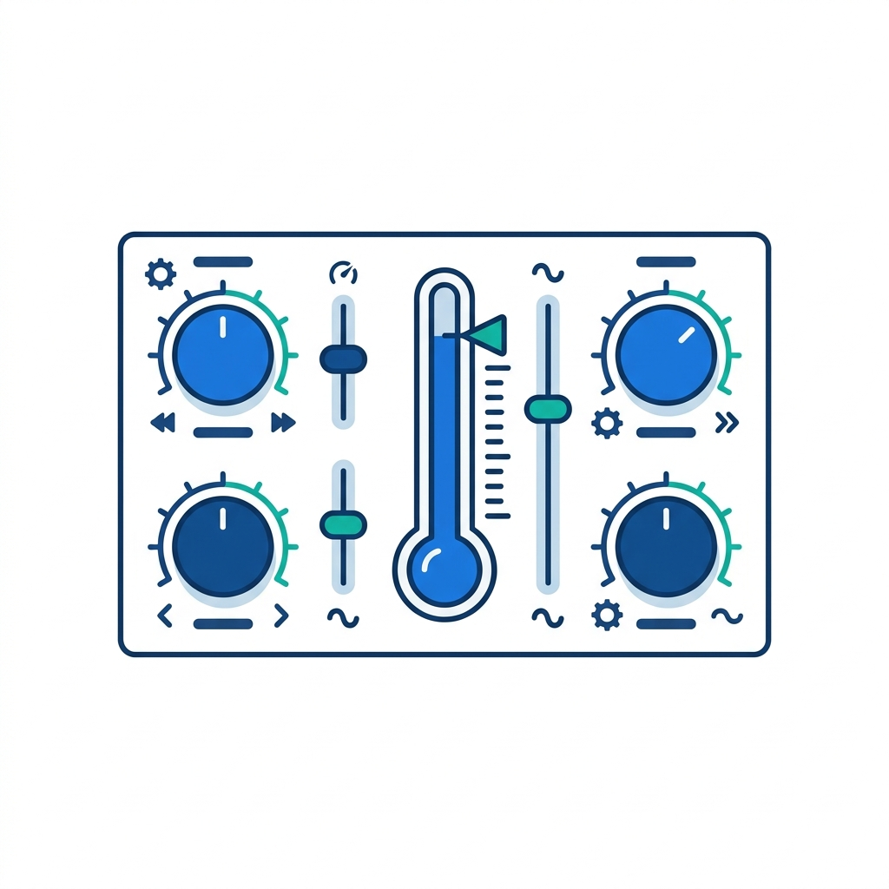
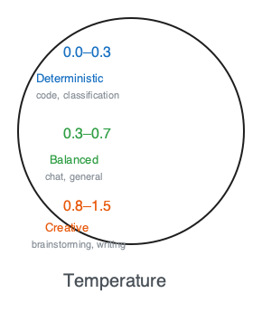
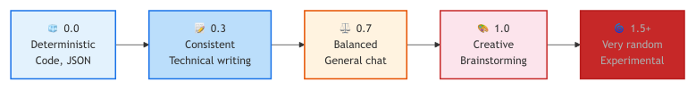
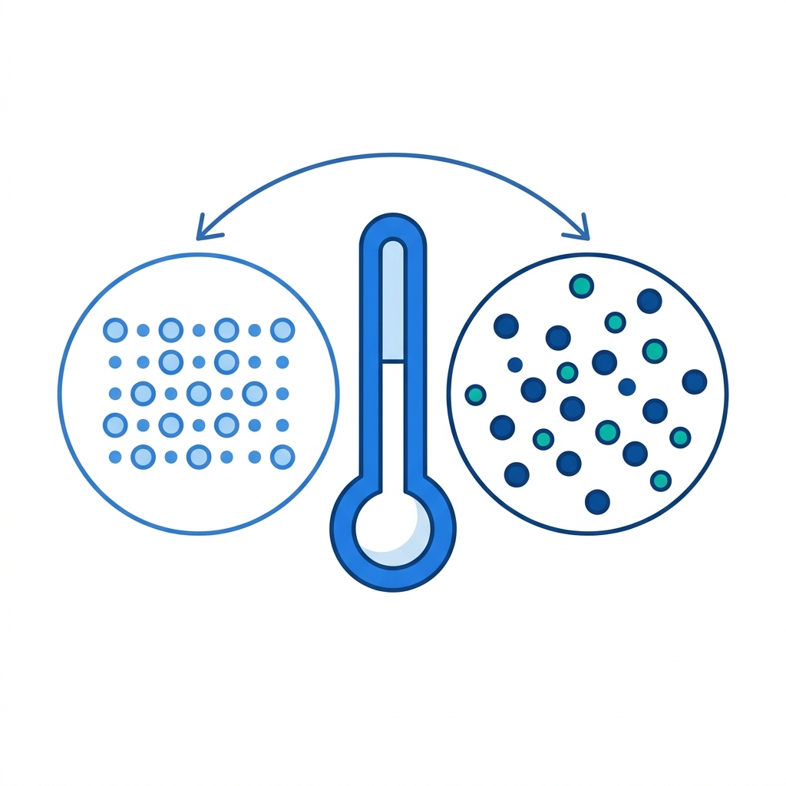
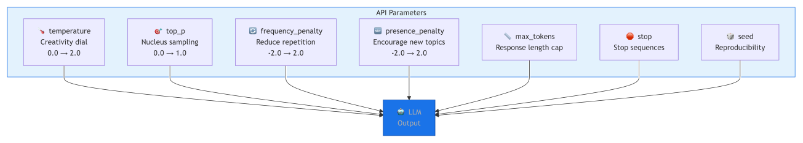
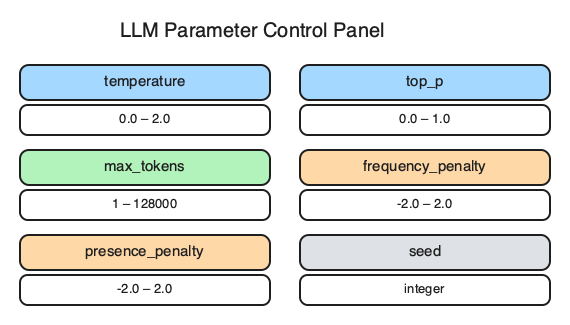

# 7. API Parameters & Output Control

> **🎯 Learning Objectives**
>
> - Tune temperature, top_p, and penalties to control output creativity and consistency
> - Use max_tokens, stop sequences, and seed for predictable, cost-efficient responses
> - Implement streaming responses for better user experience

## Five Identical Taglines

<!-- IMAGE: A tidy control panel / mixing board with labeled dials, one shaped like a thermometer turned up. Conveys tuning generation parameters. -->

<!-- END IMAGE -->

A developer at a digital marketing agency built a tagline generator for the creative team. The tool took a product description and returned five catchy taglines. The team loved the concept. They hated the results. Every time they clicked "Generate," they got the same five taglines. Word for word. Click after click. The tool felt broken.

The developer had set `temperature=0`. For the classification and JSON extraction tasks she had built previously, temperature zero was the right choice: deterministic, consistent, reliable. For a creative task, it was the wrong choice entirely. She changed one parameter to `temperature=0.9`, and suddenly the tool produced fresh, varied taglines on every click. The creative team started using it daily.

This story captures the core lesson of this chapter: API parameters are the control surface between your prompt and the model's behavior. The same prompt produces dramatically different output depending on temperature, penalties, token limits, and streaming settings. Knowing which knob to turn (and when to leave them alone) is the difference between a prototype that impresses in a demo and a production system that works reliably at scale.

## Temperature: The Creativity Dial

**Temperature** is the single most important parameter you will adjust. It controls randomness in token selection by scaling the probability distribution over candidate tokens before sampling.


<!-- figure: Temperature scale from deterministic to highly random -->

The diagram lays out the temperature range as a left-to-right progression from deterministic (0.0) to experimental (1.5+); the sketch below maps the same range onto a vertical gauge annotated with recommended use cases at each level.


<!-- figure: Temperature ranges annotated with use cases — hand-drawn gauge -->

At temperature 0, the model always picks the most probable next token. The output is deterministic: run the same prompt twice, get the same result. As temperature increases, the probability distribution flattens, and less likely tokens get a real chance of being selected. At temperature 1.2 or above, the output becomes unpredictable and often incoherent.

### How Temperature Affects Token Selection

Consider the model predicting the next word after "The capital of France is":

```
temperature=0.0:  Paris (99%) | Lyon (0.5%) | Marseille (0.3%)
                  ████████████████████████████████████████████

temperature=0.7:  Paris (72%) | Lyon (12%) | Marseille (8%)
                  ██████████████████████████░░░░░░░░░░

temperature=1.2:  Paris (35%) | Lyon (18%) | Marseille (15%)
                  ████████████░░░░░░░░░░░░░░░░░░░░░░░░
```

At 0.0, the model always says "Paris." At 1.2, it might say "Lyon," which is creative but wrong.

### Temperature by Task Type

| Task | Recommended | Why |
|:-----|:-----------|:----|
| Code generation | 0.0 | Syntax errors increase at higher temps |
| JSON extraction | 0.0 | Must be valid and consistent |
| Classification | 0.0 | Want the same label every time |
| Technical writing | 0.2-0.3 | Slight variation, mostly consistent |
| Summarization | 0.3-0.5 | Some flexibility in wording |
| General chat | 0.7 | Natural-sounding responses |
| Creative writing | 0.8-1.0 | Want variety and surprise |
| Brainstorming | 1.0-1.2 | Maximize divergent ideas |

### Seeing It in Code

```python
from shared import get_completion

prompt = "Generate a marketing tagline for a coffee shop called Byte Brew."

for temp in [0.2, 0.7, 1.2]:
    response = get_completion(
        messages=[{"role": "user", "content": prompt}],
        temperature=temp,
    )
    print(f"temp={temp}: {response}")

# temp=0.2: "Byte Brew: Code Better, Sip Smarter."
# temp=0.7: "Fuel Your Code, One Cup at a Time."
# temp=1.2: "Where Semicolons Meet Espresso Storms!"
```

At 0.2, the output is polished but predictable. At 0.7, it is creative and coherent. At 1.2, it takes risks that sometimes land and sometimes do not.

> [!TIP]
> **Start with temperature=0 for code and classification tasks.** You want deterministic, reproducible output. Only increase temperature when you explicitly want variety (brainstorming, creative writing, generating alternatives).

> [!TIP]
> **Cross-Reference:** To see how these parameters are structured in a full API response alongside token usage statistics, see [Chapter 3](03-working-with-llm-apis.md): Working with LLM APIs.

## top_p: Nucleus Sampling

**top_p** is an alternative to temperature for controlling randomness. Instead of scaling the probability distribution, it limits the model to the smallest set of tokens whose cumulative probability reaches `p`.

```
Tokens sorted by probability: Paris(45%) Lyon(15%) Marseille(12%) Nice(8%) ...

top_p=0.6 → considers {Paris, Lyon}                    (60%)
top_p=0.9 → considers {Paris, Lyon, Marseille, Nice}   (80%)
top_p=1.0 → considers all tokens (default)
```

With `top_p=0.6`, the model only chooses between Paris and Lyon, ignoring all less likely tokens. With `top_p=0.9`, it considers more candidates but still filters out the long tail of improbable tokens.

### Temperature vs top_p

| Parameter | Controls | Analogy |
|:----------|:---------|:--------|
| `temperature` | How spread the probabilities are | Blurring the focus |
| `top_p` | How many candidates to consider | Narrowing the candidate pool |

In practice, most developers use `temperature` and leave `top_p` at its default (1.0). The two parameters interact in complex ways, and changing both simultaneously creates unpredictable results.

> [!WARNING]
> **Do not change temperature AND top_p simultaneously.** They both control randomness through different mechanisms. Changing both creates unpredictable interactions. Pick one.

## Frequency and Presence Penalties

Both penalties reduce repetition, but they work differently.

**frequency_penalty** penalizes tokens proportional to how many times they have already appeared in the output. A word used five times gets penalized five times as much as a word used once. This reduces word-level repetition.

**presence_penalty** penalizes tokens that have appeared at all, regardless of how many times. It is a binary signal: "you already said this word, try something new." This encourages topic diversity.

| Parameter | Range | How It Works | Best For |
|:----------|:------|:-------------|:---------|
| `frequency_penalty` | -2.0 to 2.0 | Proportional to token count | Reducing word repetition in essays, blog posts |
| `presence_penalty` | -2.0 to 2.0 | Binary (appeared or not) | Encouraging new topics in brainstorming |

### Recommended Settings by Task

| Task | frequency_penalty | presence_penalty |
|:-----|:-----------------|:-----------------|
| Code generation | 0.0 | 0.0 |
| JSON extraction | 0.0 | 0.0 |
| Technical writing | 0.3-0.5 | 0.0-0.3 |
| Blog post | 0.3-0.5 | 0.0-0.3 |
| Brainstorming | 0.3 | 0.5-0.8 |
| Long conversations | 0.0 | 0.3 |

For code and structured output, leave both at 0.0. Repetition in code is often correct (`if`, `return`, `self` all appear many times in valid Python). Penalizing them produces broken code.

```python
from shared import get_completion

response = get_completion(
    messages=[
        {"role": "user", "content":
            "Brainstorm 10 unique feature ideas for a developer tool."},
    ],
    temperature=0.9,
    frequency_penalty=0.3,
    presence_penalty=0.6,
)
print(response)
```

## max_tokens: Controlling Response Length

**max_tokens** sets a hard upper limit on how many tokens the model generates. It does not guarantee the response will be that long. The model may stop earlier if it completes its thought. But it will never exceed the limit.

| Scenario | Recommended max_tokens |
|:---------|:----------------------|
| Classification (one word) | 10 |
| Short answer | 100-200 |
| Code snippet | 500-1000 |
| Detailed explanation | 1000-2000 |
| Long-form content | 4096+ |

```python
from shared import get_completion

response = get_completion(
    messages=[
        {"role": "system", "content":
            "Classify as POSITIVE, NEGATIVE, or NEUTRAL."},
        {"role": "user", "content": "The food was okay but nothing special."},
    ],
    temperature=0.0,
    max_tokens=10,
)
print(response)  # Output: NEUTRAL
```

### Detecting Truncation

If the model hits the `max_tokens` limit, the response is cut off mid-sentence. The API signals this through the `finish_reason` field:

```python
import litellm
from shared import get_model

response = litellm.completion(
    model=get_model(),
    messages=[{"role": "user", "content": "Write a long essay..."}],
    max_tokens=50,
)

reason = response.choices[0].finish_reason
if reason == "length":
    print("Response was truncated! Increase max_tokens.")
elif reason == "stop":
    print("Response completed naturally.")
```

Always check `finish_reason` in production. Truncated JSON breaks your parser. Truncated code breaks your compiler. Truncated summaries miss key points.

> [!TIP]
> **Cross-Reference:** Setting max_tokens too low is a common source of truncated JSON responses. For cost implications of setting max_tokens too high, see [Chapter 13](13-cost-optimization.md): Cost Optimization.

## Stop Sequences

**Stop sequences** tell the model to stop generating when it outputs a specific string. The stop string itself is not included in the output. This gives you clean, predictable termination.

```python
import litellm
from shared import get_model

response = litellm.completion(
    model=get_model(),
    messages=[
        {"role": "user", "content":
            "Write a Python function to calculate factorial."},
    ],
    stop=["\ndef ", "\nclass "],
)
print(response.choices[0].message.content)
```

This generates exactly one function. The moment the model tries to write a second function (starting with `\ndef `), generation stops. Without the stop sequence, the model might generate helper functions, test cases, or unrelated code.

### Common Stop Sequence Patterns

| Use Case | Stop Sequence | Effect |
|:---------|:-------------|:-------|
| One function | `["\ndef ", "\nclass "]` | Stops before next definition |
| One SQL query | `[";\n"]` | Stops after the semicolon |
| One paragraph | `["\n\n"]` | Stops at the first blank line |
| Numbered list of 5 | `["\n6."]` | Stops before item 6 |

```python
import litellm
from shared import get_model

response = litellm.completion(
    model=get_model(),
    messages=[
        {"role": "user", "content":
            "List 5 Python debugging tips. Number them 1-5."},
    ],
    stop=["\n6."],
)
print(response.choices[0].message.content)
```

The model generates items 1 through 5 and stops cleanly before it can write item 6.

## Seed for Reproducibility

The `seed` parameter makes responses more reproducible. When you provide the same seed with the same prompt and parameters, the model produces the same output (in most cases).

```python
from shared import get_completion

response1 = get_completion(
    messages=[{"role": "user", "content": "Tell me a Python tip."}],
    temperature=0.7,
    seed=42,
)
response2 = get_completion(
    messages=[{"role": "user", "content": "Tell me a Python tip."}],
    temperature=0.7,
    seed=42,
)
print(response1 == response2)  # True (highly likely)
```

### When to Use Seed

| Use Case | Why |
|:---------|:----|
| Automated testing | Consistent outputs for assertions |
| Demos and presentations | Reproduce the same response reliably |
| A/B testing prompts | Compare prompt changes with same randomness |
| Debugging | Reproduce a specific failure |

For maximum determinism, combine `seed` with `temperature=0.0`. Even with seed, results may vary slightly across model versions or infrastructure changes. Seed is a best-effort feature, not a guarantee.

> [!NOTE]
> **Did You Know?** The name "temperature" comes from statistical mechanics. In physics, higher temperature means particles move more randomly. In LLMs, higher temperature means token selection is more random. The analogy is exact: both are softmax scaling factors.

<!-- IMAGE: A thermometer in the center linking two clusters: orderly aligned particles on the cool side and scattered random particles on the hot side. Conveys temperature as randomness. -->

<!-- END IMAGE -->

## Streaming Responses

**Streaming** changes how the API delivers the response. Instead of waiting for the entire response to be generated and returning it as one object, streaming sends tokens as they are produced. The user sees text appearing in real time, like someone typing.

### Why Streaming Matters

Without streaming, a 500-token response at 50 tokens per second means a 10-second blank screen before any text appears. With streaming, the first token arrives in about 200 milliseconds. The total generation time is the same, but the perceived speed is dramatically better.

| Aspect | Non-Streaming | Streaming |
|:-------|:-------------|:----------|
| Return type | Complete response object | Iterator of chunks |
| Time to first token | Full generation time | ~200ms |
| UX | Blank screen, then full response | Tokens appear in real time |
| Error handling | One try/except | Handle mid-stream errors |
| Memory | Full response in memory at once | Incremental |

### Implementation

```python
import litellm
from shared import get_model

response = litellm.completion(
    model=get_model(),
    messages=[
        {"role": "user", "content": "Explain Python decorators."},
    ],
    stream=True,
)

full_text = ""
for chunk in response:
    delta = chunk.choices[0].delta.content
    if delta:
        print(delta, end="", flush=True)
        full_text += delta
print()
```

The key details: `stream=True` returns an iterator instead of a response object. Each chunk contains a `delta` with the next piece of text. The `flush=True` in the print statement ensures tokens appear immediately rather than being buffered.

### When NOT to Stream

Streaming is not always the right choice:

- **JSON parsing:** you need the complete response before calling `json.loads()`
- **Batch processing:** you are processing hundreds of inputs and do not need real-time display
- **Post-processing pipelines:** downstream code needs the full text before it can proceed

For these cases, use the standard non-streaming API and process the complete response.

## Parameter Cheat Sheet


<!-- figure: API parameter control panel -->

The sketch acts as a control panel for tuning the model; the overview diagram below summarizes the effect of each parameter on the output.


<!-- figure: API Parameters Overview -->

| Parameter | Range | Default | When to Change |
|:----------|:------|:--------|:---------------|
| `temperature` | 0.0-2.0 | ~0.7-1.0 | Always. Match to task type |
| `top_p` | 0.0-1.0 | 1.0 | Rarely. Use instead of temperature, not with it |
| `max_tokens` | 1-model max | Model-dependent | Always. Set a reasonable limit for cost control |
| `frequency_penalty` | -2.0 to 2.0 | 0.0 | When output repeats words in long-form text |
| `presence_penalty` | -2.0 to 2.0 | 0.0 | When output loops on the same topic |
| `stop` | List of strings | None | When you need clean termination at a boundary |
| `seed` | Any integer | None | For testing, demos, and reproducibility |
| `stream` | true/false | false | For any user-facing output |

### Task-to-Parameter Quick Reference

| Task | temperature | top_p | freq_penalty | pres_penalty | max_tokens |
|:-----|:-----------|:------|:-------------|:-------------|:-----------|
| Code generation | 0.0 | 1.0 | 0.0 | 0.0 | 1000 |
| JSON extraction | 0.0 | 1.0 | 0.0 | 0.0 | 500 |
| Classification | 0.0 | 1.0 | 0.0 | 0.0 | 10 |
| Technical writing | 0.3 | 1.0 | 0.3 | 0.0 | 2000 |
| Summarization | 0.3 | 1.0 | 0.0 | 0.0 | 500 |
| General chat | 0.7 | 1.0 | 0.0 | 0.0 | 1024 |
| Creative writing | 0.9 | 1.0 | 0.5 | 0.3 | 2000 |
| Brainstorming | 1.0 | 0.9 | 0.3 | 0.6 | 1000 |

## 🧪 Try It Yourself

### Exercise 1: Temperature Comparison

Run the same creative prompt at three different temperatures and compare the results. Which temperature produces the best balance of creativity and coherence?

```python
from shared import get_completion

system = "You are a creative copywriter for tech brands."
prompt = (
    "Generate 3 taglines for a coffee shop called 'Byte Brew' "
    "that caters to software developers. Each under 10 words."
)

for temp in [0.2, 0.7, 1.2]:
    response = get_completion(
        messages=[
            {"role": "system", "content": system},
            {"role": "user", "content": prompt},
        ],
        temperature=temp,
    )
    print(f"\n--- temperature={temp} ---")
    print(response)
```

### Exercise 2: Stop Sequence Control

Generate a numbered list that stops cleanly at exactly 5 items. Use a stop sequence to prevent the model from generating item 6.

> [!TIP]
> **Starter Code:** The companion repository contains full exercises, starter code, and solutions for adjusting temperature, implementing streaming, and exploring API parameters.
> - [building-with-llms-companion/exercises/ch07/temperature_lab](https://github.com/kpassoubady/building-with-llms-companion/tree/main/exercises/ch07/temperature_lab)
> - [building-with-llms-companion/exercises/ch07/streaming_chat](https://github.com/kpassoubady/building-with-llms-companion/tree/main/exercises/ch07/streaming_chat)
> - [building-with-llms-companion/exercises/ch07/parameter_explorer](https://github.com/kpassoubady/building-with-llms-companion/tree/main/exercises/ch07/parameter_explorer)

## 📋 Chapter Summary

> **💡 Key Takeaways**
>
> - Temperature is the most important parameter: use 0.0 for code, JSON, and classification, 0.7 for chat, and 0.9 or above for creative tasks. Change either temperature or top_p, never both at once.
> - Always set max_tokens to a reasonable limit, and check finish_reason in production. A value of "length" means the response was cut off and may be incomplete or invalid.
> - Use streaming for all user-facing output to deliver the first token in roughly 200 milliseconds. Use seed for testing and demos to reproduce specific outputs reliably.

> [!PITFALLS]
> - Setting temperature too high for deterministic tasks (code, JSON) and getting syntax errors or invalid output
> - Changing both temperature and top_p simultaneously, creating unpredictable interactions
> - Not setting max_tokens at all, allowing runaway generation that wastes tokens and money

## 🧠 Knowledge Check

1. **Multiple Choice:** Temperature 0 produces:

    ::: {.mcq-2col}
    - [ ] Random output
    - [ ] Deterministic output
    - [ ] No output
    - [ ] Longer output
    :::

2. **True or False:** `max_tokens` guarantees the response will be exactly that many tokens.

    ::: {.tf-inline}
    - [ ] True
    - [ ] False
    :::

3. **Fill in the Blank:** To reduce repetitive words in output, increase the ______ penalty.

4. **Multiple Choice:** Why use streaming for user-facing applications?

    ::: {.mcq-2col}
    - [ ] It produces more accurate output
    - [ ] It reduces API costs
    - [ ] It improves perceived response speed
    - [ ] It enables larger context windows
    :::

5. **Scenario:** Your JSON responses are sometimes truncated mid-object, causing `json.loads()` to fail. What parameter should you increase, and what field should you check to detect this problem?

<details>
<summary><strong>Click to Reveal Answers</strong></summary>

1. **Deterministic output**: Temperature 0 always picks the most probable next token, producing the same output for the same input every time. Higher temperatures introduce randomness.
2. **False**: `max_tokens` sets a hard upper limit. The model may stop earlier if it completes its response naturally. It only guarantees the response will not exceed that many tokens.
3. **frequency**: The `frequency_penalty` parameter penalizes tokens proportional to how often they have appeared, reducing word-level repetition. The `presence_penalty` encourages new topics instead.
4. **It improves perceived response speed**: Streaming delivers the first token in about 200ms instead of waiting for the full response. Total generation time is the same, but users perceive the response as faster because text appears immediately.
5. **Increase `max_tokens`** to give the model enough room to complete the JSON object. **Check `finish_reason`**: if it equals `"length"`, the response was truncated by the token limit. If it equals `"stop"`, the response completed naturally.

</details>
