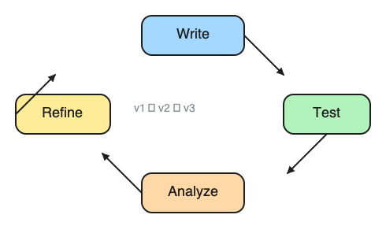
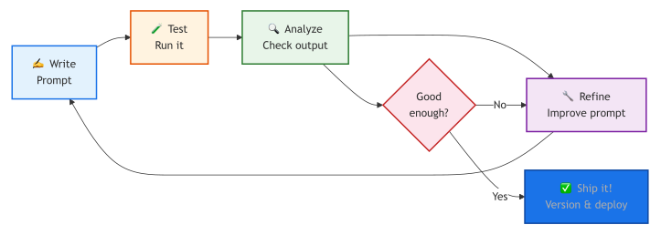
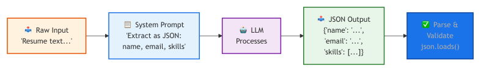
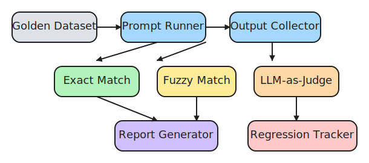
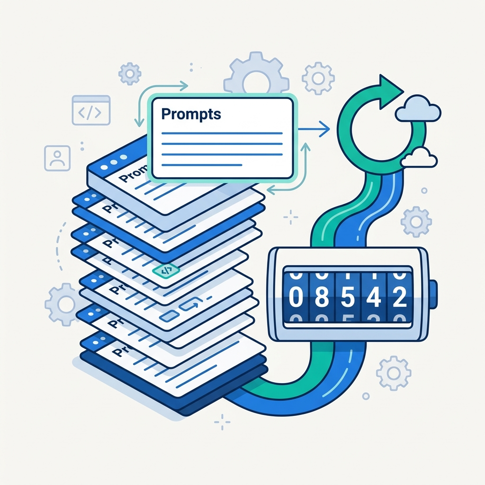

# 8. Prompt Iteration & Evaluation

> **🎯 Learning Objectives**
>
> - Apply the write-test-analyze-refine iteration loop to systematically improve prompts
> - Build evaluation rubrics and golden datasets to measure prompt quality
> - Version and manage prompts as first-class software artifacts

## Seven Tries to Production

<!-- IMAGE: A circular feedback-loop arrow around a prompt card being polished/refined at each pass, with a small checkmark target. Conveys iterating toward a better prompt. -->

<!-- END IMAGE -->

A developer was building an invoice parser for an accounting startup. The system needed to extract vendor name, amount, date, and line items from PDF invoices converted to text. Version 1 of the prompt worked on 3 out of 10 test invoices. It missed invoices with European date formats, invoices with multiple currency symbols, and invoices where the vendor name appeared in a footer rather than a header.

Version 2 added explicit date format handling and got 5 out of 10. Version 3 added few-shot examples covering European formats and reached 7 out of 10. Version 4 introduced a structured output format with validation rules and hit 8 out of 10. Version 5 accidentally broke the date parsing that version 3 had fixed, dropping back to 6 out of 10. Version 6 restored the date handling and added edge cases for multi-currency invoices. Version 7 finally reached 95% accuracy across 50 test invoices. That was the version that shipped.

Seven iterations. Each one targeted a specific failure mode observed in the previous version. The developer did not guess at improvements; she tested, analyzed the failures, and fixed exactly what was broken. This is the discipline of prompt iteration, and it is the subject of this chapter. You will learn the systematic loop that takes a first-draft prompt to production quality, the evaluation methods that tell you whether your changes actually helped, and the versioning practices that prevent version 5 disasters.

## The Prompt Iteration Loop

Prompt engineering is not a one-shot activity. Every production prompt goes through multiple iterations. The process follows a predictable loop: write, test, analyze, refine, repeat.



The diagram shows the write, test, analyze, refine cycle as a decision loop with a "ship it" exit; the sketch below renders the same process as a spiral where each orbit represents a versioned improvement.



### The Five Steps

| Step | What You Do | Time |
|:-----|:-----------|:-----|
| **Write** | Draft the prompt with all 4 building blocks ([Chapter 5](05-prompt-fundamentals.md)) | 5 min |
| **Test** | Run it against 5-10 diverse inputs | 5 min |
| **Analyze** | Read every output. Classify failures by type | 10 min |
| **Refine** | Fix the most common failure mode | 5 min |
| **Repeat** | Test again. Fix the next failure | 5 min |

Plan for 3 to 5 iterations minimum. A prompt is never done on the first try.

### Iteration in Practice: Code Review Prompt

Here is a real iteration sequence for a code review prompt:

v1: `"Review this code"`
Result: Generic, unfocused output. No consistent format.

v2: `"Review this Python function for bugs, security issues, and performance problems"`
Result: Better focus. Output format still varies between runs.

v3: Added `"Respond as a numbered list with severity (HIGH/MEDIUM/LOW)"`
Result: Consistent format. But misses edge cases in complex code.

v4: Added 2 few-shot examples showing expected output format and depth.
Result: Better coverage. But responses are too verbose (300+ words per finding).

v5: Added `"Maximum 5 findings. One sentence per finding."`
Result: Concise, consistent, actionable. Ship it.

Each version fixed exactly one problem. The developer did not rewrite the entire prompt at each step. She identified the failure, added the minimum fix, and tested again.

> [!TIP]
> **Cross-Reference:** The 4 building blocks from [Chapter 5](05-prompt-fundamentals.md) and the techniques from [Chapter 6](06-prompting-techniques.md) are the tools you use during the "Refine" step. If your output format is inconsistent, add an Output Format block. If zero-shot is not reliable enough, add few-shot examples.

## Building a Golden Dataset

**Golden dataset** is a curated set of input/expected-output pairs that you have manually verified. It is the foundation of every serious prompt evaluation effort.



> [!TIP]
> **High-Resolution Pipeline:** For a full-page version of the complete Evaluation Pipeline, see [Appendix E](appendix-e-diagrams.md#chapter-8-evaluation-pipeline). The high-resolution file is also available in the companion repository:
> - [ch08-eval-pipeline.png](https://github.com/kpassoubady/building-with-llms-companion/blob/main/diagrams/ch08-eval-pipeline.png)

### What Makes a Good Golden Dataset

Start with 10 entries. Add more as you iterate. Every time the prompt fails on a real input, add that input to the dataset. Over time, your golden dataset becomes a comprehensive regression suite.

```python
GOLDEN_DATASET = [
    {
        "input": "The app crashes when I click save",
        "expected_category": "bug_report",
        "expected_priority": "high",
    },
    {
        "input": "Can you add dark mode?",
        "expected_category": "feature_request",
        "expected_priority": "low",
    },
    {
        "input": "I was charged twice this month",
        "expected_category": "billing",
        "expected_priority": "high",
    },
    {
        "input": "How do I export my data?",
        "expected_category": "how_to",
        "expected_priority": "low",
    },
    {
        "input": "",
        "expected_category": "unknown",
        "expected_priority": "low",
    },
]
```

Notice the fifth entry: an empty string. Edge cases like empty input, extremely long input, input in unexpected languages, and ambiguous input should all be in your golden dataset. These are the cases that distinguish a prompt that works in demos from a prompt that works in production.

### Rules for Golden Datasets

1. **Start with 10, grow to 50.** Ten is enough to begin iterating. Fifty covers most real-world patterns.
2. **Cover every category.** If your classifier has 5 labels, include at least 2 examples per label.
3. **Include edge cases.** Empty input, ambiguous input, adversarial input, multilingual input.
4. **Include the failures.** Every time the prompt gets something wrong, add that input to the dataset.
5. **Store as JSON or CSV.** Make it loadable by your evaluation script.

> [!IMPORTANT]
> **Never evaluate a prompt on a single test case.** The minimum viable test set is 10 diverse inputs covering happy paths, edge cases, and adversarial inputs. Fewer than 10 gives you false confidence.

## Evaluation Methods

Once you have a golden dataset, you need methods to score your prompt's output. The right method depends on your task type and accuracy requirements.

### Method 1: Exact Match

For classification and extraction tasks, compare the model's output directly to the expected output.

```python
from shared import get_completion

def evaluate_classifier(golden_dataset, system_prompt):
    """Run a prompt against a golden dataset and calculate accuracy."""
    correct = 0
    total = len(golden_dataset)

    for test in golden_dataset:
        response = get_completion(
            messages=[
                {"role": "system", "content": system_prompt},
                {"role": "user", "content": test["input"]},
            ],
            temperature=0.0,
        )
        actual = response.strip().lower()
        expected = test["expected_category"].lower()

        status = "PASS" if actual == expected else "FAIL"
        if actual == expected:
            correct += 1
        print(f"  {status}: '{test['input'][:40]}' "
              f"→ {actual} (expected: {expected})")

    accuracy = correct / total * 100
    print(f"\nAccuracy: {correct}/{total} ({accuracy:.1f}%)")
    return accuracy
```

Exact match is the simplest and most reliable method. It works when the expected output is short, deterministic, and unambiguous: classification labels, extracted field values, yes/no answers.

### Method 2: Manual Rubrics

For tasks with open-ended output (summaries, code reviews, explanations), use a structured scoring rubric.

```python
RUBRIC = {
    "accuracy":     "Is the output factually correct? (1-5)",
    "format":       "Does it match the requested format? (1-5)",
    "completeness": "Does it cover all required points? (1-5)",
    "conciseness":  "Is it the right length? (1-5)",
    "actionable":   "Can the user act on this output? (1-5)",
}
```

Score each output across all criteria. Track scores over iterations to see whether changes improve overall quality or just shift problems around.

| Input | accuracy | format | completeness | conciseness | actionable | Total |
|:------|:---------|:-------|:-------------|:------------|:-----------|:------|
| Test 1 | 5 | 5 | 4 | 5 | 5 | 24/25 |
| Test 2 | 4 | 5 | 3 | 5 | 4 | 21/25 |
| Test 3 | 5 | 3 | 5 | 2 | 5 | 20/25 |

Manual rubrics are tedious but essential for the first 10 to 20 test cases. They build your intuition for what "good" looks like before you automate.

### Method 3: LLM-as-Judge

**LLM-as-judge** uses a second model call to grade the first model's output. This scales to thousands of evaluations without human effort.

```python
from shared import get_completion
import json

def judge_output(original_prompt, llm_output, criteria):
    """Use a strong model to score an LLM output."""
    judge_prompt = f"""Score this LLM output on each criterion (1-5).
Respond with ONLY valid JSON: {{"criterion": score, ...}}

Original prompt: {original_prompt}
LLM output: {llm_output}

Criteria:
- relevance: Does it address the original prompt?
- accuracy: Is the information correct?
- conciseness: Is it appropriately brief?"""

    response = get_completion(
        messages=[
            {"role": "system", "content":
                "You are an expert output quality judge. "
                "Be strict and objective."},
            {"role": "user", "content": judge_prompt},
        ],
        temperature=0.0,
    )
    return json.loads(response)
```

The LLM-as-judge pattern uses a strong model (like GPT-4o) to evaluate the output of any model, including itself. The judge prompt includes the original prompt, the output to evaluate, and a scoring rubric.

### Evaluation Methods Comparison

| Method | Best For | Scales? | Accuracy |
|:-------|:---------|:--------|:---------|
| Exact match | Classification, extraction | Yes | High (for deterministic tasks) |
| Manual rubrics | Open-ended output, first 20 cases | No | Highest (human judgment) |
| LLM-as-judge | Large-scale evaluation, regression | Yes | Good (validate against manual first) |

Start with manual rubrics to calibrate your expectations. Switch to LLM-as-judge once you have validated that the judge agrees with your manual scores on at least 20 examples.



> [!NOTE]
> **Did You Know?** Anthropic's prompt engineering team reports that their production prompts go through an average of 12 iterations before deployment. Even experts do not get prompts right on the first try.

<!-- IMAGE: An odometer-style counter showing a high count next to a prompt card that has been refined many times. Conveys many iterations before deployment. -->

<!-- END IMAGE -->

## Prompt Versioning

**Prompt versioning** treats prompts as code. They affect behavior, quality, and cost. Version them accordingly.

### The Problem

```python
# Bad: prompt buried in business logic, no version tracking
response = get_completion([
    {"role": "system", "content": "You are a helpful assistant."},
    {"role": "user", "content": f"Summarize: {text}"},
])
```

This prompt has no version number, no documentation, no way to roll back if a change breaks something. When you iterate from v1 to v7, you need to know what changed at each step and why.

### Prompt Templates

Store prompts as versioned configuration, separate from business logic:

```python
PROMPTS = {
    "ticket_classifier_v3": {
        "version": "3.0",
        "system": (
            "Classify support tickets into exactly one category: "
            "billing, technical, account, feature_request, other. "
            "Respond with ONLY the category label, lowercase."
        ),
        "user_template": "{ticket_text}",
        "temperature": 0.0,
        "max_tokens": 10,
    },
    "code_review_v2": {
        "version": "2.1",
        "system": (
            "You are a senior code reviewer. "
            "Focus on: bugs, security, performance. "
            "Respond as a numbered list. "
            "Max 5 items. One sentence each."
        ),
        "user_template": (
            "Review this {language} code:\n\n"
            "```{language}\n{code}\n```"
        ),
        "temperature": 0.0,
        "max_tokens": 500,
    },
}


def run_prompt(prompt_name, **kwargs):
    """Run a versioned prompt template."""
    config = PROMPTS[prompt_name]
    messages = [
        {"role": "system", "content": config["system"]},
        {"role": "user", "content":
            config["user_template"].format(**kwargs)},
    ]
    return get_completion(
        messages,
        temperature=config["temperature"],
        max_tokens=config["max_tokens"],
    )
```

This pattern separates the prompt definition from the calling code. You can change the prompt without modifying the business logic. You can A/B test two versions by switching the prompt name. You can roll back to a previous version instantly.

### Configuration Files for Larger Projects

For projects with many prompts, store them in YAML or JSON files:

```yaml
# prompts/ticket_classifier.yaml
name: ticket_classifier
version: "3.0"
description: "Classifies support tickets by category"
system: |
  Classify support tickets into exactly one category:
  billing, technical, account, feature_request, other.
  Respond with ONLY the category label, lowercase.
user_template: "{ticket_text}"
parameters:
  temperature: 0.0
  max_tokens: 10
changelog:
  - "v1.0: Basic classifier"
  - "v2.0: Added 'other' category for edge cases"
  - "v3.0: Added lowercase constraint, reduced max_tokens"
```

Track prompt files in Git. Review prompt changes in pull requests just like code changes. A prompt change can break production output just as easily as a code change.

> [!TIP]
> **Save your failures.** Every time a prompt produces wrong output, add that input to your golden dataset. Over time, your test set becomes a comprehensive regression suite that prevents old bugs from returning.

## When to Stop Iterating

Knowing when to stop is as important as knowing how to iterate. Three signals tell you to ship:

1. **Accuracy plateau.** If version 6 and version 7 score the same on your golden dataset, ship version 6. Additional iterations are not improving the prompt.

2. **Target reached.** Set an accuracy target before you start iterating. "90% accuracy on the golden dataset" is a clear, measurable goal. When you hit it, stop.

3. **Diminishing returns.** If each iteration improves accuracy by less than 1%, the remaining gains are not worth the engineering time. Ship and move to the next task.

### What 100% Accuracy Means (and Does Not)

LLM output is inherently probabilistic. Achieving 100% accuracy on a golden dataset does not mean the prompt handles every possible input perfectly. It means the prompt handles every input in your test set correctly. As you encounter new failure cases in production, add them to the dataset and iterate again.

A realistic accuracy target depends on the task:

| Task Type | Realistic Target |
|:----------|:----------------|
| Binary classification | 95-98% |
| Multi-class classification (5+ labels) | 88-95% |
| Entity extraction | 90-95% |
| Summarization (manual rubric score) | 4.0/5.0 average |
| Code generation | Manual review required |

> [!TIP]
> **Cross-Reference:** For building a full automated evaluation harness in production, see [Chapter 14](14-ethics-evaluation.md): Ethics, Evaluation & Responsible AI. For the capstone project that applies this iteration loop end-to-end, see Appendix B.

## 🧪 Try It Yourself

### Exercise 1: Build a Golden Dataset

Create a 10-entry golden dataset for a support ticket classifier. Include at least one example per category, plus two edge cases (empty input and ambiguous input).

```python
GOLDEN_DATASET = [
    {"input": "...", "expected_category": "...", "expected_priority": "..."},
    # Add 9 more entries
]
```

### Exercise 2: Simple Evaluator

Write a function that runs a prompt against your golden dataset and calculates accuracy. Print a pass/fail report for each entry.

```python
from shared import get_completion

system = "Classify as: billing, technical, account, feature_request, other."

correct = 0
for test in GOLDEN_DATASET:
    response = get_completion(
        messages=[
            {"role": "system", "content": system},
            {"role": "user", "content": test["input"]},
        ],
        temperature=0.0,
    )
    actual = response.strip().lower()
    match = actual == test["expected_category"]
    correct += match
    print(f"{'PASS' if match else 'FAIL'}: {test['input'][:40]}")

print(f"\nAccuracy: {correct}/{len(GOLDEN_DATASET)}")
```

> [!TIP]
> **Starter Code:** The companion repository contains full exercises, starter code, and solutions for prompt iteration and LLM-as-judge scoring.
> - [building-with-llms-companion/exercises/ch08/refactor_assistant](https://github.com/kpassoubady/building-with-llms-companion/tree/main/exercises/ch08/refactor_assistant)
> - [building-with-llms-companion/exercises/ch08/email_drafter](https://github.com/kpassoubady/building-with-llms-companion/tree/main/exercises/ch08/email_drafter)
> - [building-with-llms-companion/exercises/ch08/eval_harness](https://github.com/kpassoubady/building-with-llms-companion/tree/main/exercises/ch08/eval_harness)
> - [building-with-llms-companion/exercises/ch08/llm_judge](https://github.com/kpassoubady/building-with-llms-companion/tree/main/exercises/ch08/llm_judge)

## 📋 Chapter Summary

> **💡 Key Takeaways**
>
> - Follow the write-test-analyze-refine loop and plan for at least 3 to 5 iterations. Fix one specific failure mode per iteration instead of rewriting the entire prompt. Add every real-world failure to your golden dataset so old bugs cannot return.
> - Build a golden dataset of 10 to 50 curated input/expected-output pairs covering happy paths, edge cases, and adversarial inputs. Exact match works for classification. Manual rubrics and LLM-as-judge scale to open-ended output.
> - Store prompts as versioned templates in Git, separate from business logic. Ship when accuracy plateaus or the target is reached. Iterating past that point has diminishing returns.

> [!PITFALLS]
> - Evaluating a prompt on a single test case and assuming it works
> - Rewriting the entire prompt at each iteration instead of fixing one specific failure
> - Not saving failure cases to the golden dataset, allowing old bugs to reappear

## 🧠 Knowledge Check

1. **Multiple Choice:** What is the minimum recommended test set size for evaluating a prompt?

    ::: {.mcq-2col}
    - [ ] 1
    - [ ] 5
    - [ ] 10
    - [ ] 100
    :::

2. **True or False:** The LLM-as-judge pattern uses the same model to generate and evaluate output.

    ::: {.tf-inline}
    - [ ] True
    - [ ] False
    :::

3. **Fill in the Blank:** A curated set of input/expected-output pairs used for evaluation is called a ______ dataset.

4. **Multiple Choice:** When should you stop iterating on a prompt?

    ::: {.mcq-2col}
    - [ ] After exactly 5 iterations
    - [ ] When accuracy plateaus between versions
    - [ ] When you are bored
    - [ ] When the prompt is over 500 words
    :::

5. **Scenario:** Your prompt scores 92% on your golden dataset. Your client needs 95%. What are two concrete next steps?

<details>
<summary><strong>Click to Reveal Answers</strong></summary>

1. **10**: Ten diverse inputs covering happy paths, edge cases, and adversarial inputs is the minimum viable test set. Fewer than 10 gives false confidence because you miss failure modes that only appear with varied input.
2. **False**: The LLM-as-judge pattern uses a strong model (e.g., GPT-4o) to evaluate the output of any model. Using the same model to judge its own output introduces bias. A stronger or different model provides more objective scoring.
3. **golden**: A golden dataset contains manually verified input/expected-output pairs. It serves as a regression test suite for your prompts, growing over time as you add failure cases.
4. **When accuracy plateaus between versions**: If version N and version N+1 score the same on your golden dataset, further iterations are unlikely to help. Ship the current version and monitor for new failure patterns in production.
5. **Two next steps: (1) Analyze the 8% failures for patterns.** Are they all the same type of failure (e.g., ambiguous inputs, edge cases)? Fix the most common pattern. **(2) Add more edge-case examples** to the golden dataset and to the few-shot examples in the prompt. The failures often cluster around a specific input pattern that the prompt does not handle.

</details>
