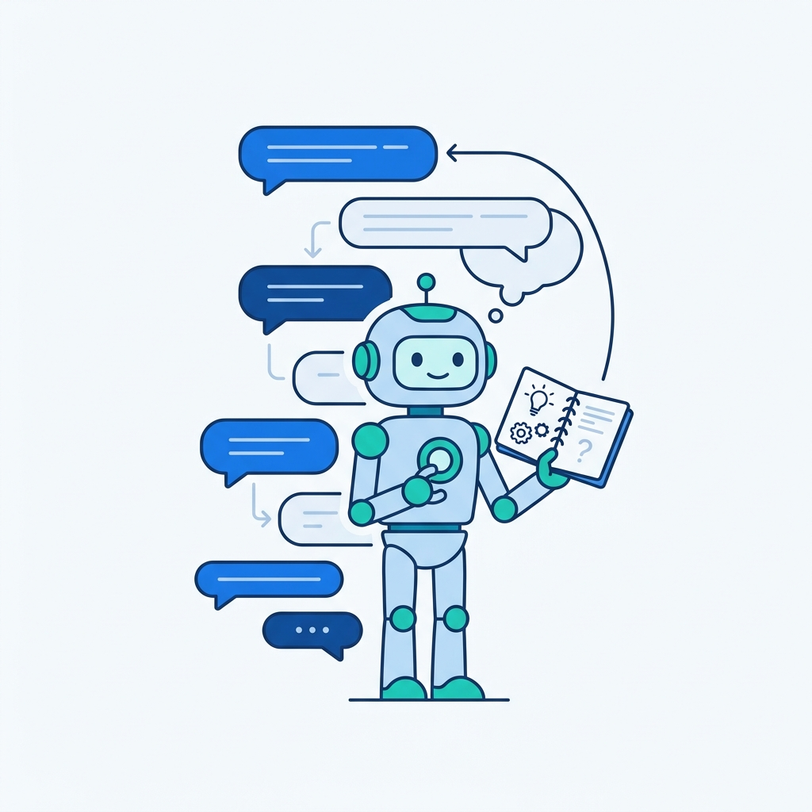
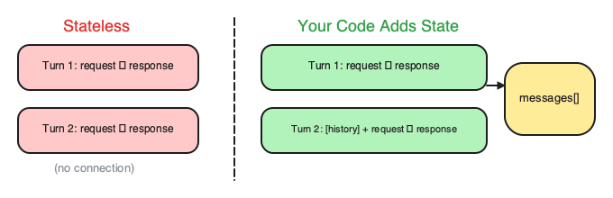
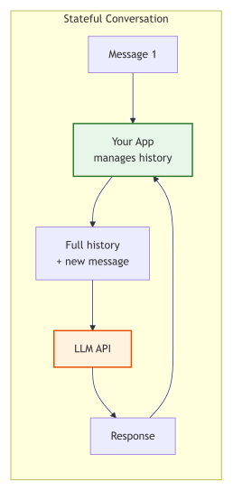
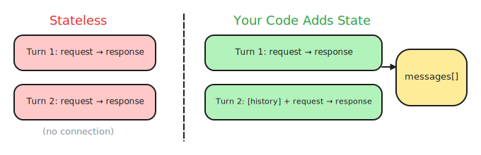
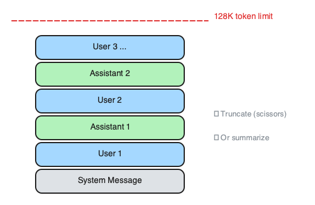
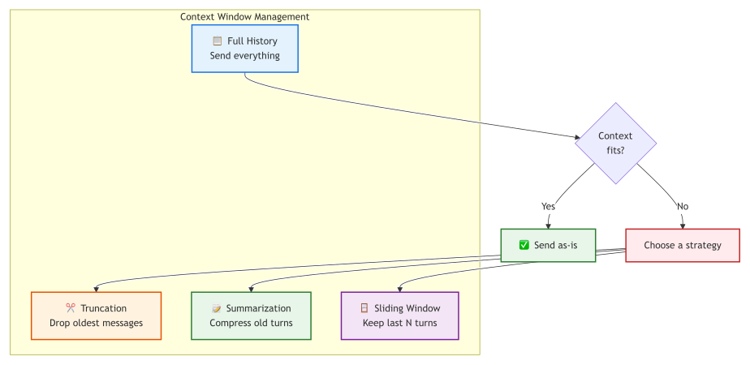
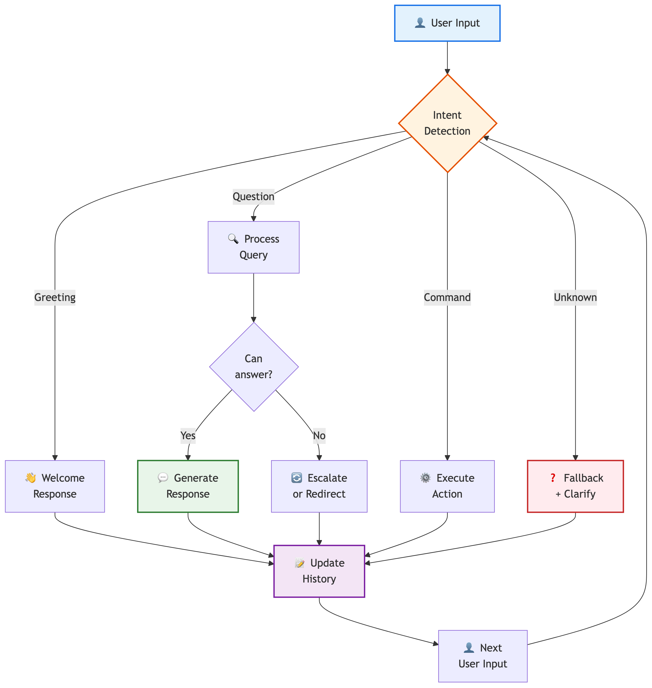

# 9. Conversation Design & Multi-turn Chat

> **🎯 Learning Objectives**
>
> - Bridge the gap between stateless APIs and stateful conversations using message history
> - Implement context window management strategies: truncation, summarization, sliding window
> - Design chatbot personas with clear purpose, audience, and conversation flow

## The Chatbot With Amnesia

<!-- IMAGE: A vertical thread of chat bubbles, with a friendly robot holding a notebook to remember earlier turns. Conveys keeping conversation context. -->

<!-- END IMAGE -->

Every developer who has built a chatbot has heard this complaint: "I already told you my name." The user introduces themselves, asks a question, gets a great answer, asks a follow-up, and the bot has amnesia. The user types "What's my name?" and the bot replies, "I don't know your name." The user closes the tab.

The problem is not the model. GPT-4o, Claude, Gemini: they all understand context perfectly well when you give it to them. The problem is that LLM APIs are stateless. Every request starts from zero. The model does not "forget" your name. It never "knew" it in the first place. Your second API call was a blank slate with no reference to the first.

The fix is not a smarter model. The fix is your code. You manage the conversation history, you decide what the model sees, and you control how much context to send. In this chapter, you will learn how to turn a stateless API into a stateful conversation, manage the inevitable growth of context, and design chatbots that feel intentional rather than accidental.

## The Stateless Problem
**Stateless API** means each request is processed independently. There is no session, no cookie, no server-side memory. When you call the API twice, the second call has no knowledge of the first.


<!-- figure: Stateless API: each request independent, no shared memory -->

The diagrams contrast a stateless API (two independent requests) with a stateful conversation (your app managing history); the sketch below shows how your code bridges the gap by passing a growing messages[] array across turns.

<!-- IMAGE: tateful Conversation: your app manages history. -->

<!-- END IMAGE -->

Here is the problem in code. Two separate API calls, two separate universes:

```python
from shared import get_completion

# Call 1: the user introduces themselves
response1 = get_completion(
    messages=[{"role": "user", "content": "My name is Alice and I work at Acme Corp."}],
    tier="mini",
)
print(response1)  # "Nice to meet you, Alice!"

# Call 2: a completely separate request
response2 = get_completion(
    messages=[{"role": "user", "content": "What's my name and where do I work?"}],
    tier="mini",
)
print(response2)  # "I don't know your name or where you work."
```


<!-- figure: Your code adds state by passing messages across turns -->

The model answered correctly both times. In the second call, it genuinely had no information about the user. The API did exactly what it was designed to do.

> [!NOTE]
> **Did You Know?** ELIZA (1966) used no AI at all. It was pure pattern matching: "I feel sad" triggered "Why do you feel sad?" Joseph Weizenbaum was horrified that people attributed understanding to his simple program. He wrote a book warning about anthropomorphizing computers. His concerns are more relevant today than ever.

## Managing Conversation History

<!-- IMAGE: A vintage computer terminal echoing a question mark back at a small person who projects a heart, hinting misplaced trust. Conveys an early pattern-matching chatbot. -->

<!-- END IMAGE -->

**Conversation history** is the solution: maintain a list of messages and send the entire list with every API call. The model reads the full conversation and responds in context.

A conversation is a list of message dictionaries with three roles:

| Role | Who Adds It | When |
|:-----|:------------|:-----|
| `system` | Your code | Once at start |
| `user` | Your code (from user input) | Each turn |
| `assistant` | Your code (from API response) | After each response |

Here is the fundamental chatbot loop. Every conversational application, from a simple Q&A bot to a complex customer support agent, builds on this pattern:

```python
from shared import get_completion

SYSTEM_MESSAGE = {"role": "system", "content": "You are a helpful assistant. Be concise."}

conversation = [SYSTEM_MESSAGE]

while True:
    user_input = input("You: ")
    if user_input.lower() in ("quit", "exit"):
        break

    conversation.append({"role": "user", "content": user_input})
    response = get_completion(conversation, tier="mini")
    print(f"Bot: {response}")

    conversation.append({"role": "assistant", "content": response})
```

Now the model remembers everything. "My name is Alice" in turn 1 is still visible in turn 5 because you send the entire list every time.

The cost of this approach is literal. Every turn adds tokens. A 50-turn conversation with an average of 200 tokens per message means you are sending roughly 10,000 tokens in the final API call. The total tokens sent across all 50 calls is approximately 250,000. That is real money and real latency.

> [!TIP]
> **Developer Gotcha:** The token usage reported by the API in a multi-turn chat is the *total* tokens processed in that single request (all previous turns + the new turn). You pay for the entire history every single turn, making long conversations exponentially more expensive than separate one-turn prompts.

For a deeper dive into message roles (system, user, assistant) and how to structure system messages, see [Chapter 3](03-working-with-llm-apis.md): Working with LLM APIs and [Chapter 5](05-prompt-fundamentals.md): Prompt Engineering Fundamentals. If your chatbot needs to answer questions from a large knowledge base that exceeds the context window, see [Chapter 11](11-rag-architecture.md): Retrieval-Augmented Generation (RAG) for a more scalable approach than message history alone.

## Context Window Management Strategies

Every model has a maximum context window. GPT-4o supports 128K tokens. Claude 3.5 Sonnet supports 200K. Gemini 2.5 Pro supports 1M. These are large, but long conversations eventually exceed the limit. Even within the limit, very long contexts can degrade response quality as the model loses focus on recent messages.

You need a strategy. There are three core approaches, and most production systems use a hybrid.


<!-- figure: Four context management strategies compared: full, truncation, summarization, sliding window -->

The diagram branches from a capacity check into three management strategies (truncation, summarization, sliding window); the sketch below visualizes a context window filling up and shows where each strategy trims or compresses the history.


<!-- figure: Context window filling up with truncation and summarize-back options -->

### Truncation

**Truncation** drops the oldest messages when the conversation exceeds a token budget. The system message always stays.

```python
import tiktoken

def truncate(conversation, max_tokens=8000):
    """Keep system message + most recent messages that fit."""
    enc = tiktoken.encoding_for_model("gpt-4o")
    system = [conversation[0]]
    recent = conversation[1:]

    while recent:
        total = sum(len(enc.encode(m["content"])) for m in system + recent)
        if total <= max_tokens:
            break
        recent.pop(0)

    return system + recent
```

Truncation is simple and predictable. The downside is permanent loss. If the user said their name in turn 1, it vanishes once enough new turns push it out.

### Summarization

**Summarization** asks the LLM to compress old messages into a short summary. Keep recent messages verbatim.

```python
from shared import get_completion

def summarize(conversation, keep_recent=6):
    """Compress old turns into a summary, keep recent turns intact."""
    if len(conversation) <= keep_recent + 1:
        return conversation

    system = conversation[0]
    old_turns = conversation[1:-keep_recent]
    recent = conversation[-keep_recent:]

    old_text = "\n".join(f"{m['role']}: {m['content']}" for m in old_turns)
    summary = get_completion(
        messages=[
            {
                "role": "system",
                "content": "Summarize in 2-3 sentences. Preserve key facts: names, preferences, decisions."
            },
            {"role": "user", "content": old_text},
        ],
        temperature=0.0,
    )

    return [system,
            {"role": "system", "content": f"Earlier conversation: {summary}"},
            *recent]
```

Summarization preserves key information across the entire conversation. The tradeoff is an extra API call (and its cost) each time you summarize, and the summary may miss details the original messages contained.

### Sliding Window

**Sliding window** keeps only the last N turns plus the system message. The simplest bounded-cost approach.

```python
def sliding_window(conversation, max_turns=10):
    """Keep system message + last N user/assistant pairs."""
    system = [conversation[0]]
    turns = conversation[1:]

    if len(turns) > max_turns * 2:
        turns = turns[-(max_turns * 2):]

    return system + turns
```

### Choosing a Strategy

| Strategy | Pros | Cons | Best For |
|:---------|:-----|:-----|:---------|
| **Truncation** | Simple, predictable | Loses old context permanently | Quick prototypes |
| **Summarization** | Preserves key facts | Extra API call, may miss details | Production chatbots |
| **Sliding window** | Simple, bounded cost | Loses early context (names, preferences) | Casual assistants |
| **Hybrid** | Best retention, bounded cost | More implementation complexity | Enterprise applications |

Most production chatbots use a hybrid: summarize old turns and keep recent ones verbatim. This gives the model a compressed view of the full conversation plus full fidelity on the last several exchanges.

> [!WARNING]
> **Context window costs grow with conversation length.** A 50-turn conversation with 200 tokens per turn sends 10,000 tokens in the final call. But the total tokens sent across all calls is approximately 250,000. Budget accordingly, especially during development when you test long conversations repeatedly.

## Designing a Chatbot Persona

**Chatbot persona** prevents drift. It answers questions about cooking when it should be debugging Python. It cracks jokes during a compliance audit. It switches from formal to casual mid-conversation.

Before writing code, answer six questions:

| Question | Example |
|:---------|:--------|
| **Purpose** | Help developers debug Python errors |
| **Audience** | Junior to mid-level Python developers |
| **Persona** | Patient, encouraging senior developer |
| **Scope** | Python only. No JavaScript, no DevOps. |
| **Tone** | Professional but friendly. Uses code examples. |
| **Limitations** | Cannot access user's codebase. Text-only. |

The answers to these questions become your system message. Here is a complete persona for a tech support bot:

```python
SYSTEM_MESSAGE = {
    "role": "system",
    "content": """You are PyBuddy, a patient and encouraging Python debugging assistant.

AUDIENCE: Junior to mid-level Python developers
TONE: Professional but friendly. Use code examples generously.

CAPABILITIES:
- Explain Python errors in plain English
- Suggest fixes with code examples
- Teach debugging strategies

LIMITATIONS:
- Python only. Politely redirect other language questions.
- Do not write complete applications. Help debug, not build.

RULES:
- Always ask clarifying questions before suggesting a fix
- Show the error, explain why it happens, then show the fix
- Keep responses under 300 words unless the user asks for detail""",
}
```

Notice the structure: capabilities tell the model what it can do, limitations tell it what it cannot do, and rules define behavioral constraints. The "DO NOT" section is critical. Without explicit constraints, the model will happily answer any question, regardless of whether it should.

> [!TIP]
> **Always include a system message that defines what the bot should NOT do.** "You are a Python help assistant. You do not answer questions about other languages. If asked, politely redirect." This prevents your support bot from becoming a general-purpose chatbot.

## Conversation Flow Design

A well-designed chatbot handles more than the happy path. Real users go off-topic, ask ambiguous questions, get frustrated, and occasionally try to break the bot.


<!-- figure: Conversation Flow -->

### Intents and Fallbacks

An intent is what the user wants to accomplish. A debugging bot might handle these intents: explain an error, suggest a fix, teach a concept, review code. Everything else is off-topic.

A fallback is what the bot does when it cannot determine the intent or the intent is out of scope. Good fallbacks are specific, not generic. "I specialize in Python debugging. For JavaScript questions, try MDN Web Docs." is better than "I can't help with that."

### Escalation

Some conversations need a human. Define escalation triggers in your system message: "If the user asks about billing, pricing, or account access, respond with: 'Let me connect you with our support team. Please email support@example.com.'"

### Guard Rails

Guard rails keep the conversation on track. They are implemented as constraints in the system message and reinforced by the model's instruction-following ability.

| Scenario | Strategy |
|:---------|:---------|
| Off-topic question | Politely redirect to scope |
| Ambiguous input | Ask a clarifying question |
| User frustration | Acknowledge, empathize, then help |
| Empty input | Prompt gently: "What Python error are you seeing?" |
| Harmful request | Decline clearly and redirect |
| Repeated question | Rephrase the answer, add more detail |

### Remembering User Context

For longer conversations, extract key user facts and inject them into the system message. This approach survives context window management because the facts live in the system message, not in old turns that might be truncated.

```python
user_context = {
    "name": "Alice",
    "skill_level": "intermediate",
    "project": "Flask REST API",
}

system_content = f"""You are PyBuddy, a Python debugging assistant.

USER CONTEXT:
- Name: {user_context['name']}
- Skill level: {user_context['skill_level']}
- Current project: {user_context['project']}

Adapt your explanations to the user's skill level."""
```

For securing chatbots against prompt injection and other adversarial inputs, see [Chapter 12](12-security-guardrails.md): Security and Guardrails. For managing the cost of long conversations, see [Chapter 13](13-cost-optimization.md): Cost Optimization.

## 🧪 Try It Yourself

The companion repository contains full exercises, starter code, and solutions for building multi-turn chatbots, managing context windows, and testing different personas:

- [building-with-llms-companion/exercises/ch09/multi_turn_chatbot](https://github.com/kpassoubady/building-with-llms-companion/tree/main/exercises/ch09/multi_turn_chatbot)
- [building-with-llms-companion/exercises/ch09/context_manager](https://github.com/kpassoubady/building-with-llms-companion/tree/main/exercises/ch09/context_manager)
- [building-with-llms-companion/exercises/ch09/persona_lab](https://github.com/kpassoubady/building-with-llms-companion/tree/main/exercises/ch09/persona_lab)

### Exercise 1: The Amnesia Test

Write two separate `get_completion` calls. In the first, tell the model your name. In the second, ask what your name is. Verify the model does not remember. Then rewrite both as a single call with a message list and verify it does remember.

### Exercise 2: Sliding Window Chat

Build a chat loop that keeps only the last 5 turns (10 messages) plus the system message. Have a 10-turn conversation, then ask about something from turn 1. Observe what the bot remembers and what it has lost.

### Exercise 3: Persona Swap

Create two different system messages: one for a formal legal assistant and one for a casual cooking helper. Ask both the same question ("How do I handle an exception?") and compare the responses.


## 📋 Chapter Summary

> **💡 Key Takeaways**
>
> - LLM APIs are stateless. Your code must append each user message and assistant response to a message list and send the full list with every API call. Without this, the model has no memory between turns.
> - Manage context growth with truncation, summarization, or a sliding window. Most production chatbots combine summarization of old turns with verbatim retention of recent ones to balance token cost against context fidelity.
> - Define persona, scope, tone, and explicit limitations in the system message before writing any chatbot code. Specifying what the bot should NOT do is as important as specifying what it can do.

> [!PITFALLS]
> - Sending each user message as an independent API call without conversation history, causing the bot to "forget" everything between turns
> - Letting conversation history grow unbounded, leading to high token costs and eventually exceeding the context window limit
> - Writing a system message that says what the bot CAN do but not what it CANNOT do, allowing it to drift off-topic

## 🧠 Knowledge Check

1. **Multiple Choice:** Why must you send the entire conversation history with each API call?

    ::: {.mcq-2col}
    - [ ] The API charges per conversation, not per message
    - [ ] The API is stateless and has no memory between calls
    - [ ] The model needs to verify previous responses
    - [ ] The API requires a minimum message count
    :::

2. **True or False:** The summarization context management strategy uses fewer total tokens than keeping all messages verbatim over a long conversation.

    ::: {.tf-inline}
    - [ ] True
    - [ ] False
    :::

3. **Fill in the Blank:** A ______ window strategy keeps the last N turns and drops older ones.

4. **Multiple Choice:** Which of the following should you include in a chatbot's system message?

    ::: {.mcq-2col}
    - [ ] Only what the bot can do
    - [ ] Only the bot's name
    - [ ] Purpose, capabilities, and what the bot should NOT do
    - [ ] The full conversation history
    :::

5. **Scenario:** Your chatbot suddenly starts answering questions about cooking recipes when it is supposed to be a Python debugging assistant. The system message says "You are a Python debugging assistant." What is the most likely problem, and how would you fix it?

<details>
<summary><strong>Click to Reveal Answers</strong></summary>

1. **Answer**: The API is stateless and has no memory between calls. Each request is independent. The model only sees what you include in the messages list for that specific call.

2. **Answer**: True. Summarization compresses old messages into a short summary, reducing the token count of earlier turns. Over a long conversation, this saves significant tokens compared to sending every message verbatim.

3. **Answer**: Sliding. A sliding window strategy keeps the system message plus the last N user/assistant pairs, dropping everything older.

4. **Answer**: Purpose, capabilities, and what the bot should NOT do. A complete system message defines the persona, what the bot can do, what it cannot do, and behavioral rules. Without explicit constraints, the model will answer any question.

5. **Answer**: The system message lacks explicit constraints. Saying "You are a Python debugging assistant" defines identity but not boundaries. The fix is to add explicit scope and refusal instructions: "You specialize in Python debugging. You do not answer questions about other topics. If asked about non-Python topics, politely redirect the user."

</details>
