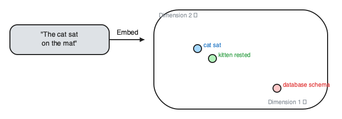
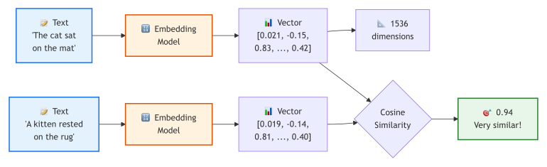
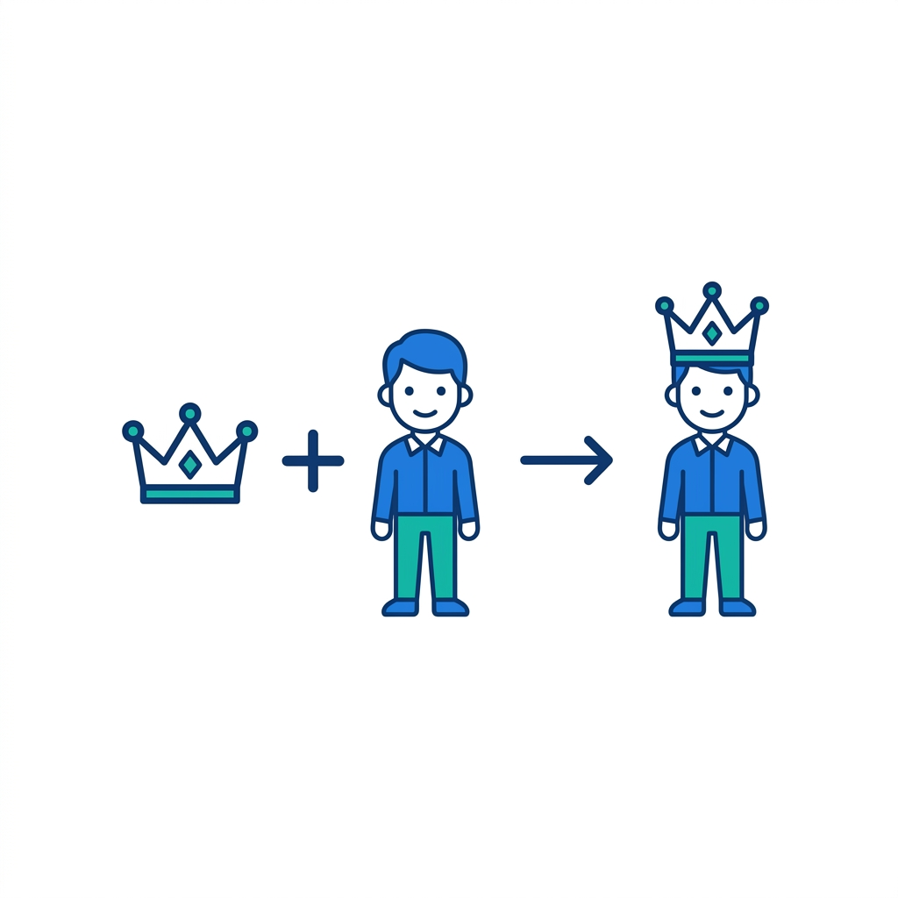
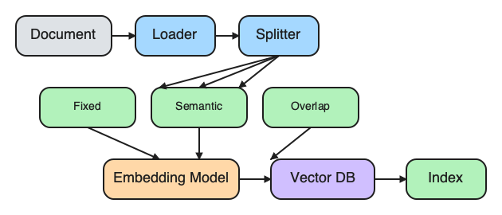
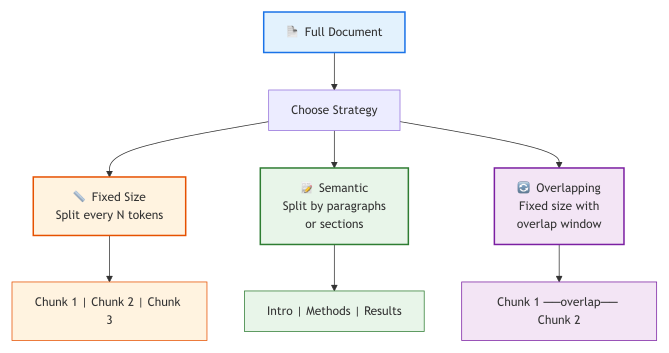
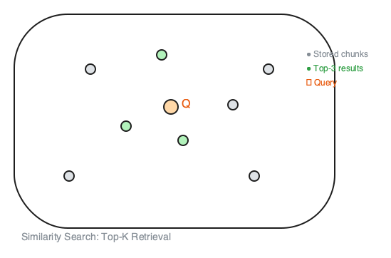
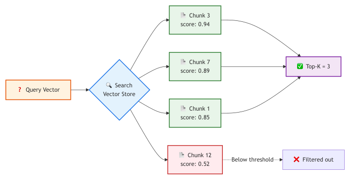

# 10. Embeddings & Vector Databases

> **🎯 Learning Objectives**
>
> - Generate text embeddings using OpenAI, Gemini, or open-source models
> - Store and query embeddings in vector databases (FAISS, Chroma, Pinecone)
> - Apply effective chunking strategies to prepare documents for embedding

## Matching Meaning, Not Words

<!-- IMAGE: Words turning into points/arrows scattered across a starfield-like space, with similar points clustered together. Conveys meaning mapped into vector space. -->

<!-- END IMAGE -->

In 2019, Google deployed BERT to power 10% of English search queries. For years, search had been about matching keywords: if you typed "how to fix a broken pipe," the engine looked for pages containing those exact words. BERT changed the game. Instead of matching words, Google started matching meaning. A search for "can you get medicine for someone at a pharmacy" now correctly matched pages about prescription pickup policies, even though none of those pages contained the phrase "get medicine for someone."

The technology behind this shift was embeddings: representing text as a list of numbers where similar meanings produce similar numbers. The sentence "the cat sat on the mat" and the sentence "a kitten rested on the rug" produce nearly identical vectors, while "database schema migration" lands in a completely different region of the number space. This simple idea powers recommendation engines, semantic search, plagiarism detection, and the retrieval half of RAG.

In this chapter, you will learn how to generate embeddings, measure similarity between them, store them in vector databases for fast retrieval, and chunk documents so that each piece carries enough meaning to be useful.

## What Are Embeddings?

**Embedding** is a vector (a list of floating-point numbers) that represents the meaning of a piece of text. The key property is that texts with similar meaning produce vectors that are close together in the number space, and texts with different meaning produce vectors that are far apart.


<!-- figure: Text converted to high-dimensional vectors showing similar texts clustering close -->

The diagram traces two sentences through an embedding model to vectors and a cosine similarity score; the sketch below maps those same vectors into a 2D space so you can see how similar texts cluster close together.


<!-- figure: Two sentences mapped into 2D vector space with cosine similarity -->

A single sentence becomes a list of 768 to 3,072 numbers, depending on the model. You do not need to understand what each number means. What matters is the relationship between vectors: similar texts produce similar vectors.

```python
import litellm
import numpy as np

# Embed three sentences
response = litellm.embedding(
    model="text-embedding-3-small",
    input=[
        "The cat sat on the mat",
        "A kitten rested on the rug",
        "Database schema migration strategies",
    ],
)

vectors = [item["embedding"] for item in response.data]
print(f"Dimensions per vector: {len(vectors[0])}")  # 1536
print(f"First 5 values: {[round(v, 4) for v in vectors[0][:5]]}")
```

The output is a list of 1,536 numbers per sentence. By itself, a single vector is not useful. The power comes from comparing vectors.

> [!NOTE]
> **Did You Know?** The word2vec algorithm (2013) was the breakthrough that showed words could be represented as vectors. The famous example: vector("King") minus vector("Man") plus vector("Woman") approximately equals vector("Queen"). Modern embedding models handle entire sentences and paragraphs, not just single words.

<!-- IMAGE: A clean vector-arithmetic visual: a crown plus a small figure, an arrow, resolving to a second crowned figure. Conveys word-vector analogies. No text. -->

<!-- END IMAGE -->

## Measuring Similarity

Two vectors are similar if they point in roughly the same direction.

**Cosine similarity** is the standard measure: the cosine of the angle between two vectors. A score of 1.0 means identical direction (same meaning). A score near 0.0 means unrelated. A score of -1.0 means opposite.

```python
import numpy as np

def cosine_similarity(a, b):
    """Compute cosine similarity between two vectors."""
    a, b = np.array(a), np.array(b)
    return float(np.dot(a, b) / (np.linalg.norm(a) * np.linalg.norm(b)))

# Compare the three sentences from above
sim_cat_kitten = cosine_similarity(vectors[0], vectors[1])
sim_cat_database = cosine_similarity(vectors[0], vectors[2])

print(f"cat/kitten similarity:   {sim_cat_kitten:.3f}")   # ~0.85
print(f"cat/database similarity: {sim_cat_database:.3f}")  # ~0.15
```

The cat sentence and the kitten sentence score high because they share meaning. The cat sentence and the database sentence score low because they are unrelated topics.

| Score Range | Meaning | Example |
|:------------|:--------|:--------|
| 0.90+ | Very similar | "fix the bug" vs "resolve the issue" |
| 0.70-0.89 | Related | "Python error" vs "debugging code" |
| 0.50-0.69 | Somewhat related | "Python" vs "programming" |
| Below 0.50 | Unrelated | "Python" vs "chocolate cake" |

These thresholds are approximate and vary by embedding model. Always test with your specific data to calibrate expectations.

## Embedding Models

Several providers offer embedding models. The choice depends on your quality requirements, cost constraints, and whether you need to run locally.

| Model | Provider | Dimensions | Cost (per 1M tokens) | Notes |
|:------|:---------|:-----------|:---------------------|:------|
| `text-embedding-3-small` | OpenAI | 1,536 | $0.02 | Best cost/quality ratio for most tasks |
| `text-embedding-3-large` | OpenAI | 3,072 | $0.13 | Higher quality, 5x more expensive |
| `embedding-001` | Google | 768 | Free tier available | Good for Gemini ecosystem |
| `voyage-3` | Voyage AI | 1,024 | $0.06 | Strong retrieval benchmarks |
| Sentence Transformers | Open-source | 384-1,024 | Free (self-hosted) | No API dependency, runs locally |

All of these models are accessed through the same pattern via `litellm`:

```python
import litellm

response = litellm.embedding(
    model="text-embedding-3-small",  # swap model name for any provider
    input=["Your text here"],
)
vector = response.data[0]["embedding"]
print(f"Dimensions: {len(vector)}")  # 1536
```

> [!NOTE]
> **Use the smallest embedding model that works for your task.** `text-embedding-3-small` (1,536 dimensions) is 5x cheaper than `text-embedding-3-large` (3,072 dimensions) and performs within 2% on most retrieval benchmarks. Start small, upgrade only if retrieval quality demands it.

> [!TIP]
> **Cross-Reference:** To see how these embeddings are used to ground LLM responses in real-world knowledge, see [Chapter 11](11-rag-architecture.md): Retrieval-Augmented Generation (RAG).

## Chunking Strategies

**Chunking** splits documents into smaller pieces before embedding. You cannot embed an entire 50-page document as a single vector. Embedding models have token limits (typically 8K), and even within those limits, a single vector for a long document averages out the meaning of every paragraph, diluting the signal. You need to split documents into smaller pieces, called chunks, before embedding.


<!-- figure: Chunking Strategies -->

> [!TIP]
> **High-Resolution Pipeline:** For a full-page version of the complete Chunking and Indexing Pipeline, see [Appendix E](appendix-e-diagrams.md#chapter-10-chunking-and-indexing-pipeline). The high-resolution file is also available in the companion repository:
> - [ch10-chunking-indexing.png](https://github.com/kpassoubady/building-with-llms-companion/blob/main/diagrams/ch10-chunking-indexing.png)

### Fixed-Size Chunking

Split text into chunks of a fixed character or token count, with optional overlap between consecutive chunks.

```python
def chunk_text(text, chunk_size=500, overlap=50):
    """Split text into overlapping chunks by character count."""
    chunks = []
    start = 0
    while start < len(text):
        end = start + chunk_size
        chunks.append(text[start:end])
        start = end - overlap
    return chunks

document = open("handbook.md").read()
chunks = chunk_text(document, chunk_size=500, overlap=50)
print(f"Document split into {len(chunks)} chunks")
```

Fixed-size chunking is simple and predictable. The downside is that it cuts through sentences and paragraphs, potentially splitting a single idea across two chunks.

### Semantic Chunking

Split on natural boundaries: paragraph breaks, section headers, or sentence endings. This preserves meaning within each chunk.

```python
def chunk_by_paragraphs(text, max_chunk_size=500):
    """Split by paragraph boundaries, merge small paragraphs."""
    paragraphs = text.split("\n\n")
    chunks, current = [], ""
    for para in paragraphs:
        if len(current) + len(para) > max_chunk_size and current:
            chunks.append(current.strip())
            current = ""
        current += para + "\n\n"
    if current.strip():
        chunks.append(current.strip())
    return chunks
```

### Overlap

Overlap means each chunk shares some text with the previous one. This prevents the case where a sentence is split exactly at a chunk boundary, leaving half the idea in one chunk and half in the next. A 10-20% overlap is standard.

### Choosing a Strategy

| Strategy | Pros | Cons | Best For |
|:---------|:-----|:-----|:---------|
| **Fixed-size** | Simple, predictable, uniform chunks | Cuts through sentences and ideas | Homogeneous text (logs, transcripts) |
| **Semantic** | Preserves paragraph and section structure | Uneven chunk sizes | Structured documents (docs, articles) |
| **Overlap** | Reduces information loss at boundaries | Slightly more chunks, slightly more cost | Any strategy (use as an add-on) |

> [!WARNING]
> **Chunk size matters more than you think.** Too small (50 tokens) and chunks lack context. Too large (2,000 tokens) and irrelevant content dilutes the embedding. Start with 300-500 tokens and tune based on retrieval quality.

### Metadata

Store metadata alongside each chunk. When you retrieve chunks later, the metadata tells you where the text came from, enabling source citations in your responses.

```python
chunks = [
    {"text": "...", "source": "handbook.md", "section": "Vacation Policy", "chunk_id": 0},
    {"text": "...", "source": "handbook.md", "section": "Sick Leave", "chunk_id": 1},
    {"text": "...", "source": "onboarding.md", "section": "First Week", "chunk_id": 0},
]
```

> [!TIP]
> **Cross-Reference:** For a deeper dive into how chunking fits into a full Retrieval-Augmented Generation pipeline, see [Chapter 11](11-rag-architecture.md): RAG Architecture.


<!-- figure: Chunking and indexing pipeline -->

## Vector Databases

**Vector database** stores vectors and enables fast nearest-neighbor search. Once you have vectors, you need a place to store them and a way to search for the most similar ones. Vector databases are optimized for exactly this: storing high-dimensional vectors and performing fast nearest-neighbor search.

| Feature | Traditional Database | Vector Database |
|:--------|:--------------------|:----------------|
| **Query type** | Exact match (WHERE x = y) | Nearest neighbor (most similar) |
| **Data stored** | Rows and columns | High-dimensional vectors |
| **Search method** | SQL queries | Cosine similarity, L2 distance |
| **Use case** | Structured data | Semantic search, RAG, recommendations |

### FAISS (Facebook AI Similarity Search)

FAISS is a library by Meta for fast, in-memory similarity search. It has no server, no persistence by default, and no metadata management. You get raw speed and control.

```python
import faiss
import numpy as np

# 1. Create an index for 1536-dimensional vectors
dimension = 1536
index = faiss.IndexFlatL2(dimension)

# 2. Add vectors
vectors = np.array(list_of_embeddings, dtype=np.float32)
index.add(vectors)
print(f"Vectors in index: {index.ntotal}")

# 3. Search for the 3 nearest neighbors
query = np.array([query_embedding], dtype=np.float32)
distances, indices = index.search(query, k=3)

# indices[0]   = [7, 3, 12]              — IDs of closest vectors
# distances[0] = [0.12, 0.34, 0.56]      — L2 distances (lower = closer)
```

FAISS stores only vectors. You manage metadata (source file, chunk text) in a parallel list where position `i` in the list corresponds to vector `i` in the index.

```python
# Parallel metadata list
for idx in indices[0]:
    print(f"Source: {chunks[idx]['source']}, Text: {chunks[idx]['text'][:60]}")
```

### Chroma

Chroma is an embedded vector database with a simpler API. It stores documents, metadata, and vectors together, and can auto-embed text if you configure an embedding function.

```python
import chromadb

client = chromadb.Client()
collection = client.create_collection("my_docs")

# Add documents with metadata
collection.add(
    documents=["Python uses indentation", "FAISS enables similarity search"],
    metadatas=[{"source": "python.md"}, {"source": "faiss.md"}],
    ids=["doc1", "doc2"],
)

# Query
results = collection.query(query_texts=["How does Python structure code?"], n_results=2)
print(results["documents"])   # matched texts
print(results["metadatas"])   # source metadata
print(results["distances"])   # similarity scores
```

### Pinecone

Pinecone is a cloud-managed vector database for production workloads. It handles scaling, persistence, and replication. You interact through an API with an API key.

### When to Use Which

| Database | Type | Best For | Setup Complexity |
|:---------|:-----|:---------|:-----------------|
| **FAISS** | Library (local) | Prototypes, small datasets (under 100K vectors) | `pip install faiss-cpu` |
| **Chroma** | Embedded DB | Development, small production (100K to 1M vectors) | `pip install chromadb` |
| **Pinecone** | Cloud service | Production at scale (1M+ vectors) | API key required |
| **pgvector** | PostgreSQL extension | Teams already on PostgreSQL | Extension install |

> [!NOTE]
> **Did You Know?** FAISS was open-sourced by Meta in 2017 and can search through a billion vectors in milliseconds using approximate nearest-neighbor algorithms. The library powers similarity search at Facebook, Instagram, and WhatsApp scale.

## Similarity Search

With embeddings stored in a vector database, you can now search by meaning rather than by keywords. This is the foundation of RAG and semantic search applications.


<!-- figure: Query vector matched against stored chunks with scored results and top-K filter -->

The diagram follows a query vector through the index to scored chunks and a top-K filter; the sketch below shows the same search as a spatial layout with the query as a star and chunks as dots, highlighting the nearest matches.



The search workflow is: embed the query using the same model that embedded the documents, search the index for the K nearest vectors, and return the corresponding chunks.

```python
import faiss
import numpy as np
import litellm

# Assume: index is a FAISS index, chunks is the parallel metadata list

def search(query_text, index, chunks, k=3):
    """Embed a query and return the top-K most similar chunks."""
    response = litellm.embedding(model="text-embedding-3-small", input=[query_text])
    query_vector = np.array([response.data[0]["embedding"]], dtype=np.float32)

    distances, indices = index.search(query_vector, k=k)

    results = []
    for rank, idx in enumerate(indices[0]):
        results.append({
            "rank": rank + 1,
            "distance": float(distances[0][rank]),
            "text": chunks[idx]["text"],
            "source": chunks[idx]["source"],
        })
    return results

# Usage
for result in search("How does Python handle errors?", index, chunks):
    print(f"  #{result['rank']} [dist={result['distance']:.3f}] {result['source']}")
    print(f"    {result['text'][:80]}...")
```

### Distance Metrics

| Metric | Range | Interpretation |
|:-------|:------|:---------------|
| **L2 (Euclidean)** | 0 to infinity | Lower = more similar |
| **Cosine similarity** | -1 to 1 | Higher = more similar |
| **Inner product** | -infinity to infinity | Higher = more similar |

For normalized vectors (most embedding models output normalized vectors), L2 distance and cosine similarity produce equivalent rankings. FAISS uses L2 by default. To use cosine similarity with FAISS, normalize your vectors and use `IndexFlatIP` (inner product).

### Thresholds

Not every search result is relevant. A low similarity score (or high distance) means the best match in your database is still not a good match for the query. Set a threshold below which you discard results rather than returning poor matches.

## 🧪 Try It Yourself

### Exercise 1: Embedding Explorer

Embed 10 sentences on mixed topics (programming, cooking, sports). Compute the pairwise cosine similarity matrix. Identify which sentences cluster together.

### Exercise 2: Chunk and Search

Take any markdown file from the `day3/knowledge-base/` folder. Chunk it using both fixed-size and semantic strategies. Embed the chunks, build a FAISS index, and query it. Compare which strategy returns more relevant results.

### Exercise 3: FAISS vs Chroma

Load the same 5 documents into both FAISS (with a parallel metadata list) and Chroma (with built-in metadata). Query both with the same question. Compare the APIs and the results.

> [!TIP]
> **Starter Code:** The companion repository contains full exercises, starter code, and solutions for exploring embeddings, experimenting with chunking strategies, and comparing vector databases.
> - [building-with-llms-companion/exercises/ch10/embedding_explorer](https://github.com/kpassoubady/building-with-llms-companion/tree/main/exercises/ch10/embedding_explorer)
> - [building-with-llms-companion/exercises/ch10/chunking_lab](https://github.com/kpassoubady/building-with-llms-companion/tree/main/exercises/ch10/chunking_lab)
> - [building-with-llms-companion/exercises/ch10/vector_db_comparison](https://github.com/kpassoubady/building-with-llms-companion/tree/main/exercises/ch10/vector_db_comparison)

## 📋 Chapter Summary

> **💡 Key Takeaways**
>
> - Embeddings convert text into fixed-length vectors where similar meanings produce similar vectors. Use cosine similarity (scores near 1.0) to measure relevance. Always use the same embedding model for both ingestion and query.
> - Chunk documents into 300 to 500 token pieces before embedding. Semantic boundaries (paragraphs, sections) preserve meaning better than fixed character counts. Store metadata alongside each chunk so you can cite sources on retrieval.
> - Choose your vector store by scale: FAISS for prototypes, Chroma for development and small production, Pinecone for large-scale production. Similarity search embeds the query, finds the top-K nearest vectors, and returns the corresponding chunks.

> [!PITFALLS]
> - Using different embedding models for ingestion and query, producing incompatible vectors that return garbage results
> - Choosing chunk sizes that are too small (no context) or too large (diluted meaning), both of which degrade retrieval quality
> - Forgetting to store metadata alongside vectors, making it impossible to cite sources or trace results back to documents

## 🧠 Knowledge Check

1. **Multiple Choice:** What does cosine similarity measure?

    ::: {.mcq-2col}
    - [ ] The Euclidean distance between two vectors
    - [ ] The angle between two vectors
    - [ ] The number of overlapping tokens
    - [ ] The byte-level difference between two strings
    :::

2. **True or False:** An embedding is a fixed-length list of numbers representing the semantic meaning of text.

    ::: {.tf-inline}
    - [ ] True
    - [ ] False
    :::

3. **Fill in the Blank:** Splitting documents into smaller pieces before embedding is called ______.

4. **Multiple Choice:** Which of the following is a cloud-managed vector database?

    ::: {.mcq-2col}
    - [ ] FAISS
    - [ ] Chroma
    - [ ] Pinecone
    - [ ] NumPy
    :::

5. **Scenario:** Your similarity search returns irrelevant results even though you know the query is well-formed and the relevant documents are in the index. Name two things you would check to diagnose the problem.

<details>
<summary><strong>Click to Reveal Answers</strong></summary>

1. **(b) The angle between two vectors.** Cosine similarity computes the cosine of the angle between two vectors. A score of 1.0 means the vectors point in the same direction (identical meaning), and 0.0 means they are perpendicular (unrelated).

2. **True.** An embedding converts text into a fixed-length vector of floating-point numbers. The position in vector space encodes semantic meaning, so similar texts produce similar vectors.

3. **Chunking.** Documents are split into smaller pieces (chunks) of 300-500 tokens before embedding. This ensures each vector represents a focused piece of meaning.

4. **(c) Pinecone.** Pinecone is a fully managed cloud service for vector storage and search. FAISS is a local library, Chroma is an embedded database, and NumPy is a numerical computing library.

5. **Two things to check:** (1) Chunk size: chunks may be too large (diluting the embedding with irrelevant content) or too small (lacking sufficient context). (2) Embedding model mismatch: the query and the documents may have been embedded with different models, producing vectors in different spaces that cannot be meaningfully compared. Other valid checks include whether vectors are properly normalized and whether the correct distance metric is being used.

</details>
