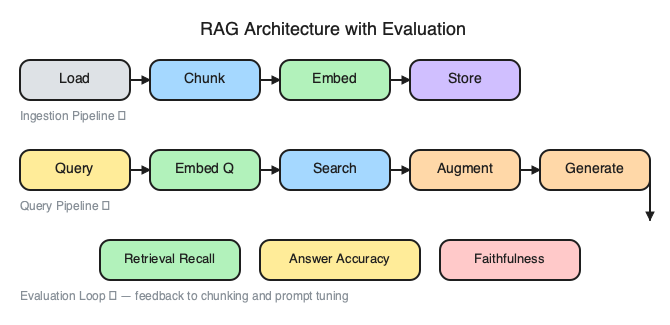
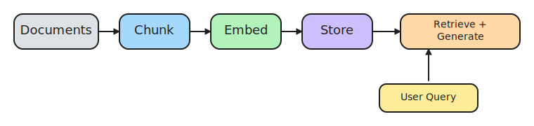
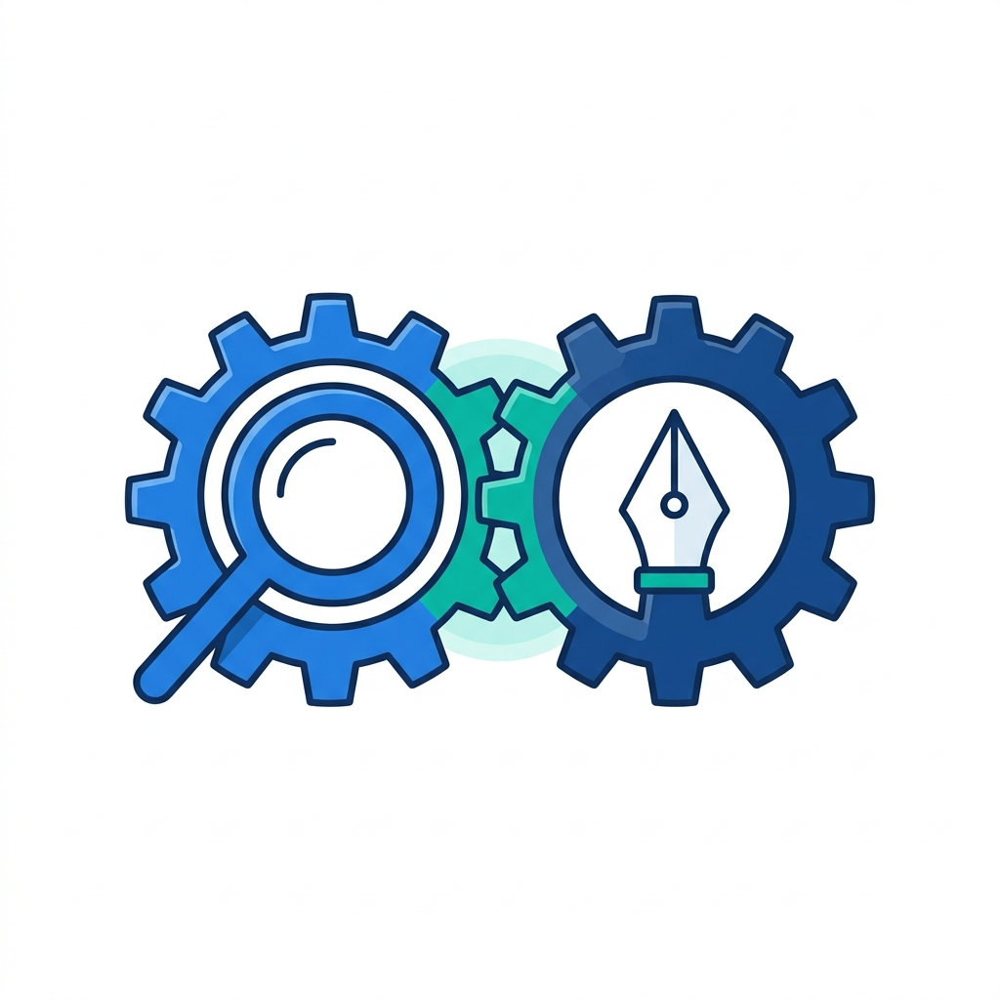
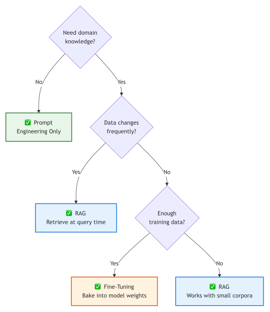
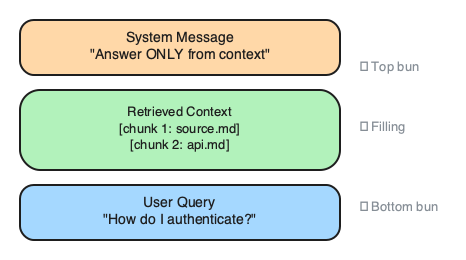
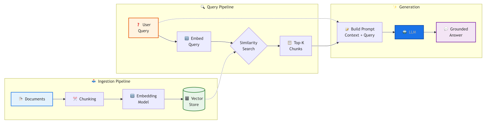

# 11. Retrieval-Augmented Generation (RAG)

> **🎯 Learning Objectives**
>
> - Build a complete RAG pipeline: ingestion, chunking, embedding, retrieval, generation
> - Construct RAG prompts that ground LLM responses in retrieved context with source citations
> - Evaluate when RAG is the right approach vs fine-tuning or prompt engineering alone

## Confidently Wrong

<!-- IMAGE: A helper robot pulling a specific book from a shelf and handing its contents to a speech bubble. Conveys retrieve-then-answer grounding. -->

<!-- END IMAGE -->

A startup built an internal chatbot to answer questions about their codebase. The chatbot used GPT-4 and worked impressively well for general programming questions. Then an engineer asked, "What is the retry policy for our payment service?" The bot responded with confidence: "The payment service retries failed transactions three times with exponential backoff starting at 500ms." Every detail was wrong. The actual policy was five retries with linear backoff starting at 1 second. The bot had never seen the internal documentation. It generated a plausible answer from patterns in its training data.

The team added RAG. Instead of answering from memory, the bot now searches the company wiki before every response. It retrieves the relevant documentation, injects it into the prompt, and generates an answer grounded in actual source material. Hallucinations dropped from roughly 30% to under 5%. The model did not get smarter. It got informed.

In this chapter, you will build a complete RAG system from scratch: ingest documents, chunk and embed them, store vectors in a database, retrieve relevant context at query time, and generate grounded answers with source citations. By the end, you will have a working pipeline that turns any folder of documents into an answerable knowledge base.

## The Hallucination Problem and Why RAG Helps

LLMs generate text that sounds correct but may be factually wrong. Ask GPT-4 about your company's vacation policy and it will produce a confident, well-structured answer. The problem is that the answer comes from statistical patterns in training data, not from your actual policy documents. The model has never seen your internal wiki.

Hallucinations happen for three reasons:

1. The model was not trained on your private data
2. Knowledge cutoff means the model does not know about recent changes
3. The model optimizes for fluency, not accuracy

**Retrieval-Augmented Generation (RAG)** solves this by retrieving relevant documents before generating a response. Instead of relying on the model's training data, you hand it the specific documents it needs to answer the question.


<!-- figure: RAG ingestion and query pipelines end-to-end -->

**High-Resolution Architecture:** For a full-page, high-resolution RAG architecture diagram, see [Appendix E](appendix-e-diagrams.md#chapter-11-rag-architecture-full). The high-resolution file is also available in the companion repository:
- [ch11-rag-full.png](https://github.com/kpassoubady/building-with-llms-companion/blob/main/diagrams/ch11-rag-full.png)

The diagram separates RAG into three labeled subgraphs (ingestion, query, generation) with data flowing left to right; the sketch below condenses the same pipeline into five hand-drawn steps you can trace from document to grounded answer.


<!-- figure: RAG in five hand-drawn steps: chunk, embed, store, retrieve, generate -->

The core idea is simple: search first, then answer. A RAG system finds the three or four most relevant chunks of documentation, injects them into the prompt, and instructs the model to answer based only on that context. The model still generates the response, but now it has real source material to work from instead of relying on patterns memorized during training.

> [!NOTE]
> **Did You Know?** The RAG paper was published by Facebook AI Research (now Meta AI) in 2020 by Patrick Lewis et al. The key insight was combining a retriever (DPR) with a generator (BART) in a single end-to-end system. The paper has been cited over 4,000 times and launched an entire category of LLM applications.

<!-- IMAGE: Two interlocking gears labeled by shape, one a magnifying glass (retriever) and one a pen (generator), meshing into a single unit. Conveys retriever plus generator as one system. -->

<!-- END IMAGE -->

## The Two Pipelines

Every RAG system has two distinct pipelines. Understanding the separation is critical because they run at different times and have different performance characteristics.

### Ingestion Pipeline (Runs Once or on Updates)

**Ingestion pipeline** processes your documents into a searchable format. You run it once when setting up the system, and again whenever your documents change.

```
Documents → Load → Chunk → Embed → Store in Vector DB
```

1. **Load** documents from their source (PDF, Markdown, HTML, database)
2. **Chunk** each document into smaller pieces (200-500 tokens)
3. **Embed** each chunk into a vector using an embedding model
4. **Store** the vectors and metadata in a vector database

### Query Pipeline (Runs Every User Question)

**Query pipeline** runs in real time. A user asks a question, the system retrieves relevant context, and the LLM generates a grounded answer.

```
User Query → Embed → Search Vector DB → Retrieve Top-K → Augment Prompt → LLM → Answer
```

1. **Embed** the user query using the same embedding model
2. **Search** the vector store for the most similar chunks
3. **Retrieve** the top-K chunks (typically 3-5)
4. **Augment** the prompt with the retrieved context
5. **Generate** an answer grounded in the context

| Pipeline | When It Runs | What It Does | Speed |
|:---------|:-------------|:-------------|:------|
| **Ingestion** | Once, or on document updates | Chunk, embed, store documents | Minutes to hours (depends on corpus size) |
| **Query** | Every user question | Retrieve context, generate answer | 1-3 seconds per query |

The embedding and vector storage steps use the same models and databases covered in [Chapter 10](10-embeddings-vector-databases.md): Embeddings & Vector Databases. This chapter focuses on wiring them into a complete pipeline.

## Building the Ingestion Pipeline

The ingestion pipeline turns a folder of documents into a searchable vector index. You will build it in three steps: load, chunk, and embed.

### Loading Documents

Start by reading your source files. For this example, the knowledge base is a folder of Markdown files, but the same pattern works for any text format.

```python
import os

def load_documents(docs_dir):
    """Load all .md files from a directory."""
    documents = []
    for filename in sorted(os.listdir(docs_dir)):
        if filename.endswith(".md"):
            filepath = os.path.join(docs_dir, filename)
            with open(filepath, "r") as f:
                documents.append({
                    "filename": filename,
                    "content": f.read(),
                })
    return documents

docs = load_documents("day3/knowledge-base")
print(f"Loaded {len(docs)} documents")  # Loaded 5 documents
```

### Chunking with Metadata

Split each document into chunks and attach metadata so you can trace every chunk back to its source. This metadata is what enables source citations in the final answer.

```python
def chunk_documents(documents, chunk_size=500, overlap=50):
    """Chunk documents and preserve source metadata."""
    chunks = []
    for doc in documents:
        text = doc["content"]
        start = 0
        chunk_num = 0
        while start < len(text):
            end = start + chunk_size
            chunks.append({
                "text": text[start:end],
                "source": doc["filename"],
                "chunk_id": chunk_num,
            })
            start = end - overlap
            chunk_num += 1
    return chunks

chunks = chunk_documents(docs)
print(f"Created {len(chunks)} chunks")  # Created 42 chunks
```

For a detailed comparison of fixed-size, semantic, and overlapping chunking strategies, see [Chapter 10](10-embeddings-vector-databases.md): Embeddings & Vector Databases.

> [!TIP]
> **Developer Gotcha:** When chunking structured documents (like Markdown or code), a naive fixed-character chunker might split a code block or table right in the middle, breaking the syntax for the LLM. Consider using a syntax-aware splitter (like those provided by LangChain or LlamaIndex) that respects header boundaries and preserves code blocks.

### Embedding and Storing

Embed all chunks and store them in a FAISS index. The parallel list pattern keeps chunk metadata aligned with vector positions.

```python
import litellm
import faiss
import numpy as np

def embed_texts(texts, model="text-embedding-3-small"):
    """Embed a list of texts using litellm."""
    response = litellm.embedding(model=model, input=texts)
    return [item["embedding"] for item in response.data]

# Embed all chunks
texts = [chunk["text"] for chunk in chunks]
embeddings = embed_texts(texts)

# Build FAISS index
dimension = len(embeddings[0])
index = faiss.IndexFlatL2(dimension)
vectors = np.array(embeddings, dtype=np.float32)
index.add(vectors)

print(f"Index ready: {index.ntotal} vectors, {dimension} dimensions")
```

The cost of embedding a small knowledge base is negligible. Fifty chunks at roughly 100 tokens each totals 5,000 tokens. At $0.02 per million tokens, that is $0.0001. Even a knowledge base with 10,000 chunks costs under $0.20 to embed.

You can persist the index to disk so you do not re-embed on every startup:

```python
# Save index to disk
faiss.write_index(index, "knowledge_base.faiss")

# Load index later
index = faiss.read_index("knowledge_base.faiss")
```

In production, persist the chunks list alongside the index (as JSON or in a database) so that vector positions still map to the correct metadata.

## Building the Query Pipeline

The query pipeline takes a user question, finds the most relevant chunks, and generates a grounded answer. It runs in real time on every question.

### Retrieval

Embed the user query using the same model that embedded the documents, then search the FAISS index for the nearest vectors.

```python
def retrieve(query, index, chunks, k=3):
    """Embed the query, search the index, return top-k chunks."""
    query_embedding = embed_texts([query])[0]
    query_vector = np.array([query_embedding], dtype=np.float32)

    distances, indices = index.search(query_vector, k)

    results = []
    for i, idx in enumerate(indices[0]):
        results.append({
            **chunks[idx],
            "score": float(distances[0][i]),
        })
    return results
```

### Generation

Build the prompt with retrieved context, call the LLM, and return the answer with source information.

```python
from shared import get_completion

def rag_query(query, index, chunks, k=3):
    """Full RAG pipeline: retrieve, augment, generate."""
    retrieved = retrieve(query, index, chunks, k=k)
    if not retrieved:
        return {"answer": "No relevant documents found.", "sources": []}

    messages = build_rag_prompt(query, retrieved)
    response = get_completion(messages, temperature=0.0)

    sources = list(set(c["source"] for c in retrieved))
    return {"answer": response, "sources": sources}

result = rag_query("How does Python handle errors?", index, chunks)
print(result["answer"])
print(f"Sources: {result['sources']}")
```

Setting `temperature=0.0` makes the model deterministic. For RAG, you want the model to report what the documents say, not to be creative. If you are building a RAG-powered chatbot with multi-turn conversation, combine this pipeline with the conversation history techniques from [Chapter 9](09-conversation-design.md): Conversation Design.

[Chapter 5](05-prompt-fundamentals.md): Prompt Fundamentals covers the four building blocks of a prompt (role, context, task, format). A RAG prompt uses all four: the system message defines the role and constraints, the retrieved chunks provide context, the user question is the task, and the citation instruction specifies the output format.

> [!WARNING]
> **The query embedding model must match the ingestion embedding model.** If you embed documents with `text-embedding-3-small` and queries with `text-embedding-3-large`, the vectors live in different spaces and similarity scores are meaningless. This is the single most common RAG bug.

## The RAG Prompt Template

The prompt is the most important part of the query pipeline. It controls whether the model stays grounded in the retrieved context or drifts into hallucination.


<!-- figure: RAG prompt sandwich -->

A RAG prompt has three layers:

1. **System message**: instructs the model to answer only from the provided context
2. **Retrieved context**: the actual chunks, each labeled with its source
3. **User query**: the original question

```python
RAG_SYSTEM = """Answer the user's question based ONLY on the provided context.
If the context doesn't contain the answer, say
'I don't have enough information to answer that.'
Always cite your sources using [Source: filename]."""

def build_rag_prompt(query, retrieved_chunks):
    """Build a prompt with retrieved context and citation instructions."""
    context = "\n\n---\n\n".join(
        f"[Source: {c['source']}]\n{c['text']}"
        for c in retrieved_chunks
    )
    return [
        {"role": "system", "content": RAG_SYSTEM},
        {"role": "user", "content": f"Context:\n{context}\n\n---\n\nQuestion: {query}"},
    ]
```

> [!IMPORTANT]
> **The RAG prompt must say "Answer based ONLY on the provided context."** Without this constraint, the model will supplement retrieved facts with its own (potentially hallucinated) knowledge. The whole point of RAG is grounding. If you omit this instruction, you have an expensive search engine, not a RAG system.

### Handling "I Don't Know"

The system message includes an explicit fallback: "If the context doesn't contain the answer, say 'I don't have enough information to answer that.'" This is critical. Without it, the model will attempt to answer every question, even when the retrieved context is irrelevant. A confident wrong answer is worse than an honest "I don't know."

### Citation Format

The `[Source: filename]` pattern lets users verify answers against the original documents. In production, you might link directly to the source page or paragraph. For prototypes, the filename is sufficient.

```
User: What Python data structures support key-value pairs?

Bot:  Python dictionaries are the primary data structure for
      key-value pairs. They provide O(1) average lookup time
      and support any hashable type as keys.
      [Source: python-data-structures.md]
```

## RAG vs Alternatives

RAG is not the only way to give an LLM access to your data. The three main approaches are prompt engineering, RAG, and fine-tuning. Each has different trade-offs.


<!-- figure: RAG vs Alternatives -->

| Approach | When to Use | Cost | Data Freshness | Effort |
|:---------|:------------|:-----|:---------------|:-------|
| **Prompt engineering** | General tasks, no private data needed | Low | N/A | Low |
| **RAG** | Private or changing data, need citations | Medium | Real-time (updates immediately when docs change) | Medium |
| **Fine-tuning** | Specific style or behavior, stable data | High | Stale after training | High |
| **RAG + fine-tuning** | Enterprise production systems | Highest | Real-time retrieval + trained behavior | Highest |

The decision process is straightforward:

1. **Try prompt engineering first.** If you can fit the necessary context into the prompt directly (a few pages of text), you do not need RAG.
2. **Add RAG when you have too much data to fit in a prompt.** RAG scales from 10 documents to 10 million. It handles changing data because you update the index, not the model.
3. **Fine-tune only as a last resort.** Fine-tuning is expensive, slow, and the model's knowledge becomes stale the moment training ends. Reserve it for cases where you need to change the model's behavior or style, rather than solely its knowledge.

**Start with 5 documents, not 500.** Build your RAG pipeline with a tiny knowledge base first. Get the retrieval and generation working end-to-end. Then scale up. Debugging retrieval issues is much easier with 5 documents than 500.

[Chapter 12](12-security-guardrails.md): Security & Guardrails covers how to protect RAG systems against prompt injection via retrieved content. [Chapter 13](13-cost-optimization.md): Cost & Latency Optimization covers strategies for reducing embedding, retrieval, and generation costs in production RAG systems.

## Evaluating RAG Quality

A RAG system can fail in two places: retrieval (wrong chunks) or generation (wrong answer from right chunks). You need to evaluate both.

### Retrieval Quality

The retrieval step should return chunks that actually contain the answer. Measure this with **retrieval recall**: for a set of test questions with known answer sources, what percentage of the time does the correct source appear in the top-K results?

```python
def evaluate_retrieval(test_cases, index, chunks, k=3):
    """Measure retrieval recall on a set of test cases."""
    hits = 0
    for case in test_cases:
        results = retrieve(case["query"], index, chunks, k=k)
        retrieved_sources = [r["source"] for r in results]
        if case["expected_source"] in retrieved_sources:
            hits += 1
    recall = hits / len(test_cases)
    print(f"Retrieval recall: {recall:.0%} ({hits}/{len(test_cases)})")
    return recall
```

### Generation Quality

Even with the right chunks, the model might generate an incorrect or unfaithful answer. Evaluate generation on three dimensions:

| Dimension | What It Measures | How to Check |
|:----------|:-----------------|:-------------|
| **Correctness** | Is the answer factually right? | Compare against gold-standard answers |
| **Faithfulness** | Does the answer only use information from the retrieved context? | Check for claims not in the chunks |
| **Completeness** | Does the answer cover all relevant information? | Compare against expected answer points |

For a prototype, manual review of 20-30 question-answer pairs is often sufficient. For production, build an automated evaluation harness using the LLM-as-judge pattern from [Chapter 8](08-iteration-evaluation.md).

### Common Failure Modes

| Problem | Symptom | Fix |
|:--------|:--------|:----|
| Chunks too large | Answer includes irrelevant information | Reduce chunk size to 200-300 tokens |
| Chunks too small | Answer misses important context | Increase chunk size, add overlap |
| Wrong embedding model | Retrieval returns unrelated chunks | Use the same model for ingestion and query |
| Low K value | Misses relevant documents | Increase K from 3 to 5 |
| High K value | Noise overwhelms signal | Decrease K, add a score threshold |
| No "ONLY" instruction | Model hallucinates despite having context | Strengthen the system message constraint |

[Chapter 8](08-iteration-evaluation.md): Iteration & Evaluation covers golden datasets and the LLM-as-judge pattern in depth. Apply those same techniques to evaluate your RAG system.


<!-- figure: Complete RAG architecture with evaluation -->

## 🧪 Try It Yourself

The companion repository contains full exercises, starter code, and solutions for building a complete RAG pipeline, wrapping it in an API, and evaluating retrieval quality:

- [building-with-llms-companion/exercises/ch11/rag_pipeline](https://github.com/kpassoubady/building-with-llms-companion/tree/main/exercises/ch11/rag_pipeline)
- [building-with-llms-companion/exercises/ch11/rag_api](https://github.com/kpassoubady/building-with-llms-companion/tree/main/exercises/ch11/rag_api)
- [building-with-llms-companion/exercises/ch11/rag_evaluator](https://github.com/kpassoubady/building-with-llms-companion/tree/main/exercises/ch11/rag_evaluator)

### Exercise 1: Build a RAG Pipeline

Load the five Markdown files from `day3/knowledge-base/`. Chunk them with 500-character chunks and 50-character overlap. Embed the chunks, build a FAISS index, and ask three questions. Print the answer and sources for each.

### Exercise 2: Tune Chunk Size

Run your pipeline with chunk sizes of 200, 500, and 1,000 characters. For each size, ask the same five questions and compare retrieval quality. Which chunk size produces the most relevant results?

### Exercise 3: Add a Relevance Threshold

Modify your `retrieve` function to discard results with an L2 distance above a threshold (try 1.5). Test with a question that has no answer in the knowledge base. The system should return "I don't have enough information" instead of irrelevant results.


## 📋 Chapter Summary

> **💡 Key Takeaways**
>
> - RAG grounds LLM answers in real documents by retrieving relevant chunks at query time and injecting them into the prompt, which cuts hallucination rates significantly compared to relying on the model's training data alone.
> - The ingestion pipeline (chunk, embed, store) runs once; the query pipeline (embed query, retrieve top-K, augment prompt, generate) runs on every request. The system prompt must say "Answer ONLY from the provided context" or the model will supplement retrieved facts with its own hallucinations.
> - Try prompt engineering first, then add RAG for private or frequently changing data. Evaluate both retrieval recall and generation faithfulness, and always use the same embedding model for ingestion and query.

> [!PITFALLS]
> - Omitting "Answer ONLY from the provided context" from the system message, allowing the model to hallucinate freely
> - Skipping metadata on chunks, making source citation impossible
> - Building on 500 documents before testing the pipeline end-to-end with 5

## 🧠 Knowledge Check

1. **Multiple Choice:** RAG stands for:

    ::: {.mcq-2col}
    - [ ] Random Answer Generation
    - [ ] Retrieval-Augmented Generation
    - [ ] Recursive AI Grounding
    - [ ] Real-time Automated Grading
    :::

2. **True or False:** RAG requires fine-tuning the LLM on your documents before it can answer questions about them.

    ::: {.tf-inline}
    - [ ] True
    - [ ] False
    :::

3. **Fill in the Blank:** The ______ pipeline runs once to process and store documents; the ______ pipeline runs on every user question.

4. **Multiple Choice:** Why should a RAG prompt include "Answer based ONLY on the provided context"?

    ::: {.mcq-2col}
    - [ ] To improve response speed
    - [ ] To reduce API costs
    - [ ] To prevent the model from hallucinating beyond the retrieved documents
    - [ ] To enable streaming responses
    :::

5. **Scenario:** Your RAG bot answers "I don't have enough information" for questions you know are covered in the knowledge base. The documents are loaded and chunked. Name two things you would check to diagnose the problem.

<details>
<summary><strong>Click to Reveal Answers</strong></summary>

1. **Answer**: Retrieval-Augmented Generation. RAG retrieves relevant documents from a knowledge base and injects them into the prompt so the LLM can generate answers grounded in real source material.

2. **Answer**: False. RAG does not require fine-tuning. The LLM uses the retrieved context at query time. You embed and index the documents, but the model itself remains unchanged.

3. **Answer**: Ingestion pipeline runs once to process and store documents; the query pipeline runs on every user question. The ingestion pipeline handles loading, chunking, embedding, and storing. The query pipeline handles embedding the query, searching, retrieving, augmenting, and generating.

4. **Answer**: To prevent the model from hallucinating beyond the retrieved documents. Without this constraint, the model will supplement retrieved facts with information from its training data, which may be incorrect for your specific domain. The "ONLY" instruction forces the model to stay grounded in the provided context.

5. **Answer**: Two things to check: (1) Chunk size: chunks may be too large, causing the embedding to average out the meaning and miss the specific topic the query targets. Try reducing chunk size to 200-300 tokens. (2) Embedding model mismatch: the documents and queries may have been embedded with different models, producing vectors in different spaces that cannot be meaningfully compared. Verify both use the same model. Other valid checks: the K value may be too low, the relevance threshold may be too strict, or the documents may not have been re-indexed after the last update.

</details>
