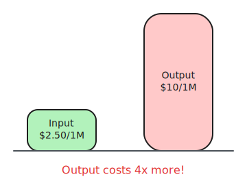
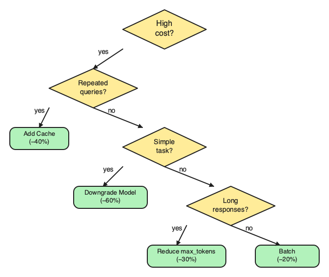
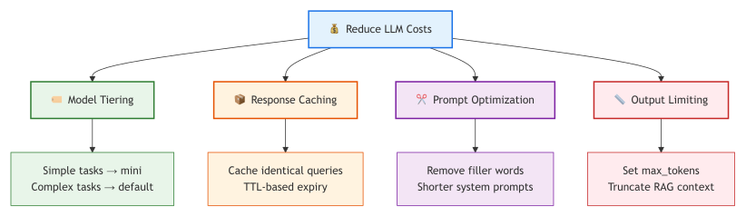
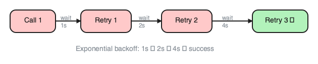
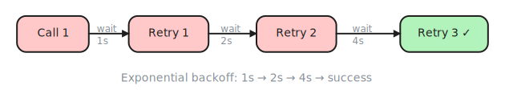

# 13. Cost, Latency & Error Handling

> **🎯 Learning Objectives**
>
> - Calculate and optimize API costs using token economics, model tiering, and caching
> - Implement retry logic with exponential backoff for resilient applications
> - Monitor API usage and set up spending alerts to prevent cost overruns

## The $2,000 Demo

<!-- IMAGE: A gauge/meter with a coin-and-token stack, and a funnel narrowing many tokens into fewer. Conveys optimizing cost and throughput. -->

<!-- END IMAGE -->

A developer built an impressive AI demo for a client presentation. The demo featured a document Q&A system that could answer complex questions about the client's product catalog. During the live demonstration, a bug in the retry logic left a loop running that sent the same prompt 10,000 times. Each call cost roughly $0.20. The demo lasted 30 minutes. The invoice was $2,000.

The client was impressed with the AI capabilities. The developer's manager was not impressed with the bill. The fix was a one-line change: a `max_retries` guard that should have been there from the start. Every production LLM system needs cost guardrails, and every developer needs to understand what each API call costs before writing the code that makes it.

In this chapter, you will learn how to calculate, optimize, and control the cost of LLM API calls. You will build retry logic that handles failures gracefully, implement caching that eliminates redundant calls, and set up monitoring that catches cost anomalies before they become budget emergencies.

## Token Economics

**Token economics** drives LLM costs. LLM APIs charge per token, not per request. A token is roughly four characters in English, or about three-quarters of a word. The critical detail that catches most developers by surprise: input and output tokens are priced differently, and the difference is substantial.

### Input vs. Output Pricing

| Model | Input (per 1M tokens) | Output (per 1M tokens) | Context Window |
|:------|:---------------------|:----------------------|:---------------|
| GPT-4o | $2.50 | $10.00 | 128K |
| GPT-4o-mini | $0.15 | $0.60 | 128K |
| Claude 3.5 Sonnet | $3.00 | $15.00 | 200K |
| Gemini 2.5 Pro | $1.25 | $10.00 | 1M |
| Gemini 2.5 Flash | $0.15 | $0.60 | 1M |

Output tokens cost 3 to 5 times more than input tokens across every major provider. A prompt that asks for a "detailed explanation with examples" generates far more output tokens than one that asks for a "one-sentence summary." Being explicit about response length in every production prompt is one of the simplest cost optimizations you can make.


<!-- figure: Token cost breakdown -->

> [!WARNING]
> **Output tokens cost 3-5x more than input tokens.** A prompt that asks for a "detailed explanation" costs much more than one that asks for a "2-sentence summary." Be explicit about response length in every production prompt.

### Calculating Cost Per Call

```python
import tiktoken

def estimate_cost(messages, response, model="gpt-4o"):
    enc = tiktoken.encoding_for_model(model)
    input_tokens = sum(len(enc.encode(m["content"])) for m in messages)
    input_tokens += len(messages) * 4  # per-message overhead
    output_tokens = len(enc.encode(response))

    PRICING = {
        "gpt-4o":      {"input": 2.50, "output": 10.00},
        "gpt-4o-mini": {"input": 0.15, "output": 0.60},
    }
    p = PRICING.get(model, PRICING["gpt-4o-mini"])
    cost = (input_tokens / 1e6) * p["input"] + (output_tokens / 1e6) * p["output"]
    return {"input_tokens": input_tokens, "output_tokens": output_tokens, "cost": cost}
```

### Real-World Cost Scenarios

| Use Case | Tokens per Request | Requests per Day | Monthly Cost (GPT-4o) | Monthly Cost (GPT-4o-mini) |
|:---------|:------------------|:----------------|:---------------------|:--------------------------|
| Simple Q&A | ~500 | 100 | ~$1.90 | ~$0.11 |
| RAG chatbot | ~2,000 | 500 | ~$37.50 | ~$2.25 |
| Code review | ~4,000 | 200 | ~$30.00 | ~$1.80 |
| Doc summarization | ~8,000 | 50 | ~$15.00 | ~$0.90 |

The same workloads on GPT-4o-mini cost roughly 15 times less. For many tasks, the quality difference is negligible.

> [!TIP]
> **Cross-Reference:** For model capabilities and when quality differences matter, see [Chapter 2](02-llm-landscape.md): The LLM Landscape. Not every task needs the most powerful model.

## Cost Optimization Strategies

Five strategies cover the vast majority of cost optimization opportunities. Apply them in order of impact.


<!-- figure: Cost optimization strategy map -->

### Strategy 1: Model Tiering

Use the cheapest model that meets your quality requirements. Start with mini for every task and upgrade only when you can demonstrate a quality gap.

```python
def choose_model(task_complexity):
    if task_complexity in ("greeting", "faq", "simple_classification"):
        return "gpt-4o-mini"   # $0.15 / 1M input
    elif task_complexity in ("summarization", "code_explanation"):
        return "gpt-4o-mini"   # Still good enough for most cases
    else:
        return "gpt-4o"        # $2.50 / 1M input - complex reasoning only
```

### Strategy 2: Prompt Optimization

Every unnecessary word in your prompt is a token you pay for. Verbose prompts are not just bad style; they are expensive.

**Verbose prompt: ~85 tokens**
```prompt
You are an extremely helpful and knowledgeable assistant
who is an expert in Python programming. I would really
appreciate it if you could please help me understand what
the following error message means and provide a detailed
explanation of how to fix it.
```

**Concise prompt: ~20 tokens**
```prompt
You are a Python expert. Explain this error and how to fix it.
```

| Technique | Token Savings | Quality Impact |
|:----------|:-------------|:---------------|
| Remove filler words | 20-40% | None |
| Shorter system prompts | 10-30% | Test carefully |
| Compress RAG context | 20-50% | May lose detail |
| Set explicit `max_tokens` | Variable | May truncate |

### Strategy 3: Response Truncation

Control output length to limit the more expensive output tokens:

```python
from shared import get_completion

response = get_completion(
    messages,
    max_tokens=150,     # Cap output length
    temperature=0.0,    # Deterministic output, fewer retries needed
)
```

### Strategy 4: Batch Processing

When you have multiple independent short queries, combine them into a single call:

```python
combined_prompt = "Answer each question below:\n"
for i, q in enumerate(questions):
    combined_prompt += f"\n{i+1}. {q}"
combined_prompt += "\n\nRespond with numbered answers."
```

One call with a longer prompt is cheaper than multiple calls with short prompts because you avoid repeated system message tokens and per-request overhead.

### Strategy Comparison

| Strategy | Savings Potential | Implementation Effort | Risk |
|:---------|:-----------------|:---------------------|:-----|
| Model tiering | 10-15x | Low (config change) | Quality may drop for complex tasks |
| Prompt optimization | 20-40% | Medium (rewriting) | Need to re-test quality |
| Response truncation | 20-60% | Low (one parameter) | May cut off useful content |
| Batch processing | 30-50% | Medium (code change) | Harder error handling |
| Caching | 30-50% | Medium (infrastructure) | Stale responses possible |


<!-- figure: Cost optimization decision tree -->

> [!TIP]
> **High-Resolution Decision Tree:** For a full-page, high-resolution Cost Optimization Decision Tree, see [Appendix E](appendix-e-diagrams.md#chapter-13-cost-optimization-decision-tree). The high-resolution file is also available in the companion repository:
> - [ch13-cost-decision-tree.png](https://github.com/kpassoubady/building-with-llms-companion/blob/main/diagrams/ch13-cost-decision-tree.png)

## Implementing a Semantic Cache

Caching is the highest-impact optimization for applications with repetitive queries. A customer support bot receiving 50,000 queries per month found that 40% were variations of the same 20 questions. Adding a cache eliminated 40% of API calls, dropping monthly cost from $7,000 to $2,800.

### Simple Hash-Based Cache

For exact-match caching, a hash of the normalized query serves as the key:

```python
import hashlib
import time

class ResponseCache:
    def __init__(self, ttl=3600):
        self.cache = {}
        self.ttl = ttl
        self.hits = 0
        self.misses = 0

    def get(self, query):
        key = hashlib.md5(query.lower().strip().encode()).hexdigest()
        entry = self.cache.get(key)
        if entry and time.time() - entry["ts"] < self.ttl:
            self.hits += 1
            return entry["response"]
        self.misses += 1
        return None

    def set(self, query, response):
        key = hashlib.md5(query.lower().strip().encode()).hexdigest()
        self.cache[key] = {"response": response, "ts": time.time()}
```

### Semantic Caching

Hash-based caching only matches identical queries.

**Semantic caching** matches queries with similar meaning by comparing their embeddings. "How do I return a product?" and "What is your return policy?" would be a cache hit.

The approach: embed the incoming query, compare it to cached query embeddings using cosine similarity, and return the cached response if similarity exceeds a threshold (typically 0.92 to 0.95).

> [!TIP]
> **Cross-Reference:** For a detailed explanation of embeddings and cosine similarity, see [Chapter 10](10-embeddings-vector-databases.md): Embeddings & Vector Databases. The same techniques that power RAG retrieval power semantic caching.

### Cache Invalidation

Every cache needs an expiration strategy. Two common approaches work for LLM response caches:

- **TTL (Time-to-Live):** Responses expire after a fixed duration (1 hour for dynamic content, 24 hours for stable content).
- **Manual flush:** Invalidate the cache when you update your system prompt or knowledge base. A prompt change means cached responses are stale.

> [!NOTE]
> **Did You Know?** OpenAI's API returns an `x-ratelimit-remaining-tokens` header with every response. You can read this header to proactively slow down before hitting rate limits, rather than waiting for a 429 error.

<!-- IMAGE: A fuel-style gauge of tokens dropping toward empty with a hand easing a throttle back to avoid a red warning. Conveys watching the rate-limit budget. -->

<!-- END IMAGE -->

## Latency Optimization

Cost and latency are related but distinct problems. A cheaper model is often a faster model, but latency optimization has its own set of techniques.

### Streaming

Streaming does not reduce total response time, but it dramatically improves perceived latency. Users see the first token in milliseconds instead of waiting seconds for the complete response.

```python
import litellm

def stream_response(messages):
    response = litellm.completion(
        model="gpt-4o-mini", messages=messages, stream=True
    )
    full = ""
    for chunk in response:
        delta = chunk.choices[0].delta.content or ""
        print(delta, end="", flush=True)
        full += delta
    print()
    return full
```

### Parallel Calls

When you have multiple independent queries, run them concurrently. Three sequential 1-second calls take 3 seconds. Three parallel calls take 1 second.

```python
import asyncio
import litellm

async def parallel_queries(queries):
    tasks = [
        litellm.acompletion(
            model="gpt-4o-mini",
            messages=[{"role": "user", "content": q}]
        )
        for q in queries
    ]
    return await asyncio.gather(*tasks)
```

### Latency Strategy Comparison

| Strategy | How It Helps | Real Latency Reduction | Perceived Latency Reduction |
|:---------|:-----------|:----------------------|:---------------------------|
| Streaming | Show tokens as they arrive | None | ~80% |
| Smaller models | GPT-4o-mini is 2-3x faster | 50-70% | 50-70% |
| Parallel calls | Run independent queries concurrently | Up to Nx | Up to Nx |
| Caching | Skip the API call entirely | 100% (cache hit) | 100% (cache hit) |
| Shorter prompts | Fewer tokens to process | 10-20% | 10-20% |

> [!TIP]
> **Cross-Reference:** For streaming implementation details and the `stream` parameter, see [Chapter 7](07-api-parameters.md): API Parameters & Output Control.

## Error Handling and Retry Logic

LLM APIs are external services. They go down. They rate-limit you. They time out. A team deployed their LLM feature without retry logic. OpenAI's API returned HTTP 429 (rate limit) and 500 (server error) on approximately 5% of requests. Without retries, 5% of user requests silently failed. Adding exponential backoff with 3 retries brought effective uptime to 99.8%.

### Common API Errors

| Error | HTTP Code | Cause | Fix |
|:------|:---------|:------|:----|
| Rate limit | 429 | Too many requests per minute | Retry with backoff |
| Server error | 500 | Provider outage | Retry, fallback provider |
| Timeout | 408/504 | Slow response | Increase timeout, use streaming |
| Auth error | 401 | Bad or expired API key | Check key, rotate |
| Context too long | 400 | Input exceeds limit | Truncate input |
| Content filtered | 400 | Safety filter triggered | Rephrase prompt |

### Exponential Backoff

**Exponential backoff** is the standard retry pattern: wait 1 second after the first failure, 2 seconds after the second, 4 seconds after the third. Each retry doubles the wait time, giving the overloaded service time to recover.

```python
import time
import litellm

def completion_with_retry(messages, max_retries=3, base_delay=1.0):
    for attempt in range(max_retries + 1):
        try:
            response = litellm.completion(
                model="gpt-4o-mini", messages=messages
            )
            return response.choices[0].message.content
        except litellm.exceptions.RateLimitError:
            if attempt == max_retries:
                raise
            delay = base_delay * (2 ** attempt)  # 1s, 2s, 4s
            time.sleep(delay)
        except litellm.exceptions.APIConnectionError:
            if attempt == max_retries:
                raise
            time.sleep(base_delay)
    raise RuntimeError("Max retries exceeded")
```


<!-- figure: API call retry loop: success exits, 429/500 waits 2^n seconds before retry -->

The diagram shows the retry decision loop with exponential wait times and a max-retries exit; the sketch below lays out the same attempts on a timeline with 1s, 2s, and 4s wait labels between each retry.


<!-- figure: Three retry attempts with wait 1s, 2s, 4s annotated on timeline -->

### Jitter

**Jitter** solves the thundering herd problem. If many clients hit a rate limit at the same time and all retry after exactly 1 second, they all hit the limit again simultaneously. This is the "thundering herd" problem. Adding random jitter to the delay spreads retries across time:

```python
import random

delay = base_delay * (2 ** attempt) + random.uniform(0, 1)
```

### Circuit Breaker

**Circuit breaker** stops trying after N consecutive failures if the API is consistently failing. Retrying every request wastes time and resources. It stops trying after N consecutive failures and returns a fallback response immediately. After a cooldown period, it allows one test request through. If that succeeds, normal operation resumes.

The circuit breaker has three states:

- **Closed (normal):** Requests pass through. Failures are counted.
- **Open (tripped):** All requests immediately return a fallback. No API calls are made.
- **Half-open (testing):** After a cooldown, one request is allowed through. If it succeeds, the circuit closes. If it fails, the circuit reopens.

### Fallback Strategies

When retries are exhausted or the circuit breaker is open, your application needs a graceful degradation path. Four common fallback strategies:

| Strategy | When to Use | Example |
|:---------|:-----------|:--------|
| Cached response | Stale data is acceptable | Return last known good answer |
| Cheaper model | Quality tradeoff is acceptable | Fall back from GPT-4o to GPT-4o-mini |
| Static response | Safety-critical scenario | "I'm unable to process this right now" |
| Alternative provider | Multi-provider setup | Fall back from OpenAI to Gemini |

The best production systems combine retry logic, circuit breakers, and fallback strategies into a resilient pipeline that users rarely notice is degraded.

## Monitoring and Alerts

You cannot optimize what you do not measure. Every production LLM application needs usage tracking, cost monitoring, and spending alerts.

### Usage Tracking

Log every API call with model, token counts, cost, and latency:

```python
import time

class UsageTracker:
    def __init__(self):
        self.calls = []

    def log_call(self, model, input_tokens, output_tokens, latency_ms):
        self.calls.append({
            "model": model,
            "input_tokens": input_tokens,
            "output_tokens": output_tokens,
            "latency_ms": latency_ms,
            "timestamp": time.time(),
        })

    def summary(self):
        total_in = sum(c["input_tokens"] for c in self.calls)
        total_out = sum(c["output_tokens"] for c in self.calls)
        return {
            "calls": len(self.calls),
            "input_tokens": total_in,
            "output_tokens": total_out,
        }
```

### Budget Guards

Set daily and monthly spending limits that prevent runaway costs:

```python
class BudgetGuard:
    def __init__(self, daily_limit=5.0):
        self.limit = daily_limit
        self.spent = 0.0

    def check(self, est_cost):
        return self.spent + est_cost <= self.limit

    def record(self, cost):
        self.spent += cost
```

When the budget guard blocks a call, your application can fall back to cached responses, switch to a cheaper model, or return a polite "service temporarily limited" message. Never let costs run unchecked.

### What to Monitor

| Metric | Why | Alert Threshold |
|:-------|:----|:---------------|
| Daily cost | Catch runaway loops | 2x normal daily average |
| Cost per request | Detect prompt bloat | Sudden increase > 50% |
| Error rate | API reliability | > 5% of requests failing |
| Latency (p95) | User experience | > 5 seconds |
| Cache hit rate | Optimization health | Drop below 20% |

Provider dashboards (OpenAI's Usage page, Google Cloud Billing) give you aggregate views. Your own logging gives you per-feature, per-endpoint, and per-user breakdowns that provider dashboards cannot.

## 🧪 Try It Yourself

### Exercise 1: Calculate Your Costs

Use the `estimate_cost` function to calculate the cost of 10 different prompts (varying lengths) with both GPT-4o and GPT-4o-mini. Create a comparison table showing the price difference.

### Exercise 2: Build a Cached Chatbot

Add the `ResponseCache` class to a simple chatbot. Ask the same question three times. Verify that only the first call hits the API, and the second and third return cached responses. Print hit/miss statistics.

### Exercise 3: Add Retry Logic

Wrap `get_completion` with the `completion_with_retry` function. Simulate failures by raising `RateLimitError` on the first two attempts. Verify that the third attempt succeeds and the delays increase.

> [!TIP]
> **Starter Code:** The companion repository contains full exercises, starter code, and solutions for implementing semantic caching and robust retry logic.
> - [building-with-llms-companion/exercises/ch13/caching_lab](https://github.com/kpassoubady/building-with-llms-companion/tree/main/exercises/ch13/caching_lab)

## 📋 Chapter Summary

> **💡 Key Takeaways**
>
> - Output tokens cost 3 to 5 times more than input tokens. Start every task on the cheapest model that meets quality requirements, set explicit `max_tokens` limits, and compress prompts by removing filler words. These three steps together can cut costs by 80% or more.
> - Semantic caching eliminates 30 to 50% of API calls in repetitive workloads by matching queries with similar meaning. Combine it with exponential backoff and jitter for retry logic that handles rate limits without thundering-herd failures.
> - Set daily spending limits with a budget guard and log every call with model, token counts, and latency. A single bug without these guardrails can generate thousands of dollars in charges overnight.

> [!PITFALLS]
> - Using the most expensive model for every task (GPT-4o-mini handles 80% of tasks well)
> - Forgetting that output tokens cost more (asking for "detailed" responses without a length limit)
> - No spending alerts (a single bug can generate thousands of dollars in charges overnight)

## 🧠 Knowledge Check

1. **Multiple Choice:** Which costs more per token?

    ::: {.mcq-2col}
    - [ ] Input tokens
    - [ ] Output tokens
    - [ ] They cost the same
    :::

2. **True or False:** Exponential backoff means doubling the wait time after each failed retry.

    ::: {.tf-inline}
    - [ ] True
    - [ ] False
    :::

3. **Fill in the Blank:** A ______ cache stores responses to similar queries and returns them without calling the API.

4. **Multiple Choice:** HTTP 429 means:

    ::: {.mcq-2col}
    - [ ] Not found
    - [ ] Rate limit exceeded
    - [ ] Server error
    - [ ] Unauthorized
    :::

5. **Scenario:** Your LLM feature costs $500 per day. Analysis shows 35% of queries are near-duplicates. How much would semantic caching save per day, and what is the monthly impact?

<details>
<summary><strong>Click to Reveal Answers</strong></summary>

1. **Answer**: (b) Output tokens. Output tokens cost 3-5x more than input tokens across all major providers. This is because generation (producing tokens one at a time) is more compute-intensive than encoding (processing the full input in parallel).
2. **True/False**: True. Exponential backoff doubles the wait: 1s, 2s, 4s, 8s. Adding random jitter (a small random delay) prevents the thundering herd problem where many clients retry simultaneously.
3. **Answer**: Semantic cache. Unlike exact-match caching, semantic caching uses embeddings to match queries with similar meaning, catching paraphrased duplicates that hash-based caching would miss.
4. **Answer**: (b) Rate limit exceeded. HTTP 429 means you have sent too many requests in a given time window. The correct response is to retry with exponential backoff, not to immediately resend the request.
5. **Answer**: ~$175 per day ($500 x 0.35 = $175). Monthly savings: ~$5,250 ($175 x 30). Over a year, that is $63,000 saved by a caching layer that takes a few hours to implement. Cross-reference [Chapter 10](10-embeddings-vector-databases.md) for the embeddings that power semantic caching.

</details>
